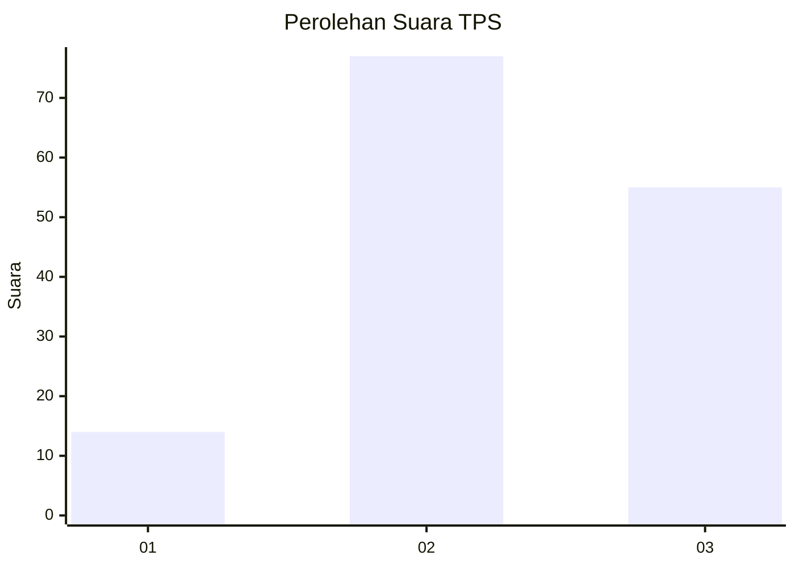
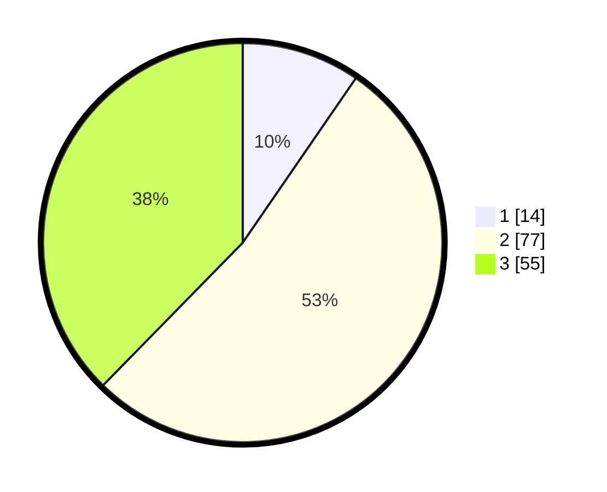

# Hasil

## Grafik

## Tabel

| No. | Nama Paslon    | Suara | Suara (raw) | Persentase |
|:--- |:-------------- | -----:| -----------:| ----------:|
| 1   | ANIES MUHAIMIN | 14    | [14][p-1]   | 9,59       |
| 2   | PRABOWO GIBRAN | 77    | [77][p-2]   | 52,74      |
| 3   | GANJAR MAHFUD  | 55    | [55][p-3]   | 37,67      |

[p-1]: https://github.com/gigit-pemilu/pemilu-2024-91-papua/blob/main/pilpres/hitung-suara/sub/91-papua/sub/06-biak-numfor/sub/03-biak-timur/sub/2016-yenusi/sub/002-tps/sub/paslon-1.txt
[p-2]: https://github.com/gigit-pemilu/pemilu-2024-91-papua/blob/main/pilpres/hitung-suara/sub/91-papua/sub/06-biak-numfor/sub/03-biak-timur/sub/2016-yenusi/sub/002-tps/sub/paslon-2.txt
[p-3]: https://github.com/gigit-pemilu/pemilu-2024-91-papua/blob/main/pilpres/hitung-suara/sub/91-papua/sub/06-biak-numfor/sub/03-biak-timur/sub/2016-yenusi/sub/002-tps/sub/paslon-3.txt

## Foto C Plano

https://sirekap-obj-formc.kpu.go.id/f0a1/pemilu/ppwp/91/06/03/20/16/9106032016002-20240215-141328--d9c6d06f-97e3-4301-96d4-ee15edfb5209.jpg

https://sirekap-obj-formc.kpu.go.id/f0a1/pemilu/ppwp/91/06/03/20/16/9106032016002-20240215-141449--28000f50-d6b9-4448-adab-4497654a4e91.jpg

https://sirekap-obj-formc.kpu.go.id/f0a1/pemilu/ppwp/91/06/03/20/16/9106032016002-20240215-141620--857dc957-08b7-4780-9545-e22a1fde0b5e.jpg

## Metadata

| Key        | Value               |
| ---------- | ------------------- |
| Time Stamp | 2024-02-25 15:00:00 |

