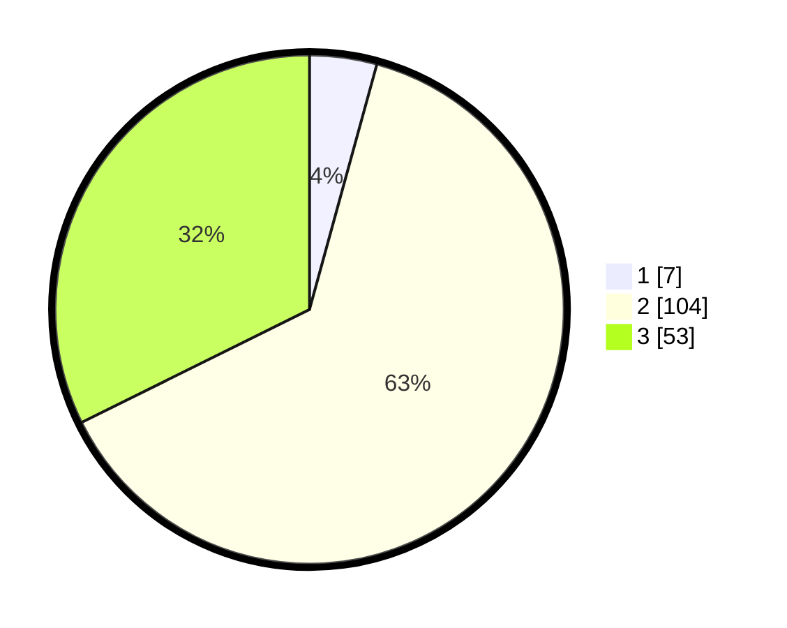

# Hasil

## Grafik

## Tabel

| No. | Nama Paslon    | Suara | Suara (raw) | Persentase |
|:--- |:-------------- | -----:| -----------:| ----------:|
| 1   | ANIES MUHAIMIN | 7     | [7][p-1]    | 4,27       |
| 2   | PRABOWO GIBRAN | 104   | [104][p-2]  | 63,41      |
| 3   | GANJAR MAHFUD  | 53    | [53][p-3]   | 32,32      |

[p-1]: https://github.com/gigit-pemilu/pemilu-2024-91-papua/blob/main/pilpres/hitung-suara/sub/91-papua/sub/06-biak-numfor/sub/03-biak-timur/sub/2030-rim/sub/001-tps/sub/paslon-1.txt
[p-2]: https://github.com/gigit-pemilu/pemilu-2024-91-papua/blob/main/pilpres/hitung-suara/sub/91-papua/sub/06-biak-numfor/sub/03-biak-timur/sub/2030-rim/sub/001-tps/sub/paslon-2.txt
[p-3]: https://github.com/gigit-pemilu/pemilu-2024-91-papua/blob/main/pilpres/hitung-suara/sub/91-papua/sub/06-biak-numfor/sub/03-biak-timur/sub/2030-rim/sub/001-tps/sub/paslon-3.txt

## Foto C Plano

https://sirekap-obj-formc.kpu.go.id/309d/pemilu/ppwp/91/06/03/20/30/9106032030001-20240215-222546--584ac4cd-1b84-449a-bd61-5e7a33c65c91.jpg

https://sirekap-obj-formc.kpu.go.id/309d/pemilu/ppwp/91/06/03/20/30/9106032030001-20240215-192837--bda889ca-3a1e-465d-b99f-de23dbd55267.jpg

https://sirekap-obj-formc.kpu.go.id/309d/pemilu/ppwp/91/06/03/20/30/9106032030001-20240215-193023--ce947308-9049-46f8-a7e6-82115eb74d91.jpg

## Metadata

| Key        | Value               |
| ---------- | ------------------- |
| Time Stamp | 2024-02-25 15:00:00 |

