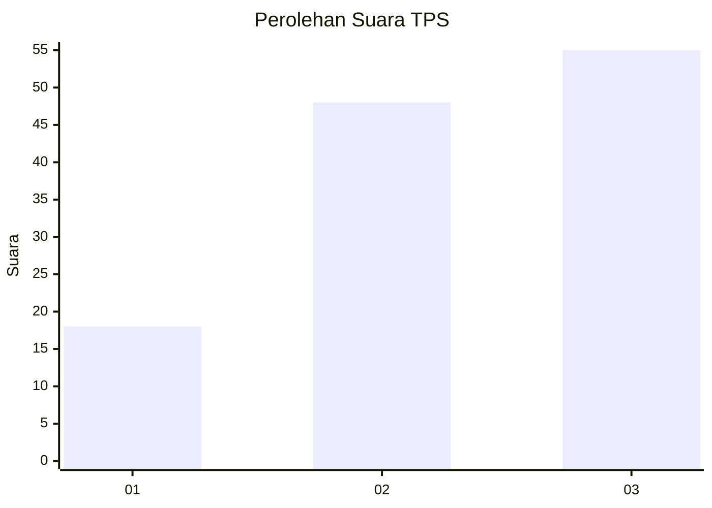
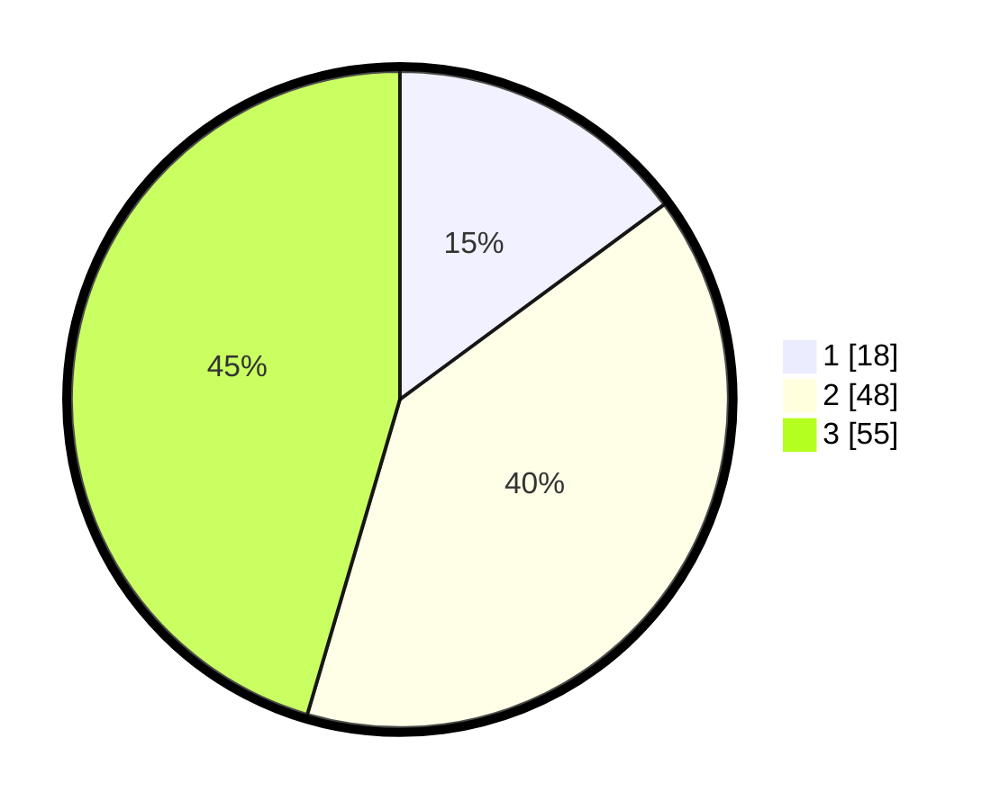

# Hasil

## Grafik

## Tabel

| No. | Nama Paslon    | Suara | Suara (raw) | Persentase |
|:--- |:-------------- | -----:| -----------:| ----------:|
| 1   | ANIES MUHAIMIN | 18    | [18][p-1]   | 14,88      |
| 2   | PRABOWO GIBRAN | 48    | [48][p-2]   | 39,67      |
| 3   | GANJAR MAHFUD  | 55    | [55][p-3]   | 45,45      |

[p-1]: https://github.com/gigit-pemilu/pemilu-2024-91-papua/blob/main/pilpres/hitung-suara/sub/91-papua/sub/06-biak-numfor/sub/03-biak-timur/sub/2033-inofi/sub/001-tps/sub/paslon-1.txt
[p-2]: https://github.com/gigit-pemilu/pemilu-2024-91-papua/blob/main/pilpres/hitung-suara/sub/91-papua/sub/06-biak-numfor/sub/03-biak-timur/sub/2033-inofi/sub/001-tps/sub/paslon-2.txt
[p-3]: https://github.com/gigit-pemilu/pemilu-2024-91-papua/blob/main/pilpres/hitung-suara/sub/91-papua/sub/06-biak-numfor/sub/03-biak-timur/sub/2033-inofi/sub/001-tps/sub/paslon-3.txt

## Foto C Plano

https://sirekap-obj-formc.kpu.go.id/6fed/pemilu/ppwp/91/06/03/20/33/9106032033001-20240215-063118--2b607cbd-7623-473c-be36-cc14004ef3f1.jpg

https://sirekap-obj-formc.kpu.go.id/6fed/pemilu/ppwp/91/06/03/20/33/9106032033001-20240216-112732--971d27ac-1ece-4f28-bbd5-a84e4c82bb0f.jpg

https://sirekap-obj-formc.kpu.go.id/6fed/pemilu/ppwp/91/06/03/20/33/9106032033001-20240216-112324--4022ec50-a4cd-45fb-a155-de7bbd47f92e.jpg

## Metadata

| Key        | Value               |
| ---------- | ------------------- |
| Time Stamp | 2024-02-25 21:00:00 |

