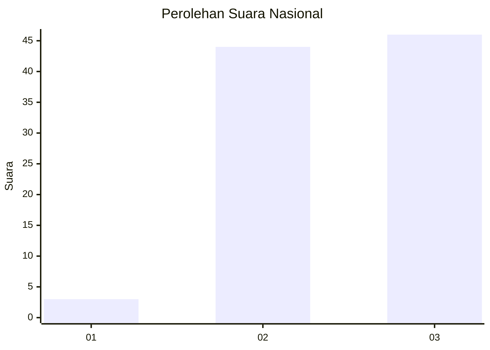
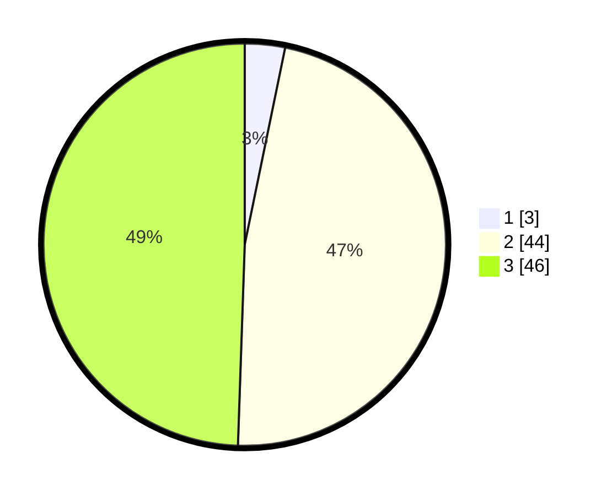

# Hasil

## Grafik

## Tabel

| No. | Nama Paslon    | Suara | Suara (raw) | Persentase |
|:--- |:-------------- | -----:| -----------:| ----------:|
| 1   | ANIES MUHAIMIN | 3     | [3][p-1]    | 3,23       |
| 2   | PRABOWO GIBRAN | 44    | [44][p-2]   | 47,31      |
| 3   | GANJAR MAHFUD  | 46    | [46][p-3]   | 49,46      |

[p-1]: https://github.com/gigit-pemilu/pemilu-2024/blob/main/pilpres/hitung-suara/sub/91-papua/sub/06-biak-numfor/sub/03-biak-timur/sub/2036-yendakem/sub/001-tps/sub/paslon-1.txt
[p-2]: https://github.com/gigit-pemilu/pemilu-2024/blob/main/pilpres/hitung-suara/sub/91-papua/sub/06-biak-numfor/sub/03-biak-timur/sub/2036-yendakem/sub/001-tps/sub/paslon-2.txt
[p-3]: https://github.com/gigit-pemilu/pemilu-2024/blob/main/pilpres/hitung-suara/sub/91-papua/sub/06-biak-numfor/sub/03-biak-timur/sub/2036-yendakem/sub/001-tps/sub/paslon-3.txt

## Foto C Plano

https://sirekap-obj-formc.kpu.go.id/060c/pemilu/ppwp/91/06/03/20/36/9106032036001-20240215-092725--a90da6fe-a9a9-4474-a50c-0fb1913b885f.jpg

https://sirekap-obj-formc.kpu.go.id/060c/pemilu/ppwp/91/06/03/20/36/9106032036001-20240215-154203--c715fabe-9e59-42cb-85f2-1fb31f175f7f.jpg

https://sirekap-obj-formc.kpu.go.id/060c/pemilu/ppwp/91/06/03/20/36/9106032036001-20240215-093048--9b86d8e5-01a2-4d39-9d75-101268d56c58.jpg

## Metadata

| Key        | Value               |
| ---------- | ------------------- |
| Time Stamp | 2024-02-15 17:00:25 |

