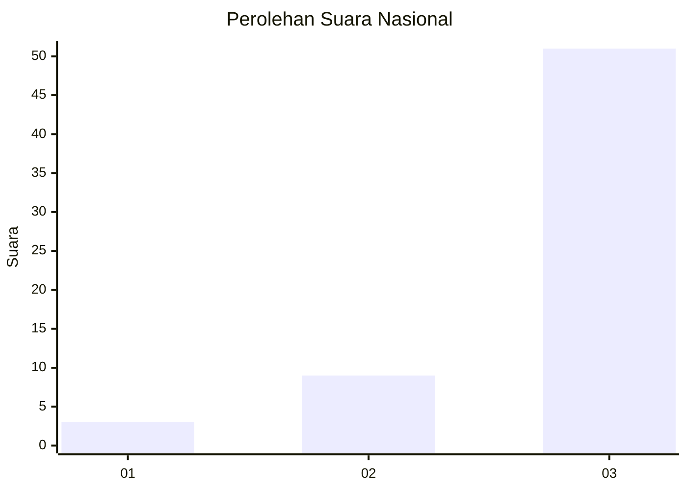
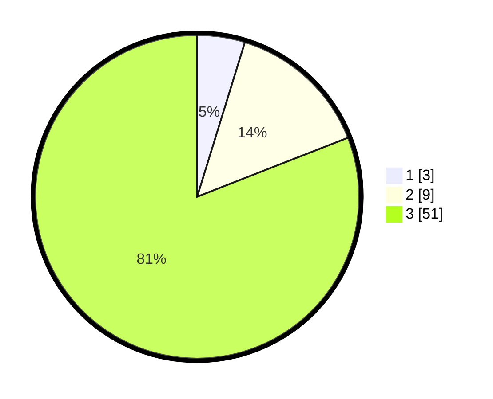

# Hasil

## Grafik

## Tabel

| No. | Nama Paslon    | Suara | Suara (raw) | Persentase |
|:--- |:-------------- | -----:| -----------:| ----------:|
| 1   | ANIES MUHAIMIN | 3     | [3][p-1]    | 4,76       |
| 2   | PRABOWO GIBRAN | 9     | [9][p-2]    | 14,29      |
| 3   | GANJAR MAHFUD  | 51    | [51][p-3]   | 80,95      |

[p-1]: https://github.com/gigit-pemilu/pemilu-2024/blob/main/pilpres/hitung-suara/sub/91-papua/sub/06-biak-numfor/sub/03-biak-timur/sub/2039-inmdi/sub/001-tps/sub/paslon-1.txt
[p-2]: https://github.com/gigit-pemilu/pemilu-2024/blob/main/pilpres/hitung-suara/sub/91-papua/sub/06-biak-numfor/sub/03-biak-timur/sub/2039-inmdi/sub/001-tps/sub/paslon-2.txt
[p-3]: https://github.com/gigit-pemilu/pemilu-2024/blob/main/pilpres/hitung-suara/sub/91-papua/sub/06-biak-numfor/sub/03-biak-timur/sub/2039-inmdi/sub/001-tps/sub/paslon-3.txt

## Foto C Plano

https://sirekap-obj-formc.kpu.go.id/1a38/pemilu/ppwp/91/06/03/20/39/9106032039001-20240215-062820--fb4ccea9-636b-49b4-9770-6d2fbb5586aa.jpg

https://sirekap-obj-formc.kpu.go.id/1a38/pemilu/ppwp/91/06/03/20/39/9106032039001-20240215-062254--acfb9f06-76b0-4f6e-ae2b-03d17408766e.jpg

https://sirekap-obj-formc.kpu.go.id/1a38/pemilu/ppwp/91/06/03/20/39/9106032039001-20240215-062428--691f4fb8-a2f5-4803-a718-891de86a42f2.jpg

## Metadata

| Key        | Value               |
| ---------- | ------------------- |
| Time Stamp | 2024-02-25 16:00:00 |

