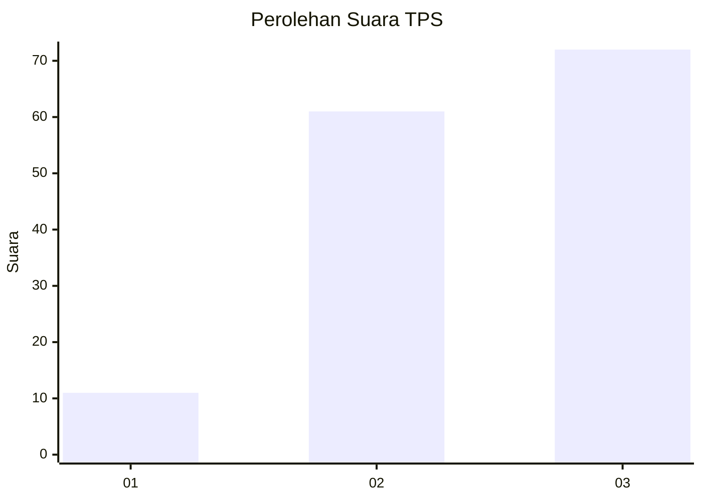
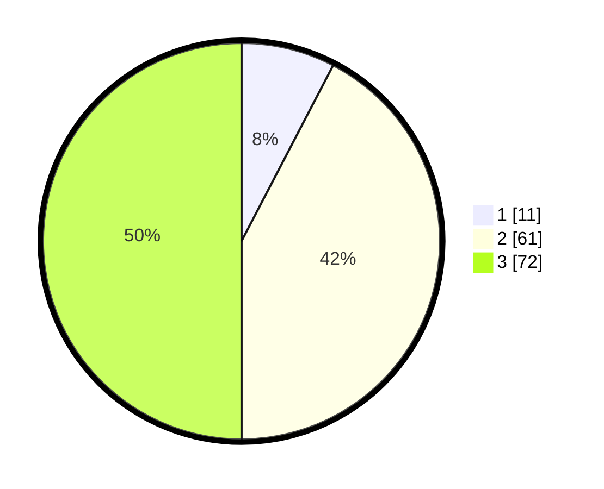

# Hasil

## Grafik

## Tabel

| No. | Nama Paslon    | Suara | Suara (raw) | Persentase |
|:--- |:-------------- | -----:| -----------:| ----------:|
| 1   | ANIES MUHAIMIN | 11    | [11][p-1]   | 7,64       |
| 2   | PRABOWO GIBRAN | 61    | [61][p-2]   | 42,36      |
| 3   | GANJAR MAHFUD  | 72    | [72][p-3]   | 50,00      |

[p-1]: https://github.com/gigit-pemilu/pemilu-2024-91-papua/blob/main/pilpres/hitung-suara/sub/91-papua/sub/06-biak-numfor/sub/04-numfor-barat/sub/2005-kameri/sub/001-tps/sub/paslon-1.txt
[p-2]: https://github.com/gigit-pemilu/pemilu-2024-91-papua/blob/main/pilpres/hitung-suara/sub/91-papua/sub/06-biak-numfor/sub/04-numfor-barat/sub/2005-kameri/sub/001-tps/sub/paslon-2.txt
[p-3]: https://github.com/gigit-pemilu/pemilu-2024-91-papua/blob/main/pilpres/hitung-suara/sub/91-papua/sub/06-biak-numfor/sub/04-numfor-barat/sub/2005-kameri/sub/001-tps/sub/paslon-3.txt

## Foto C Plano

https://sirekap-obj-formc.kpu.go.id/e007/pemilu/ppwp/91/06/04/20/05/9106042005001-20240215-144826--52390f98-e3cb-4623-8aa9-b8882968f611.jpg

https://sirekap-obj-formc.kpu.go.id/e007/pemilu/ppwp/91/06/04/20/05/9106042005001-20240215-144853--e742ba5b-b823-450b-bbef-907b253c24a2.jpg

https://sirekap-obj-formc.kpu.go.id/e007/pemilu/ppwp/91/06/04/20/05/9106042005001-20240215-144916--8d60a7c1-58d8-4215-9646-6aa340d42325.jpg

## Metadata

| Key        | Value               |
| ---------- | ------------------- |
| Time Stamp | 2024-02-25 16:00:00 |

