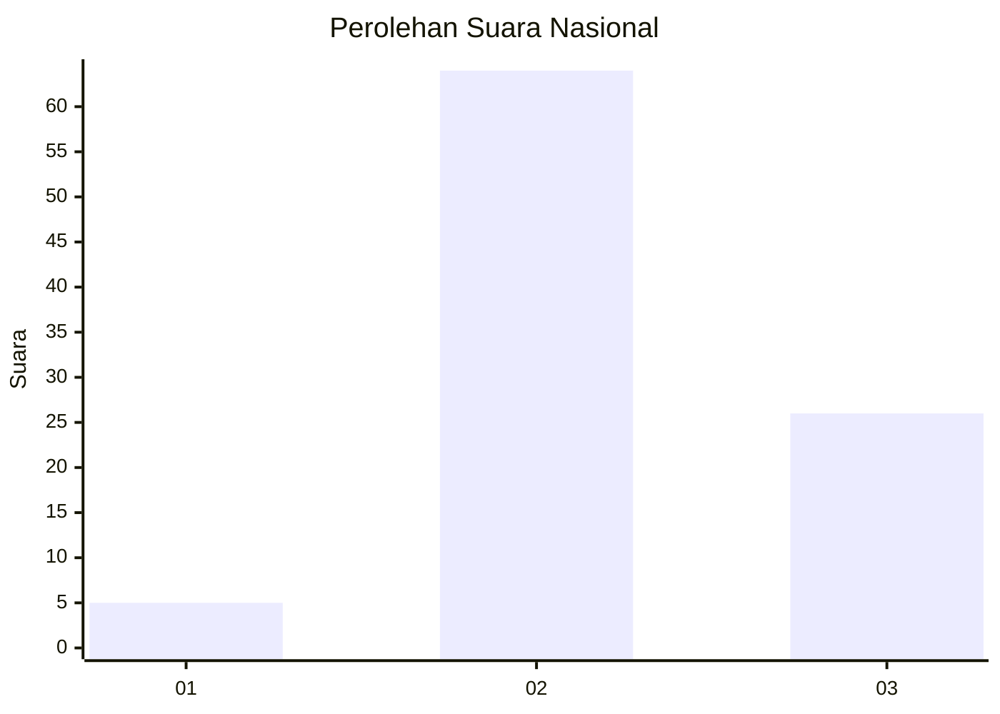
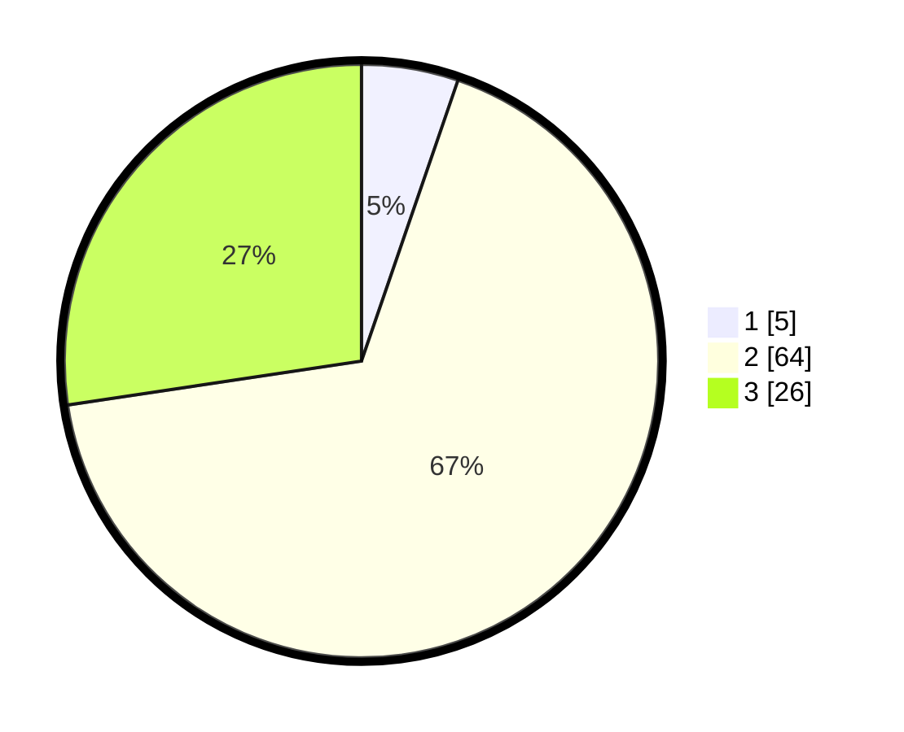

# Hasil

## Grafik

## Tabel

| No. | Nama Paslon    | Suara | Suara (raw) | Persentase |
|:--- |:-------------- | -----:| -----------:| ----------:|
| 1   | ANIES MUHAIMIN | 5     | [5][p-1]    | 5,26       |
| 2   | PRABOWO GIBRAN | 64    | [64][p-2]   | 67,37      |
| 3   | GANJAR MAHFUD  | 26    | [26][p-3]   | 27,37      |

[p-1]: https://github.com/gigit-pemilu/pemilu-2024/blob/main/pilpres/hitung-suara/sub/91-papua/sub/06-biak-numfor/sub/04-numfor-barat/sub/2012-sub-manggunsi/sub/001-tps/sub/paslon-1.txt
[p-2]: https://github.com/gigit-pemilu/pemilu-2024/blob/main/pilpres/hitung-suara/sub/91-papua/sub/06-biak-numfor/sub/04-numfor-barat/sub/2012-sub-manggunsi/sub/001-tps/sub/paslon-2.txt
[p-3]: https://github.com/gigit-pemilu/pemilu-2024/blob/main/pilpres/hitung-suara/sub/91-papua/sub/06-biak-numfor/sub/04-numfor-barat/sub/2012-sub-manggunsi/sub/001-tps/sub/paslon-3.txt

## Foto C Plano

https://sirekap-obj-formc.kpu.go.id/e3ab/pemilu/ppwp/91/06/04/20/12/9106042012001-20240215-000528--73719347-99dc-469a-b0d8-967e65317479.jpg

https://sirekap-obj-formc.kpu.go.id/e3ab/pemilu/ppwp/91/06/04/20/12/9106042012001-20240215-000638--a2388941-902d-4554-802d-07e4edad97b7.jpg

https://sirekap-obj-formc.kpu.go.id/e3ab/pemilu/ppwp/91/06/04/20/12/9106042012001-20240215-000745--8c196008-88d8-4fbf-ae64-ee4b27586769.jpg

## Metadata

| Key        | Value               |
| ---------- | ------------------- |
| Time Stamp | 2024-02-25 23:00:00 |

