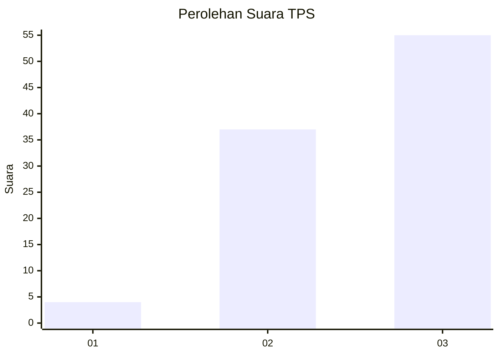
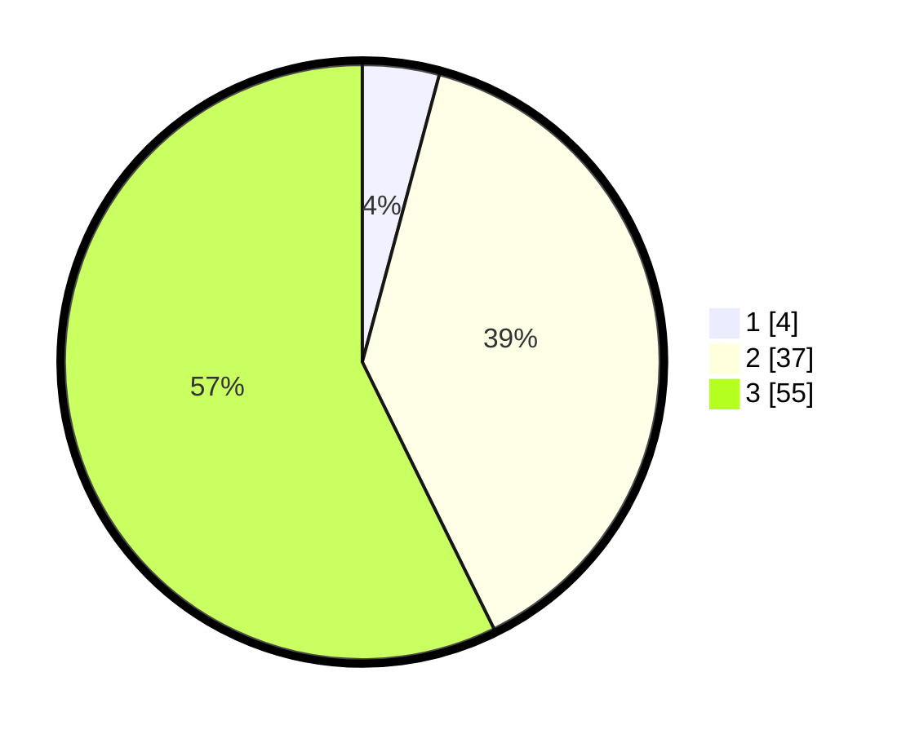

# Hasil

## Grafik

## Tabel

| No. | Nama Paslon    | Suara | Suara (raw) | Persentase |
|:--- |:-------------- | -----:| -----------:| ----------:|
| 1   | ANIES MUHAIMIN | 4     | [4][p-1]    | 4,17       |
| 2   | PRABOWO GIBRAN | 37    | [37][p-2]   | 38,54      |
| 3   | GANJAR MAHFUD  | 55    | [55][p-3]   | 57,29      |

[p-1]: https://github.com/gigit-pemilu/pemilu-2024-91-papua/blob/main/pilpres/hitung-suara/sub/91-papua/sub/06-biak-numfor/sub/04-numfor-barat/sub/2014-kansai/sub/001-tps/sub/paslon-1.txt
[p-2]: https://github.com/gigit-pemilu/pemilu-2024-91-papua/blob/main/pilpres/hitung-suara/sub/91-papua/sub/06-biak-numfor/sub/04-numfor-barat/sub/2014-kansai/sub/001-tps/sub/paslon-2.txt
[p-3]: https://github.com/gigit-pemilu/pemilu-2024-91-papua/blob/main/pilpres/hitung-suara/sub/91-papua/sub/06-biak-numfor/sub/04-numfor-barat/sub/2014-kansai/sub/001-tps/sub/paslon-3.txt

## Foto C Plano

https://sirekap-obj-formc.kpu.go.id/6b0a/pemilu/ppwp/91/06/04/20/14/9106042014001-20240215-164024--c9a8a5e0-21a6-414c-a2c0-9a4ef0c15f2d.jpg

https://sirekap-obj-formc.kpu.go.id/6b0a/pemilu/ppwp/91/06/04/20/14/9106042014001-20240215-142606--f12e24fa-e957-43ef-9d0c-229809be219e.jpg

https://sirekap-obj-formc.kpu.go.id/6b0a/pemilu/ppwp/91/06/04/20/14/9106042014001-20240215-170915--8b94eec2-0937-40fd-b806-9cb16d7553a8.jpg

## Metadata

| Key        | Value               |
| ---------- | ------------------- |
| Time Stamp | 2024-02-25 16:00:00 |

