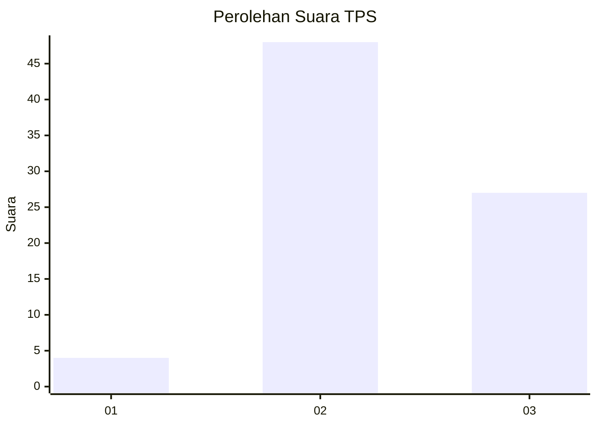
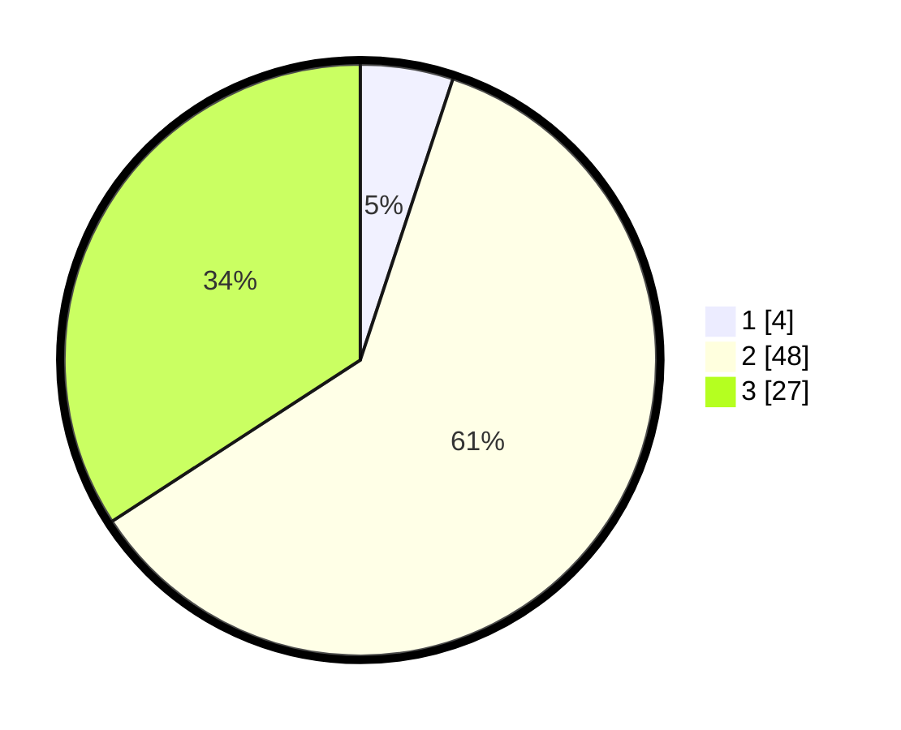

# Hasil

## Grafik

## Tabel

| No. | Nama Paslon    | Suara | Suara (raw) | Persentase |
|:--- |:-------------- | -----:| -----------:| ----------:|
| 1   | ANIES MUHAIMIN | 4     | [4][p-1]    | 5,06       |
| 2   | PRABOWO GIBRAN | 48    | [48][p-2]   | 60,76      |
| 3   | GANJAR MAHFUD  | 27    | [27][p-3]   | 34,18      |

[p-1]: https://github.com/gigit-pemilu/pemilu-2024-91-papua/blob/main/pilpres/hitung-suara/sub/91-papua/sub/06-biak-numfor/sub/04-numfor-barat/sub/2015-pomdori/sub/001-tps/sub/paslon-1.txt
[p-2]: https://github.com/gigit-pemilu/pemilu-2024-91-papua/blob/main/pilpres/hitung-suara/sub/91-papua/sub/06-biak-numfor/sub/04-numfor-barat/sub/2015-pomdori/sub/001-tps/sub/paslon-2.txt
[p-3]: https://github.com/gigit-pemilu/pemilu-2024-91-papua/blob/main/pilpres/hitung-suara/sub/91-papua/sub/06-biak-numfor/sub/04-numfor-barat/sub/2015-pomdori/sub/001-tps/sub/paslon-3.txt

## Foto C Plano

https://sirekap-obj-formc.kpu.go.id/bbdc/pemilu/ppwp/91/06/04/20/15/9106042015001-20240215-132959--32e2327b-efe4-4c67-b39f-4d68c26807ab.jpg

https://sirekap-obj-formc.kpu.go.id/bbdc/pemilu/ppwp/91/06/04/20/15/9106042015001-20240215-133239--1c1f7a90-e9b9-4fd5-8c5c-8a59269e2fd2.jpg

https://sirekap-obj-formc.kpu.go.id/bbdc/pemilu/ppwp/91/06/04/20/15/9106042015001-20240215-133434--6cbbdb20-12e1-4af0-8732-e3d6576f5325.jpg

## Metadata

| Key        | Value               |
| ---------- | ------------------- |
| Time Stamp | 2024-02-25 15:00:00 |

