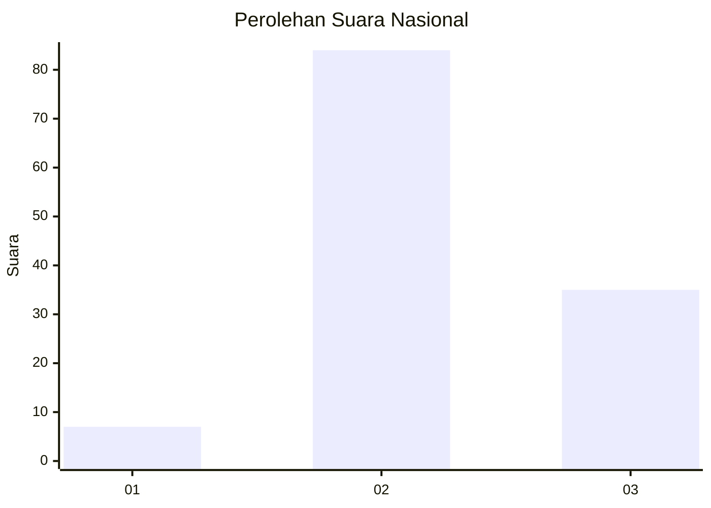
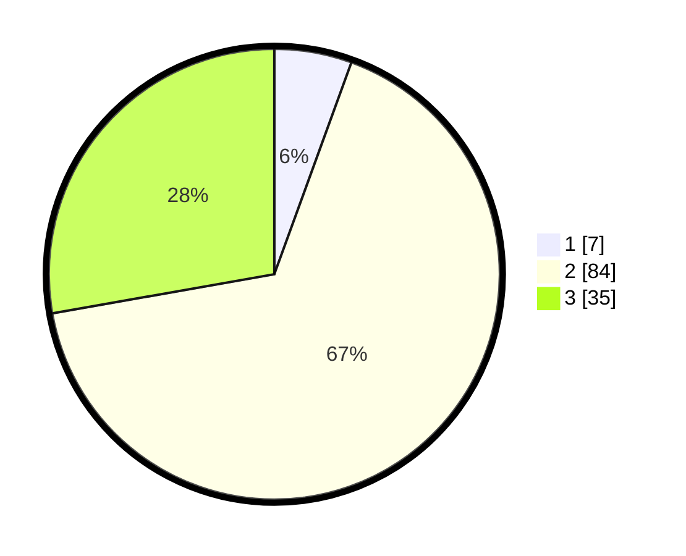

# Hasil

## Grafik

## Tabel

| No. | Nama Paslon    | Suara | Suara (raw) | Persentase |
|:--- |:-------------- | -----:| -----------:| ----------:|
| 1   | ANIES MUHAIMIN | 7     | [7][p-1]    | 5,56       |
| 2   | PRABOWO GIBRAN | 84    | [84][p-2]   | 66,67      |
| 3   | GANJAR MAHFUD  | 35    | [35][p-3]   | 27,78      |

[p-1]: https://github.com/gigit-pemilu/pemilu-2024/blob/main/pilpres/hitung-suara/sub/91-papua/sub/06-biak-numfor/sub/04-numfor-barat/sub/2020-mambodo-sawai/sub/001-tps/sub/paslon-1.txt
[p-2]: https://github.com/gigit-pemilu/pemilu-2024/blob/main/pilpres/hitung-suara/sub/91-papua/sub/06-biak-numfor/sub/04-numfor-barat/sub/2020-mambodo-sawai/sub/001-tps/sub/paslon-2.txt
[p-3]: https://github.com/gigit-pemilu/pemilu-2024/blob/main/pilpres/hitung-suara/sub/91-papua/sub/06-biak-numfor/sub/04-numfor-barat/sub/2020-mambodo-sawai/sub/001-tps/sub/paslon-3.txt

## Foto C Plano

https://sirekap-obj-formc.kpu.go.id/e055/pemilu/ppwp/91/06/04/20/20/9106042020001-20240215-001044--97136ab6-6d24-4f34-a55f-40da50e2a86b.jpg

https://sirekap-obj-formc.kpu.go.id/e055/pemilu/ppwp/91/06/04/20/20/9106042020001-20240215-001204--80ad7477-306d-498e-8f12-aa677aa60826.jpg

https://sirekap-obj-formc.kpu.go.id/e055/pemilu/ppwp/91/06/04/20/20/9106042020001-20240215-002159--b24850c5-6243-4422-9df9-a36e4a1837c0.jpg

## Metadata

| Key        | Value               |
| ---------- | ------------------- |
| Time Stamp | 2024-02-25 14:00:00 |

