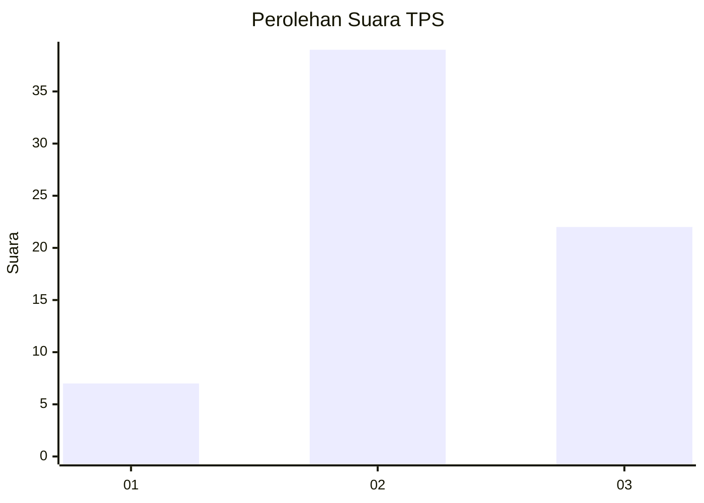
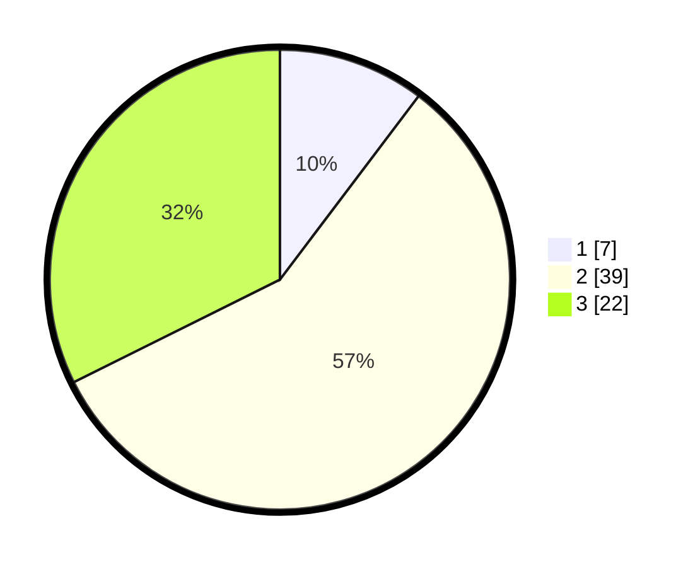

# Hasil

## Grafik

## Tabel

| No. | Nama Paslon    | Suara | Suara (raw) | Persentase |
|:--- |:-------------- | -----:| -----------:| ----------:|
| 1   | ANIES MUHAIMIN | 7     | [7][p-1]    | 10,29      |
| 2   | PRABOWO GIBRAN | 39    | [39][p-2]   | 57,35      |
| 3   | GANJAR MAHFUD  | 22    | [22][p-3]   | 32,35      |

[p-1]: https://github.com/gigit-pemilu/pemilu-2024-91-papua/blob/main/pilpres/hitung-suara/sub/91-papua/sub/06-biak-numfor/sub/05-numfor-timur/sub/2014-rarsibo/sub/001-tps/sub/paslon-1.txt
[p-2]: https://github.com/gigit-pemilu/pemilu-2024-91-papua/blob/main/pilpres/hitung-suara/sub/91-papua/sub/06-biak-numfor/sub/05-numfor-timur/sub/2014-rarsibo/sub/001-tps/sub/paslon-2.txt
[p-3]: https://github.com/gigit-pemilu/pemilu-2024-91-papua/blob/main/pilpres/hitung-suara/sub/91-papua/sub/06-biak-numfor/sub/05-numfor-timur/sub/2014-rarsibo/sub/001-tps/sub/paslon-3.txt

## Foto C Plano

https://sirekap-obj-formc.kpu.go.id/2628/pemilu/ppwp/91/06/05/20/14/9106052014001-20240215-150805--1955d846-9628-46a3-91b4-d631c8fc2618.jpg

https://sirekap-obj-formc.kpu.go.id/2628/pemilu/ppwp/91/06/05/20/14/9106052014001-20240215-144933--e4667686-9440-454e-aa74-373fa96b4db7.jpg

https://sirekap-obj-formc.kpu.go.id/2628/pemilu/ppwp/91/06/05/20/14/9106052014001-20240215-132155--4aa45825-192d-4cb2-b23b-4a5b99502dbb.jpg

## Metadata

| Key        | Value               |
| ---------- | ------------------- |
| Time Stamp | 2024-02-26 11:00:00 |

