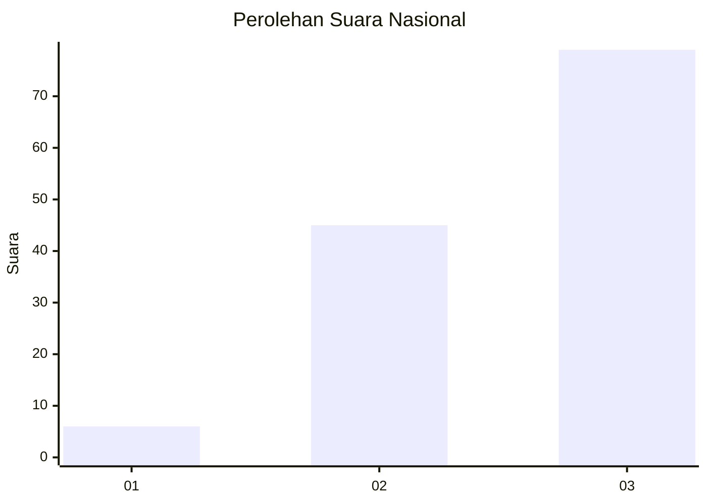
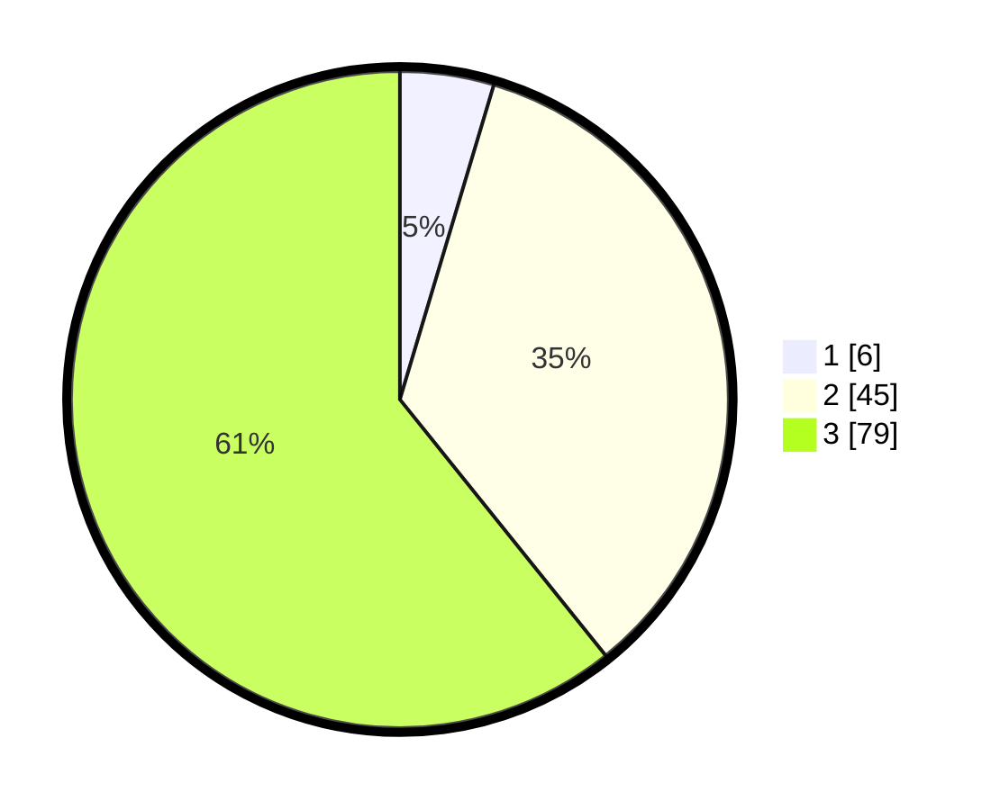

# Hasil

## Grafik

## Tabel

| No. | Nama Paslon    | Suara | Suara (raw) | Persentase |
|:--- |:-------------- | -----:| -----------:| ----------:|
| 1   | ANIES MUHAIMIN | 6     | [6][p-1]    | 4,62       |
| 2   | PRABOWO GIBRAN | 45    | [45][p-2]   | 34,62      |
| 3   | GANJAR MAHFUD  | 79    | [79][p-3]   | 60,77      |

[p-1]: https://github.com/gigit-pemilu/pemilu-2024/blob/main/pilpres/hitung-suara/sub/91-papua/sub/06-biak-numfor/sub/08-biak-barat/sub/2001-andei/sub/001-tps/sub/paslon-1.txt
[p-2]: https://github.com/gigit-pemilu/pemilu-2024/blob/main/pilpres/hitung-suara/sub/91-papua/sub/06-biak-numfor/sub/08-biak-barat/sub/2001-andei/sub/001-tps/sub/paslon-2.txt
[p-3]: https://github.com/gigit-pemilu/pemilu-2024/blob/main/pilpres/hitung-suara/sub/91-papua/sub/06-biak-numfor/sub/08-biak-barat/sub/2001-andei/sub/001-tps/sub/paslon-3.txt

## Foto C Plano

https://sirekap-obj-formc.kpu.go.id/223d/pemilu/ppwp/91/06/08/20/01/9106082001001-20240215-142459--9cb9dab5-3223-4b13-9c4a-e11ca6048456.jpg

https://sirekap-obj-formc.kpu.go.id/223d/pemilu/ppwp/91/06/08/20/01/9106082001001-20240215-171800--777e1bed-9058-46c7-a290-8ee77442c1f8.jpg

https://sirekap-obj-formc.kpu.go.id/223d/pemilu/ppwp/91/06/08/20/01/9106082001001-20240215-172451--27a8ccb5-a544-4512-ac47-57a01a8550d2.jpg

## Metadata

| Key        | Value               |
| ---------- | ------------------- |
| Time Stamp | 2024-02-28 10:00:00 |

## DATA PEMILIH TETAP

Jumlah pemilih dalam DPT: **175**.
 * L: **93**.
 * P: **82**.

## DATA PENGGUNA HAK PILIH

Jumlah pengguna hak pilih dalam DPT: **130**.
 * L: **64**.
 * P: **66**.

Jumlah pengguna hak pilih dalam DPTb: **0**.
 * L: **0**.
 * P: **0**.

Jumlah pengguna hak pilih dalam DPK: **130**.
 * L: **64**.
 * P: **66**.

Jumlah pengguna hak pilih: **130**.
 * L: **64**.
 * P: **66**.

## JUMLAH SUARA SAH DAN TIDAK SAH

JUMLAH SELURUH SUARA SAH: **130**.

JUMLAH SUARA TIDAK SAH: **0**.

JUMLAH SELURUH SUARA SAH DAN SUARA TIDAK SAH: **130**.

