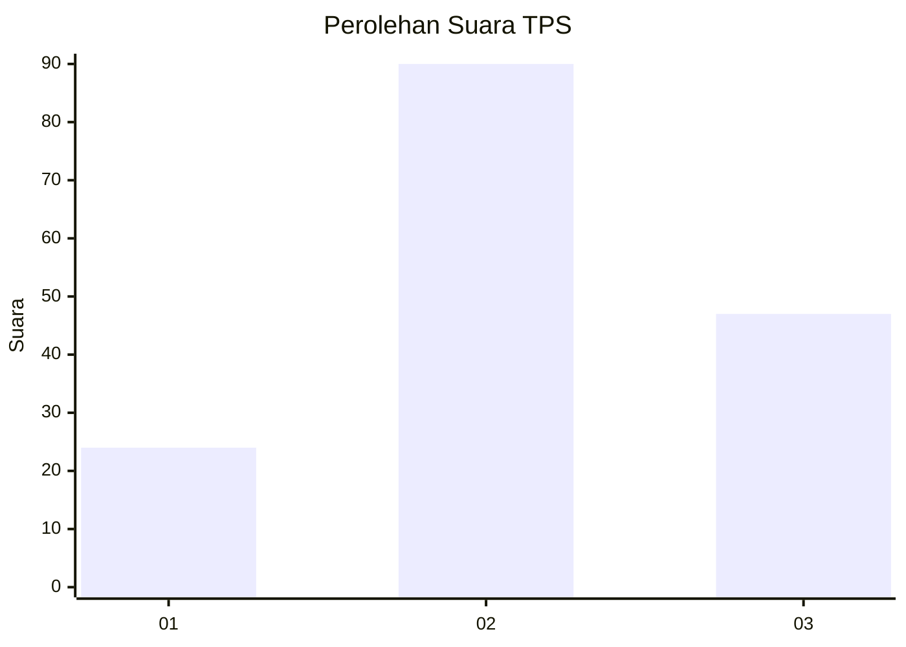
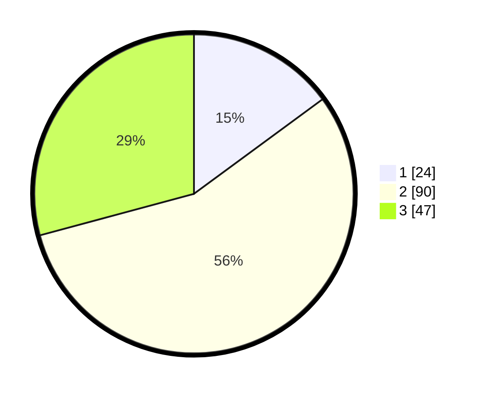

# Hasil

## Grafik

## Tabel

| No. | Nama Paslon    | Suara | Suara (raw) | Persentase |
|:--- |:-------------- | -----:| -----------:| ----------:|
| 1   | ANIES MUHAIMIN | 24    | [24][p-1]   | 14,91      |
| 2   | PRABOWO GIBRAN | 90    | [90][p-2]   | 55,90      |
| 3   | GANJAR MAHFUD  | 47    | [47][p-3]   | 29,19      |

[p-1]: https://github.com/gigit-pemilu/pemilu-2024-91-papua/blob/main/pilpres/hitung-suara/sub/91-papua/sub/06-biak-numfor/sub/08-biak-barat/sub/2006-ampunbukor/sub/001-tps/sub/paslon-1.txt
[p-2]: https://github.com/gigit-pemilu/pemilu-2024-91-papua/blob/main/pilpres/hitung-suara/sub/91-papua/sub/06-biak-numfor/sub/08-biak-barat/sub/2006-ampunbukor/sub/001-tps/sub/paslon-2.txt
[p-3]: https://github.com/gigit-pemilu/pemilu-2024-91-papua/blob/main/pilpres/hitung-suara/sub/91-papua/sub/06-biak-numfor/sub/08-biak-barat/sub/2006-ampunbukor/sub/001-tps/sub/paslon-3.txt

## Foto C Plano

https://sirekap-obj-formc.kpu.go.id/6186/pemilu/ppwp/91/06/08/20/06/9106082006001-20240214-223720--1a8ca918-a1af-483f-a447-b866099531cc.jpg

https://sirekap-obj-formc.kpu.go.id/6186/pemilu/ppwp/91/06/08/20/06/9106082006001-20240214-223446--eeb97c16-87a0-4094-99e6-143a7ee15b0b.jpg

https://sirekap-obj-formc.kpu.go.id/6186/pemilu/ppwp/91/06/08/20/06/9106082006001-20240214-223623--ade40d17-47df-4fcd-9df9-c7600ec4e915.jpg

## Metadata

| Key        | Value               |
| ---------- | ------------------- |
| Time Stamp | 2024-02-16 12:51:22 |

## DATA PEMILIH TETAP

Jumlah pemilih dalam DPT: **229**.
 * L: **112**.
 * P: **112**.

## DATA PENGGUNA HAK PILIH

Jumlah pengguna hak pilih dalam DPT: **161**.
 * L: **74**.
 * P: **87**.

Jumlah pengguna hak pilih dalam DPTb: **0**.
 * L: **0**.
 * P: **0**.

Jumlah pengguna hak pilih dalam DPK: **0**.
 * L: **0**.
 * P: **0**.

Jumlah pengguna hak pilih: **161**.
 * L: **74**.
 * P: **87**.

## JUMLAH SUARA SAH DAN TIDAK SAH

JUMLAH SELURUH SUARA SAH: **161**.

JUMLAH SUARA TIDAK SAH: **0**.

JUMLAH SELURUH SUARA SAH DAN SUARA TIDAK SAH: **161**.

