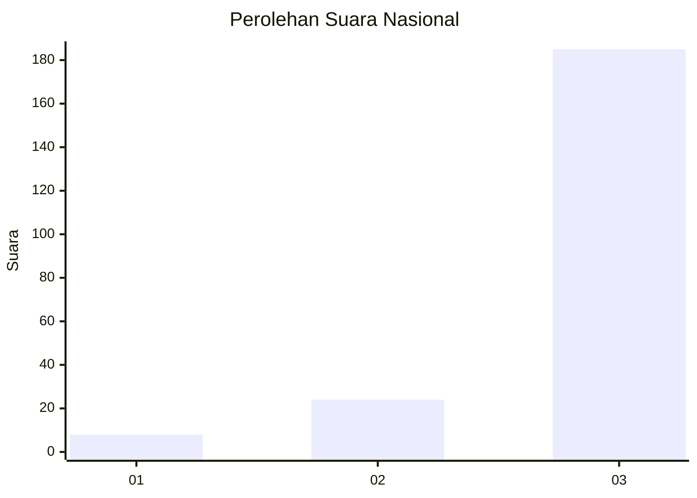
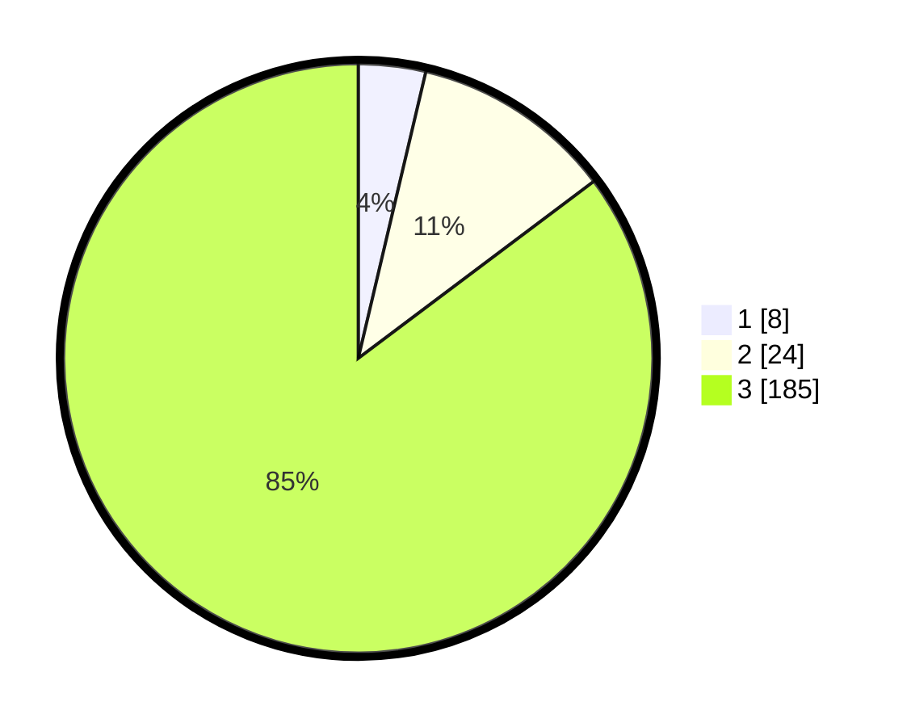

# Hasil

## Grafik

## Tabel

| No. | Nama Paslon    | Suara | Suara (raw) | Persentase |
|:--- |:-------------- | -----:| -----------:| ----------:|
| 1   | ANIES MUHAIMIN | 8     | [8][p-1]    | 3,69       |
| 2   | PRABOWO GIBRAN | 24    | [24][p-2]   | 11,06      |
| 3   | GANJAR MAHFUD  | 185   | [185][p-3]  | 85,25      |

[p-1]: https://github.com/gigit-pemilu/pemilu-2024/blob/main/pilpres/hitung-suara/sub/91-papua/sub/06-biak-numfor/sub/08-biak-barat/sub/2008-wasyai/sub/001-tps/sub/paslon-1.txt
[p-2]: https://github.com/gigit-pemilu/pemilu-2024/blob/main/pilpres/hitung-suara/sub/91-papua/sub/06-biak-numfor/sub/08-biak-barat/sub/2008-wasyai/sub/001-tps/sub/paslon-2.txt
[p-3]: https://github.com/gigit-pemilu/pemilu-2024/blob/main/pilpres/hitung-suara/sub/91-papua/sub/06-biak-numfor/sub/08-biak-barat/sub/2008-wasyai/sub/001-tps/sub/paslon-3.txt

## Foto C Plano

https://sirekap-obj-formc.kpu.go.id/001b/pemilu/ppwp/91/06/08/20/08/9106082008001-20240215-104741--b0d3d98f-98a6-473c-8c54-84438559b624.jpg

https://sirekap-obj-formc.kpu.go.id/001b/pemilu/ppwp/91/06/08/20/08/9106082008001-20240215-104922--6cab2fef-b267-454f-9660-d6703db62f76.jpg

https://sirekap-obj-formc.kpu.go.id/001b/pemilu/ppwp/91/06/08/20/08/9106082008001-20240215-105224--3bee57cc-d03b-4fc6-9d85-505fc04558c8.jpg

## Metadata

| Key        | Value               |
| ---------- | ------------------- |
| Time Stamp | 2024-02-25 12:00:00 |

