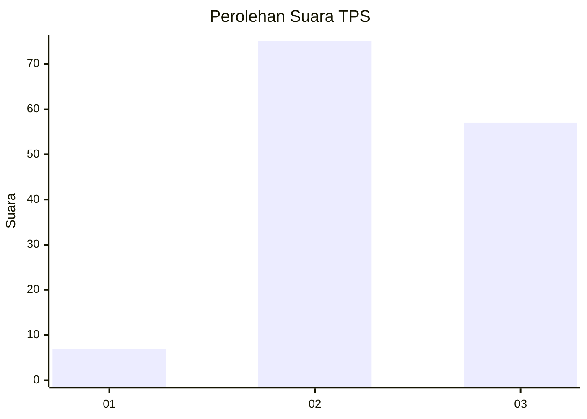
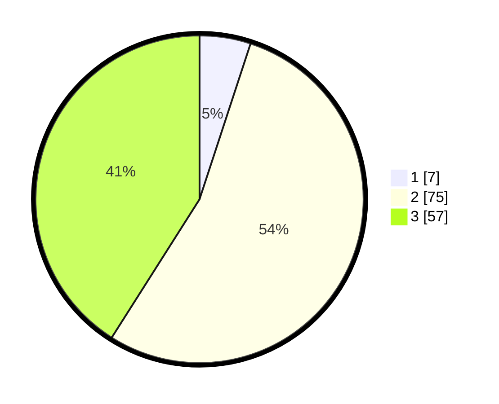

# Hasil

## Grafik

## Tabel

| No. | Nama Paslon    | Suara | Suara (raw) | Persentase |
|:--- |:-------------- | -----:| -----------:| ----------:|
| 1   | ANIES MUHAIMIN | 7     | [7][p-1]    | 5,04       |
| 2   | PRABOWO GIBRAN | 75    | [75][p-2]   | 53,96      |
| 3   | GANJAR MAHFUD  | 57    | [57][p-3]   | 41,01      |

[p-1]: https://github.com/gigit-pemilu/pemilu-2024-91-papua/blob/main/pilpres/hitung-suara/sub/91-papua/sub/06-biak-numfor/sub/08-biak-barat/sub/2010-warberik/sub/001-tps/sub/paslon-1.txt
[p-2]: https://github.com/gigit-pemilu/pemilu-2024-91-papua/blob/main/pilpres/hitung-suara/sub/91-papua/sub/06-biak-numfor/sub/08-biak-barat/sub/2010-warberik/sub/001-tps/sub/paslon-2.txt
[p-3]: https://github.com/gigit-pemilu/pemilu-2024-91-papua/blob/main/pilpres/hitung-suara/sub/91-papua/sub/06-biak-numfor/sub/08-biak-barat/sub/2010-warberik/sub/001-tps/sub/paslon-3.txt

## Foto C Plano

https://sirekap-obj-formc.kpu.go.id/ba98/pemilu/ppwp/91/06/08/20/10/9106082010001-20240215-144036--50de9573-e7fd-4831-9b6b-3e8acc24a9db.jpg

https://sirekap-obj-formc.kpu.go.id/ba98/pemilu/ppwp/91/06/08/20/10/9106082010001-20240215-144355--718dca44-474d-44c6-b66a-1fccad432c9a.jpg

https://sirekap-obj-formc.kpu.go.id/ba98/pemilu/ppwp/91/06/08/20/10/9106082010001-20240215-144436--e653683f-b68c-4165-b423-3022b0e91104.jpg

## Metadata

| Key        | Value               |
| ---------- | ------------------- |
| Time Stamp | 2024-02-25 21:00:00 |

