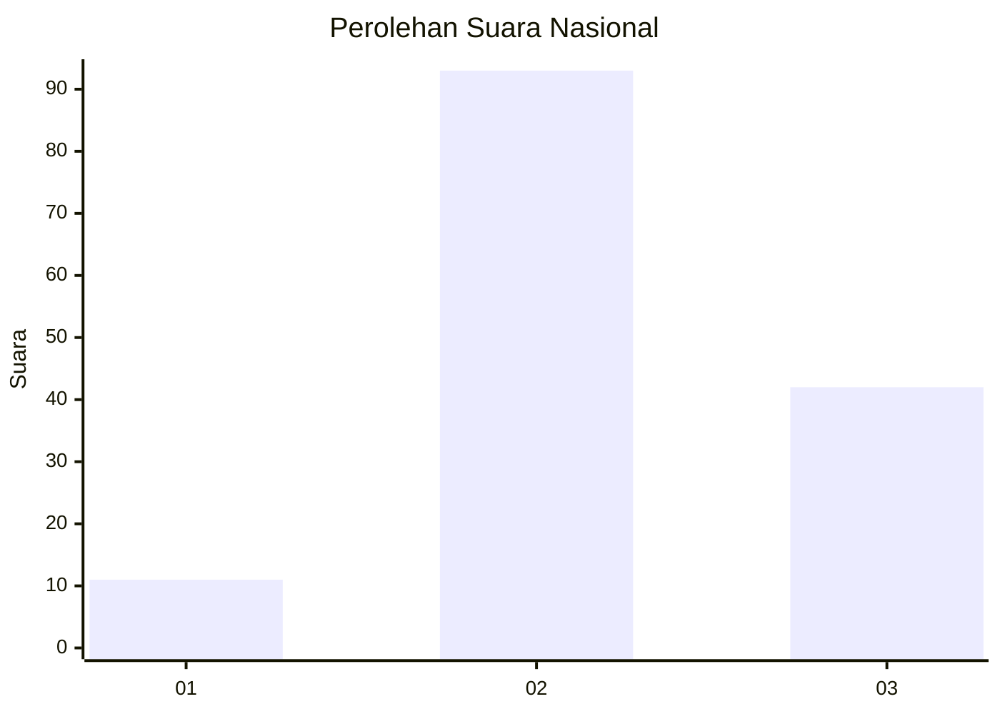
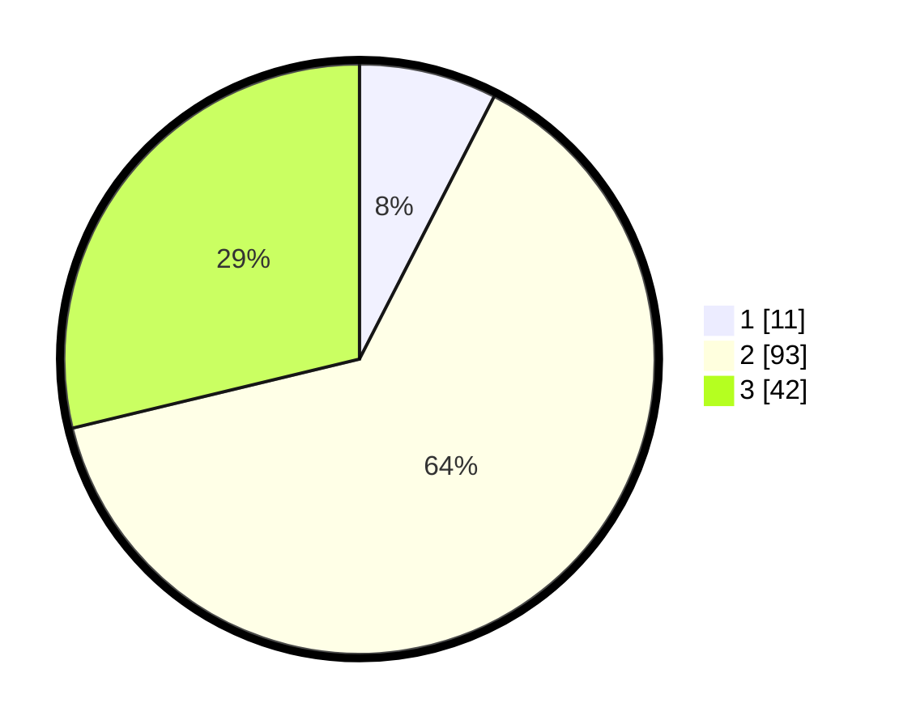

# Hasil

## Grafik

## Tabel

| No. | Nama Paslon    | Suara | Suara (raw) | Persentase |
|:--- |:-------------- | -----:| -----------:| ----------:|
| 1   | ANIES MUHAIMIN | 11    | [11][p-1]   | 7,53       |
| 2   | PRABOWO GIBRAN | 93    | [93][p-2]   | 63,70      |
| 3   | GANJAR MAHFUD  | 42    | [42][p-3]   | 28,77      |

[p-1]: https://github.com/gigit-pemilu/pemilu-2024/blob/main/pilpres/hitung-suara/sub/91-papua/sub/06-biak-numfor/sub/08-biak-barat/sub/2012-yomdori/sub/001-tps/sub/paslon-1.txt
[p-2]: https://github.com/gigit-pemilu/pemilu-2024/blob/main/pilpres/hitung-suara/sub/91-papua/sub/06-biak-numfor/sub/08-biak-barat/sub/2012-yomdori/sub/001-tps/sub/paslon-2.txt
[p-3]: https://github.com/gigit-pemilu/pemilu-2024/blob/main/pilpres/hitung-suara/sub/91-papua/sub/06-biak-numfor/sub/08-biak-barat/sub/2012-yomdori/sub/001-tps/sub/paslon-3.txt

## Foto C Plano

https://sirekap-obj-formc.kpu.go.id/30f4/pemilu/ppwp/91/06/08/20/12/9106082012001-20240215-104802--b91f672c-496f-46f4-b2c0-0b1ce2047e35.jpg

https://sirekap-obj-formc.kpu.go.id/30f4/pemilu/ppwp/91/06/08/20/12/9106082012001-20240215-191839--70934ec0-2073-4983-a6a9-fcf044990120.jpg

https://sirekap-obj-formc.kpu.go.id/30f4/pemilu/ppwp/91/06/08/20/12/9106082012001-20240215-154356--52f30039-bdc1-43c9-802f-564c63b5d5f6.jpg

## Metadata

| Key        | Value               |
| ---------- | ------------------- |
| Time Stamp | 2024-02-27 21:00:04 |

