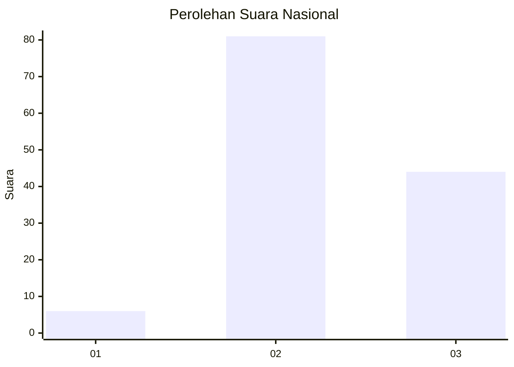
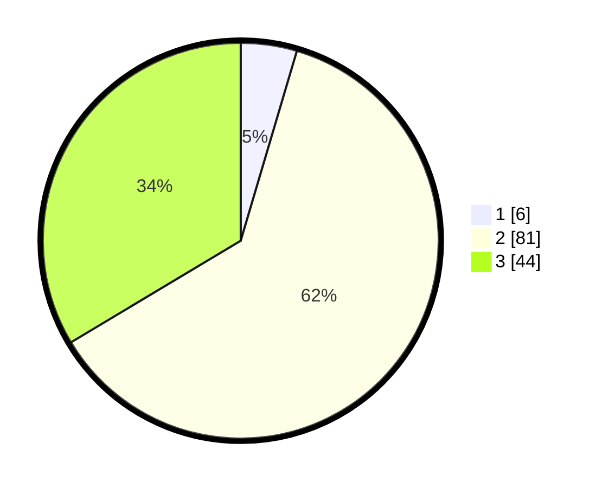

# Hasil

## Grafik

## Tabel

| No. | Nama Paslon    | Suara | Suara (raw) | Persentase |
|:--- |:-------------- | -----:| -----------:| ----------:|
| 1   | ANIES MUHAIMIN | 6     | [6][p-1]    | 4,58       |
| 2   | PRABOWO GIBRAN | 81    | [81][p-2]   | 61,83      |
| 3   | GANJAR MAHFUD  | 44    | [44][p-3]   | 33,59      |

[p-1]: https://github.com/gigit-pemilu/pemilu-2024/blob/main/pilpres/hitung-suara/sub/91-papua/sub/06-biak-numfor/sub/08-biak-barat/sub/2012-yomdori/sub/002-tps/sub/paslon-1.txt
[p-2]: https://github.com/gigit-pemilu/pemilu-2024/blob/main/pilpres/hitung-suara/sub/91-papua/sub/06-biak-numfor/sub/08-biak-barat/sub/2012-yomdori/sub/002-tps/sub/paslon-2.txt
[p-3]: https://github.com/gigit-pemilu/pemilu-2024/blob/main/pilpres/hitung-suara/sub/91-papua/sub/06-biak-numfor/sub/08-biak-barat/sub/2012-yomdori/sub/002-tps/sub/paslon-3.txt

## Foto C Plano

https://sirekap-obj-formc.kpu.go.id/fc7e/pemilu/ppwp/91/06/08/20/12/9106082012002-20240215-172526--d00c31c8-11ec-4e2c-9490-306518517e2a.jpg

https://sirekap-obj-formc.kpu.go.id/fc7e/pemilu/ppwp/91/06/08/20/12/9106082012002-20240215-172923--6e952734-ab1a-419e-9093-1177de96a6d8.jpg

https://sirekap-obj-formc.kpu.go.id/fc7e/pemilu/ppwp/91/06/08/20/12/9106082012002-20240215-173110--f4ea27f0-5ee9-4fee-bdc7-6ac334f53be3.jpg

## Metadata

| Key        | Value               |
| ---------- | ------------------- |
| Time Stamp | 2024-02-25 21:00:00 |

