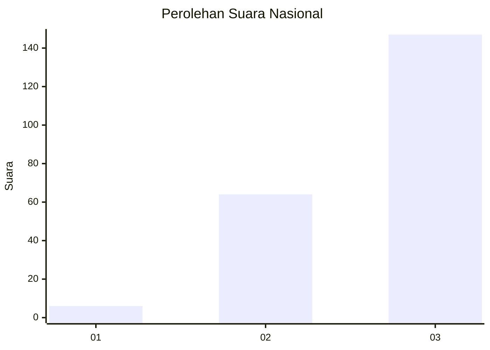
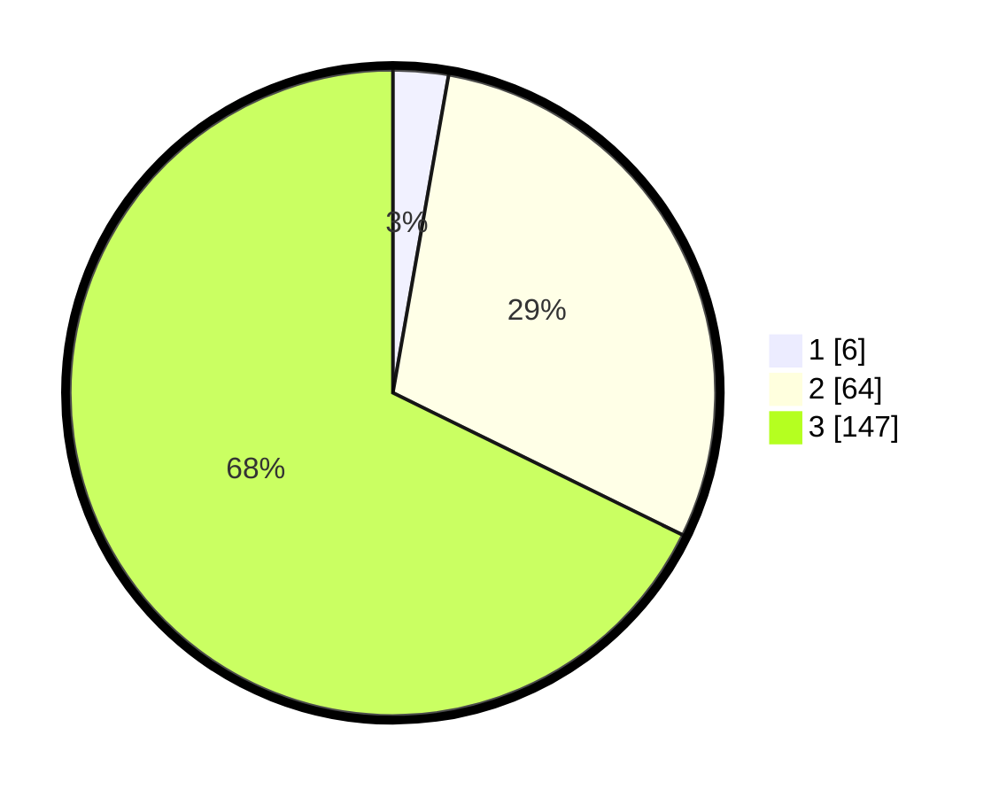

# Hasil

## Grafik

## Tabel

| No. | Nama Paslon    | Suara | Suara (raw) | Persentase |
|:--- |:-------------- | -----:| -----------:| ----------:|
| 1   | ANIES MUHAIMIN | 6     | [6][p-1]    | 2,76       |
| 2   | PRABOWO GIBRAN | 64    | [64][p-2]   | 29,49      |
| 3   | GANJAR MAHFUD  | 147   | [147][p-3]  | 67,74      |

[p-1]: https://github.com/gigit-pemilu/pemilu-2024/blob/main/pilpres/hitung-suara/sub/91-papua/sub/06-biak-numfor/sub/08-biak-barat/sub/2021-insiri/sub/001-tps/sub/paslon-1.txt
[p-2]: https://github.com/gigit-pemilu/pemilu-2024/blob/main/pilpres/hitung-suara/sub/91-papua/sub/06-biak-numfor/sub/08-biak-barat/sub/2021-insiri/sub/001-tps/sub/paslon-2.txt
[p-3]: https://github.com/gigit-pemilu/pemilu-2024/blob/main/pilpres/hitung-suara/sub/91-papua/sub/06-biak-numfor/sub/08-biak-barat/sub/2021-insiri/sub/001-tps/sub/paslon-3.txt

## Foto C Plano

https://sirekap-obj-formc.kpu.go.id/9982/pemilu/ppwp/91/06/08/20/21/9106082021001-20240215-101806--e0c401d3-e9f8-4b48-8843-85c29a65df81.jpg

https://sirekap-obj-formc.kpu.go.id/9982/pemilu/ppwp/91/06/08/20/21/9106082021001-20240215-102033--8494a7a9-6bab-40d8-bda3-0f6535b47be8.jpg

https://sirekap-obj-formc.kpu.go.id/9982/pemilu/ppwp/91/06/08/20/21/9106082021001-20240215-161427--6aaeb5df-654b-43d0-806e-d6178265c01b.jpg

## Metadata

| Key        | Value               |
| ---------- | ------------------- |
| Time Stamp | 2024-02-15 16:30:25 |

