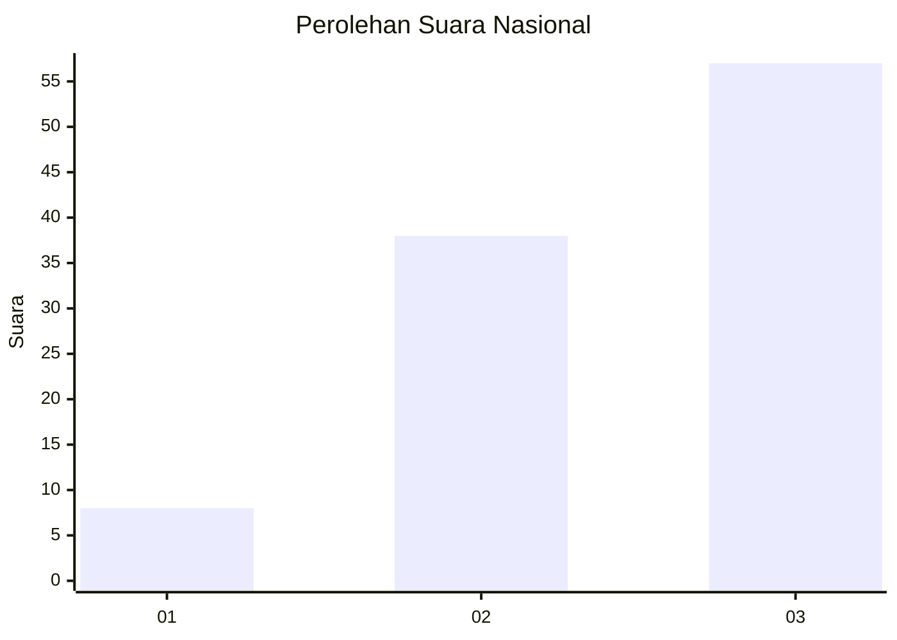
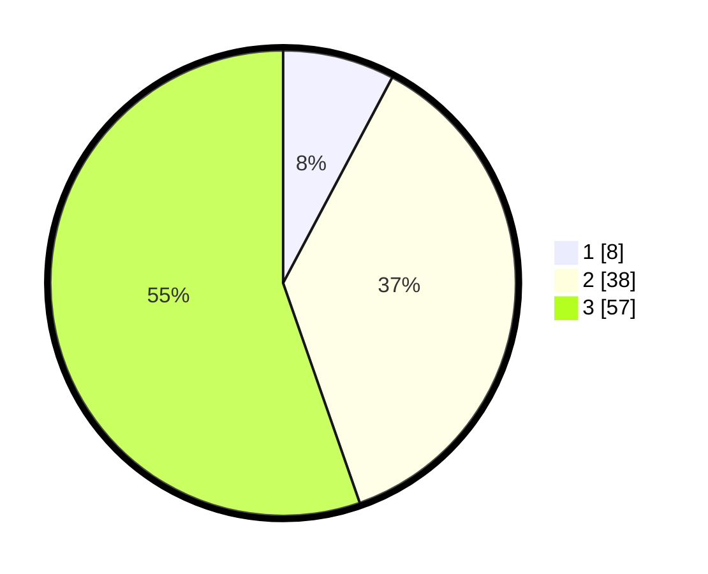

# Hasil

## Grafik

## Tabel

| No. | Nama Paslon    | Suara | Suara (raw) | Persentase |
|:--- |:-------------- | -----:| -----------:| ----------:|
| 1   | ANIES MUHAIMIN | 8     | [8][p-1]    | 7,77       |
| 2   | PRABOWO GIBRAN | 38    | [38][p-2]   | 36,89      |
| 3   | GANJAR MAHFUD  | 57    | [57][p-3]   | 55,34      |

[p-1]: https://github.com/gigit-pemilu/pemilu-2024/blob/main/pilpres/hitung-suara/sub/91-papua/sub/06-biak-numfor/sub/08-biak-barat/sub/2029-rarsbari/sub/001-tps/sub/paslon-1.txt
[p-2]: https://github.com/gigit-pemilu/pemilu-2024/blob/main/pilpres/hitung-suara/sub/91-papua/sub/06-biak-numfor/sub/08-biak-barat/sub/2029-rarsbari/sub/001-tps/sub/paslon-2.txt
[p-3]: https://github.com/gigit-pemilu/pemilu-2024/blob/main/pilpres/hitung-suara/sub/91-papua/sub/06-biak-numfor/sub/08-biak-barat/sub/2029-rarsbari/sub/001-tps/sub/paslon-3.txt

## Foto C Plano

https://sirekap-obj-formc.kpu.go.id/4220/pemilu/ppwp/91/06/08/20/29/9106082029001-20240215-162629--b5e1f81f-25dd-4cbb-8128-44f7e4aa7572.jpg

https://sirekap-obj-formc.kpu.go.id/4220/pemilu/ppwp/91/06/08/20/29/9106082029001-20240215-114607--73ac8152-89e8-4cb8-8c84-22e7a2f8dc5b.jpg

## Metadata

| Key        | Value               |
| ---------- | ------------------- |
| Time Stamp | 2024-02-24 22:31:28 |

