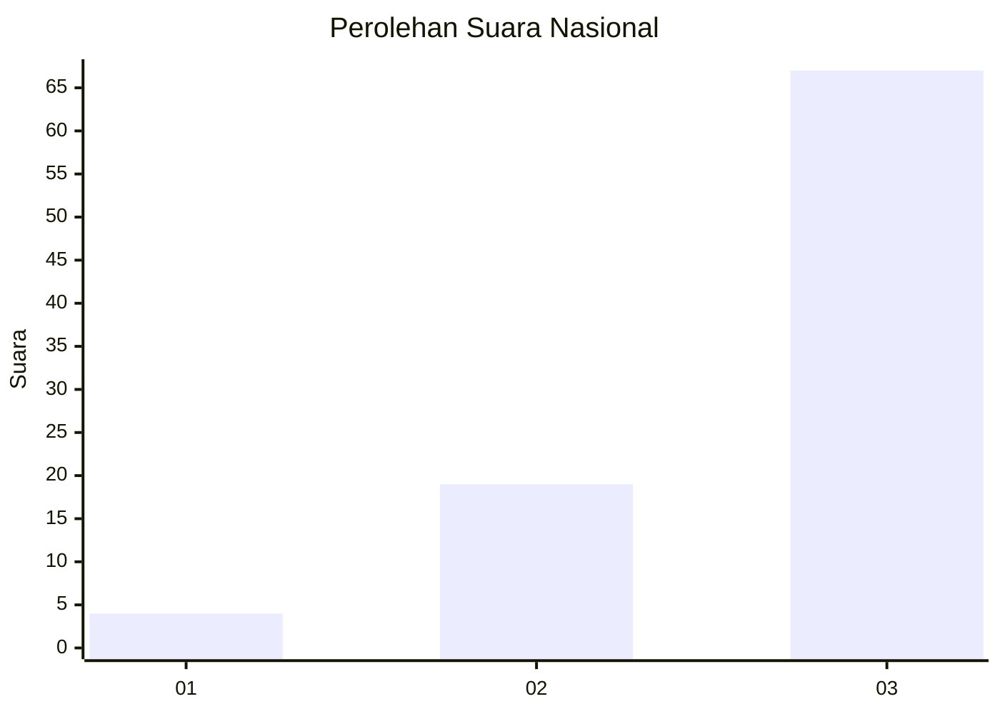
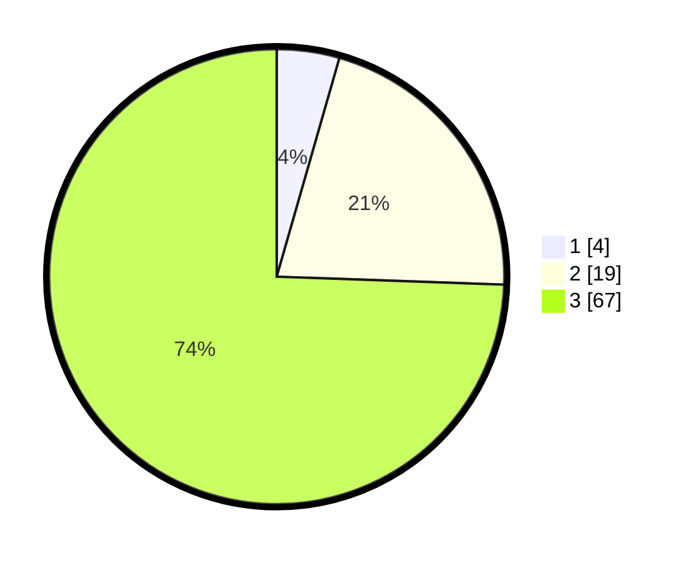

# Hasil

## Grafik

## Tabel

| No. | Nama Paslon    | Suara | Suara (raw) | Persentase |
|:--- |:-------------- | -----:| -----------:| ----------:|
| 1   | ANIES MUHAIMIN | 4     | [4][p-1]    | 4,44       |
| 2   | PRABOWO GIBRAN | 19    | [19][p-2]   | 21,11      |
| 3   | GANJAR MAHFUD  | 67    | [67][p-3]   | 74,44      |

[p-1]: https://github.com/gigit-pemilu/pemilu-2024/blob/main/pilpres/hitung-suara/sub/91-papua/sub/06-biak-numfor/sub/08-biak-barat/sub/2032-dedifu/sub/001-tps/sub/paslon-1.txt
[p-2]: https://github.com/gigit-pemilu/pemilu-2024/blob/main/pilpres/hitung-suara/sub/91-papua/sub/06-biak-numfor/sub/08-biak-barat/sub/2032-dedifu/sub/001-tps/sub/paslon-2.txt
[p-3]: https://github.com/gigit-pemilu/pemilu-2024/blob/main/pilpres/hitung-suara/sub/91-papua/sub/06-biak-numfor/sub/08-biak-barat/sub/2032-dedifu/sub/001-tps/sub/paslon-3.txt

## Foto C Plano

https://sirekap-obj-formc.kpu.go.id/7ec4/pemilu/ppwp/91/06/08/20/32/9106082032001-20240215-183322--ec49a879-18bd-4fd6-948d-b97e9e854e5d.jpg

https://sirekap-obj-formc.kpu.go.id/7ec4/pemilu/ppwp/91/06/08/20/32/9106082032001-20240215-182502--9b83c8b9-791f-4f17-a36e-3528091ed884.jpg

## Metadata

| Key        | Value               |
| ---------- | ------------------- |
| Time Stamp | 2024-02-25 12:00:00 |

