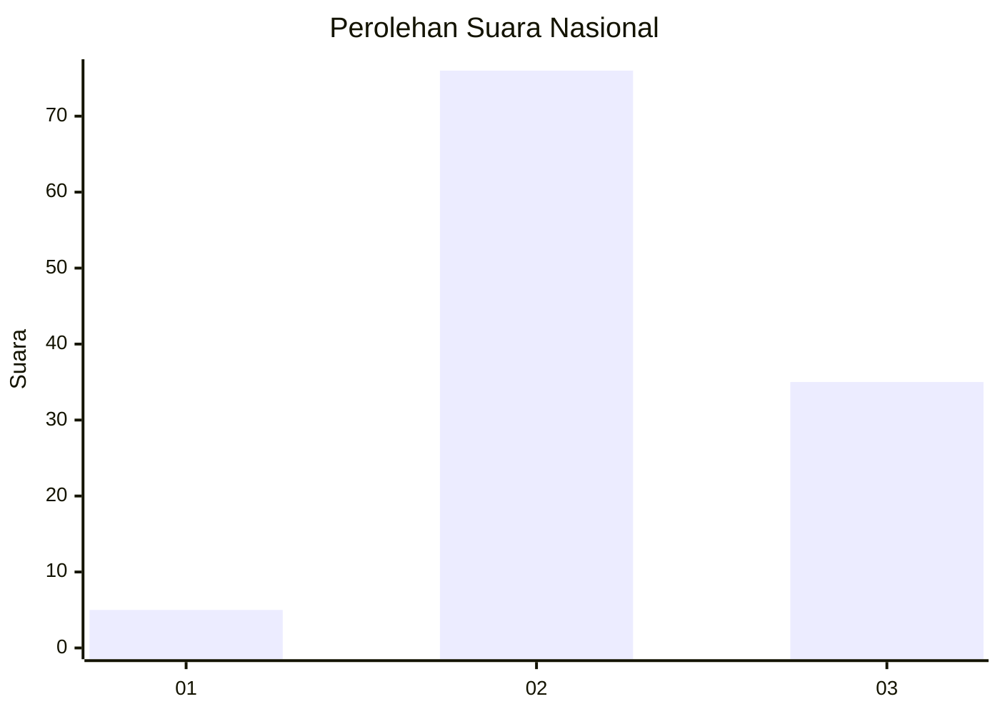
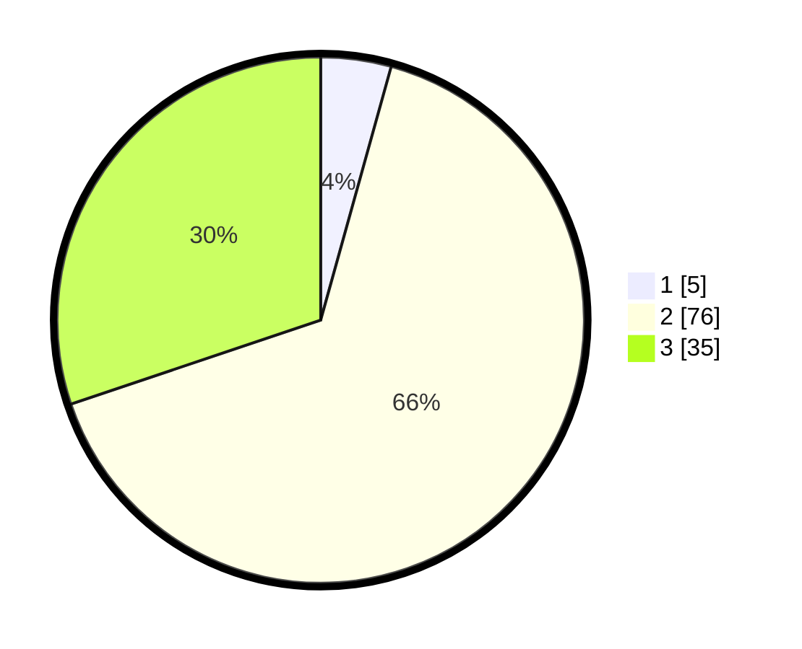

# Hasil

## Grafik

## Tabel

| No. | Nama Paslon    | Suara | Suara (raw) | Persentase |
|:--- |:-------------- | -----:| -----------:| ----------:|
| 1   | ANIES MUHAIMIN | 5     | [5][p-1]    | 4,31       |
| 2   | PRABOWO GIBRAN | 76    | [76][p-2]   | 65,52      |
| 3   | GANJAR MAHFUD  | 35    | [35][p-3]   | 30,17      |

[p-1]: https://github.com/gigit-pemilu/pemilu-2024/blob/main/pilpres/hitung-suara/sub/91-papua/sub/06-biak-numfor/sub/08-biak-barat/sub/2033-sopendo-sup-karkir/sub/001-tps/sub/paslon-1.txt
[p-2]: https://github.com/gigit-pemilu/pemilu-2024/blob/main/pilpres/hitung-suara/sub/91-papua/sub/06-biak-numfor/sub/08-biak-barat/sub/2033-sopendo-sup-karkir/sub/001-tps/sub/paslon-2.txt
[p-3]: https://github.com/gigit-pemilu/pemilu-2024/blob/main/pilpres/hitung-suara/sub/91-papua/sub/06-biak-numfor/sub/08-biak-barat/sub/2033-sopendo-sup-karkir/sub/001-tps/sub/paslon-3.txt

## Foto C Plano

https://sirekap-obj-formc.kpu.go.id/f01d/pemilu/ppwp/91/06/08/20/33/9106082033001-20240215-152838--d7d0f60f-152e-4f8c-922e-ce183596405f.jpg

https://sirekap-obj-formc.kpu.go.id/f01d/pemilu/ppwp/91/06/08/20/33/9106082033001-20240215-130205--82c7bbcb-0cef-4bb8-9ee9-4b3c935b0716.jpg

https://sirekap-obj-formc.kpu.go.id/f01d/pemilu/ppwp/91/06/08/20/33/9106082033001-20240215-154319--aeca18b6-4db1-4c5d-9c39-12044b7ac699.jpg

## Metadata

| Key        | Value               |
| ---------- | ------------------- |
| Time Stamp | 2024-02-25 13:00:00 |

