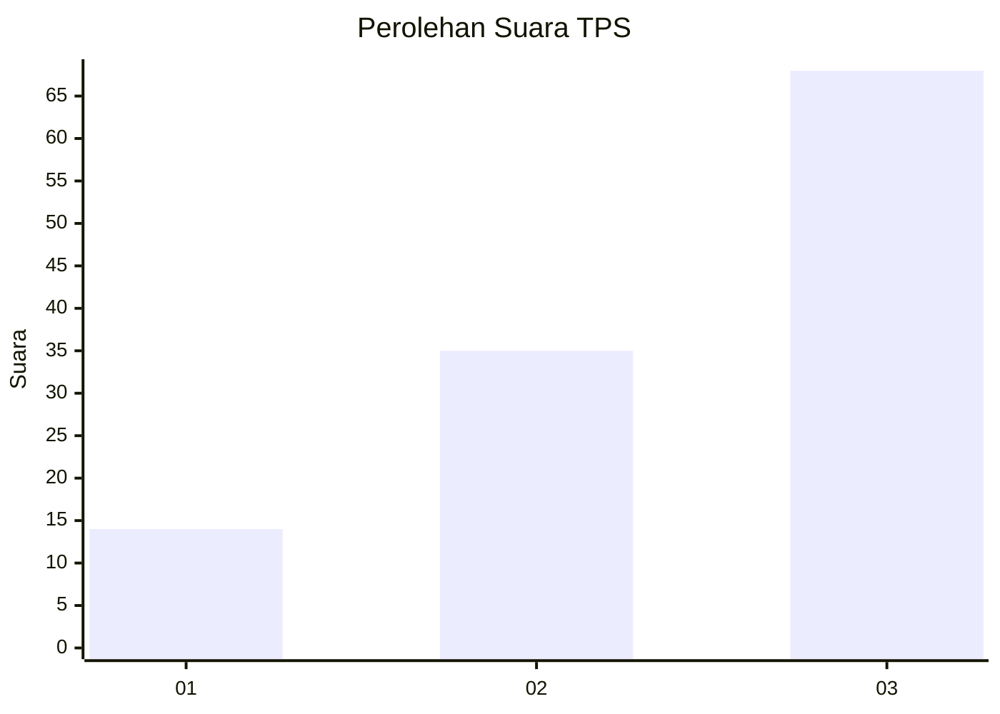
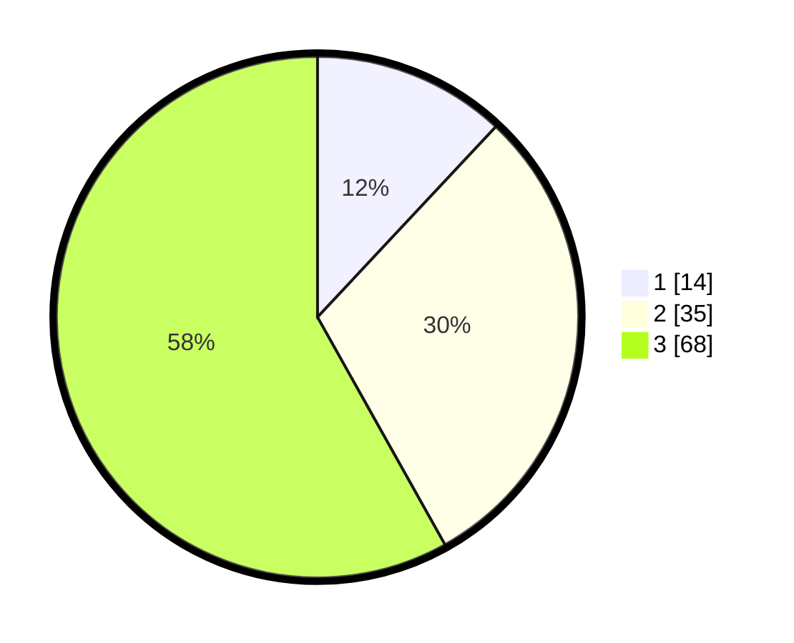

# Hasil

## Grafik

## Tabel

| No. | Nama Paslon    | Suara | Suara (raw) | Persentase |
|:--- |:-------------- | -----:| -----------:| ----------:|
| 1   | ANIES MUHAIMIN | 14    | [14][p-1]   | 11,97      |
| 2   | PRABOWO GIBRAN | 35    | [35][p-2]   | 29,91      |
| 3   | GANJAR MAHFUD  | 68    | [68][p-3]   | 58,12      |

[p-1]: https://github.com/gigit-pemilu/pemilu-2024-91-papua/blob/main/pilpres/hitung-suara/sub/91-papua/sub/06-biak-numfor/sub/09-warsa/sub/2009-inswambesi/sub/002-tps/sub/paslon-1.txt
[p-2]: https://github.com/gigit-pemilu/pemilu-2024-91-papua/blob/main/pilpres/hitung-suara/sub/91-papua/sub/06-biak-numfor/sub/09-warsa/sub/2009-inswambesi/sub/002-tps/sub/paslon-2.txt
[p-3]: https://github.com/gigit-pemilu/pemilu-2024-91-papua/blob/main/pilpres/hitung-suara/sub/91-papua/sub/06-biak-numfor/sub/09-warsa/sub/2009-inswambesi/sub/002-tps/sub/paslon-3.txt

## Foto C Plano

https://sirekap-obj-formc.kpu.go.id/52ad/pemilu/ppwp/91/06/09/20/09/9106092009002-20240215-231101--c7613078-c294-48d0-91e0-fdc47aa4fa8b.jpg

https://sirekap-obj-formc.kpu.go.id/52ad/pemilu/ppwp/91/06/09/20/09/9106092009002-20240215-230105--18f34fa1-69fc-4471-8c99-da8d61e5fdbb.jpg

https://sirekap-obj-formc.kpu.go.id/52ad/pemilu/ppwp/91/06/09/20/09/9106092009002-20240215-230952--d4642626-ac91-4f89-bf54-b2d83ec0d356.jpg

## Metadata

| Key        | Value               |
| ---------- | ------------------- |
| Time Stamp | 2024-02-24 22:31:28 |

## DATA PEMILIH TETAP

Jumlah pemilih dalam DPT: **131**.
 * L: **64**.
 * P: **67**.

## DATA PENGGUNA HAK PILIH

Jumlah pengguna hak pilih dalam DPT: **131**.
 * L: **64**.
 * P: **67**.

Jumlah pengguna hak pilih dalam DPTb: **0**.
 * L: **0**.
 * P: **0**.

Jumlah pengguna hak pilih dalam DPK: **1**.
 * L: **1**.
 * P: **0**.

Jumlah pengguna hak pilih: **132**.
 * L: **65**.
 * P: **67**.

## JUMLAH SUARA SAH DAN TIDAK SAH

JUMLAH SELURUH SUARA SAH: **117**.

JUMLAH SUARA TIDAK SAH: **0**.

JUMLAH SELURUH SUARA SAH DAN SUARA TIDAK SAH: **117**.

