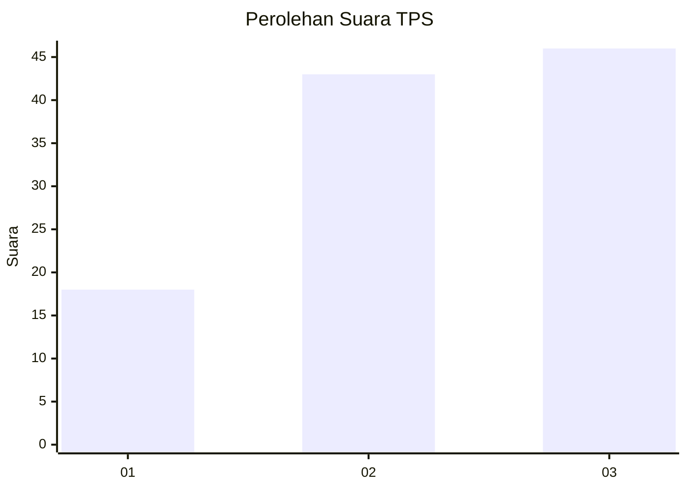
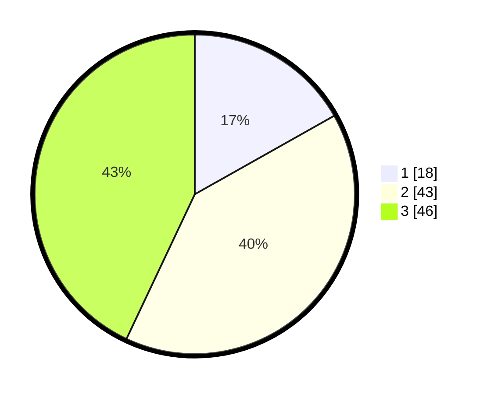

# Hasil

## Grafik

## Tabel

| No. | Nama Paslon    | Suara | Suara (raw) | Persentase |
|:--- |:-------------- | -----:| -----------:| ----------:|
| 1   | ANIES MUHAIMIN | 18    | [18][p-1]   | 16,82      |
| 2   | PRABOWO GIBRAN | 43    | [43][p-2]   | 40,19      |
| 3   | GANJAR MAHFUD  | 46    | [46][p-3]   | 42,99      |

[p-1]: https://github.com/gigit-pemilu/pemilu-2024-91-papua/blob/main/pilpres/hitung-suara/sub/91-papua/sub/06-biak-numfor/sub/09-warsa/sub/2025-manbeori/sub/001-tps/sub/paslon-1.txt
[p-2]: https://github.com/gigit-pemilu/pemilu-2024-91-papua/blob/main/pilpres/hitung-suara/sub/91-papua/sub/06-biak-numfor/sub/09-warsa/sub/2025-manbeori/sub/001-tps/sub/paslon-2.txt
[p-3]: https://github.com/gigit-pemilu/pemilu-2024-91-papua/blob/main/pilpres/hitung-suara/sub/91-papua/sub/06-biak-numfor/sub/09-warsa/sub/2025-manbeori/sub/001-tps/sub/paslon-3.txt

## Foto C Plano

https://sirekap-obj-formc.kpu.go.id/3eea/pemilu/ppwp/91/06/09/20/25/9106092025001-20240216-123200--ebfaf4b3-babd-4f13-8eff-85d0361961b0.jpg

https://sirekap-obj-formc.kpu.go.id/3eea/pemilu/ppwp/91/06/09/20/25/9106092025001-20240216-124417--dab373c9-1d87-44ce-984c-2922968ec167.jpg

https://sirekap-obj-formc.kpu.go.id/3eea/pemilu/ppwp/91/06/09/20/25/9106092025001-20240215-094436--a95f8c63-6383-490b-b3bf-fa8d60b814fe.jpg

## Metadata

| Key        | Value               |
| ---------- | ------------------- |
| Time Stamp | 2024-02-25 16:00:00 |

