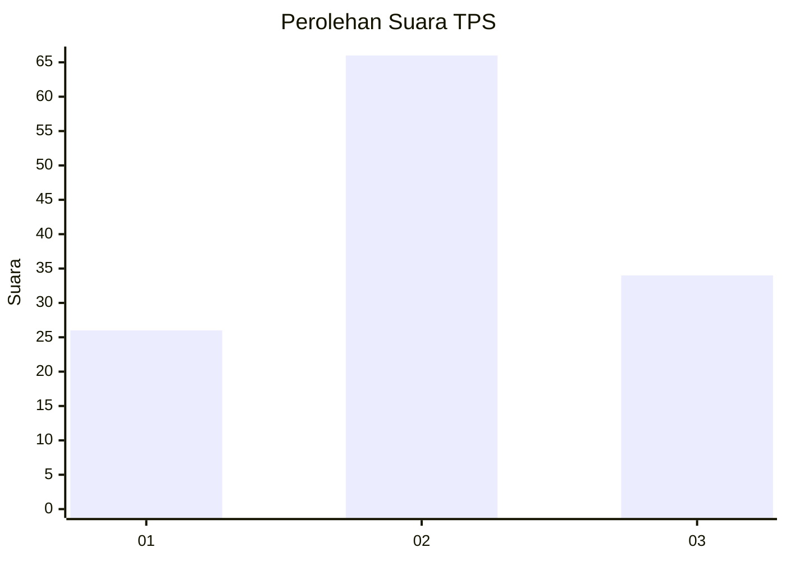
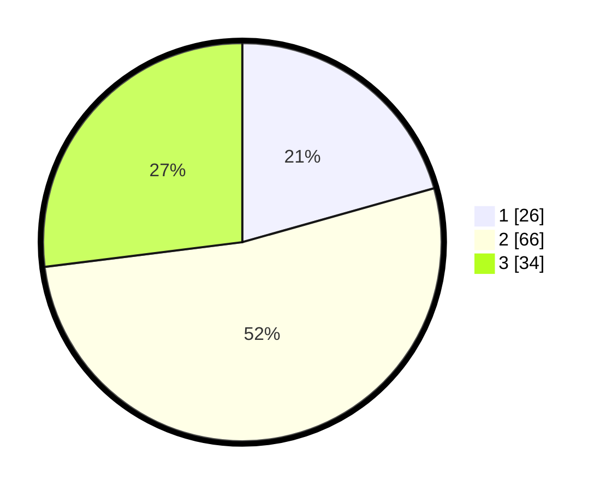

# Hasil

## Grafik

## Tabel

| No. | Nama Paslon    | Suara | Suara (raw) | Persentase |
|:--- |:-------------- | -----:| -----------:| ----------:|
| 1   | ANIES MUHAIMIN | 26    | [26][p-1]   | 20,63      |
| 2   | PRABOWO GIBRAN | 66    | [66][p-2]   | 52,38      |
| 3   | GANJAR MAHFUD  | 34    | [34][p-3]   | 26,98      |

[p-1]: https://github.com/gigit-pemilu/pemilu-2024-91-papua/blob/main/pilpres/hitung-suara/sub/91-papua/sub/06-biak-numfor/sub/09-warsa/sub/2027-wir-insos/sub/001-tps/sub/paslon-1.txt
[p-2]: https://github.com/gigit-pemilu/pemilu-2024-91-papua/blob/main/pilpres/hitung-suara/sub/91-papua/sub/06-biak-numfor/sub/09-warsa/sub/2027-wir-insos/sub/001-tps/sub/paslon-2.txt
[p-3]: https://github.com/gigit-pemilu/pemilu-2024-91-papua/blob/main/pilpres/hitung-suara/sub/91-papua/sub/06-biak-numfor/sub/09-warsa/sub/2027-wir-insos/sub/001-tps/sub/paslon-3.txt

## Foto C Plano

https://sirekap-obj-formc.kpu.go.id/c88f/pemilu/ppwp/91/06/09/20/27/9106092027001-20240215-203637--78e9b98c-892d-42e4-ba7c-807af0962cbb.jpg

https://sirekap-obj-formc.kpu.go.id/c88f/pemilu/ppwp/91/06/09/20/27/9106092027001-20240215-034614--6cdb0dde-44d3-42df-9a21-c149dbaa7e0b.jpg

## Metadata

| Key        | Value               |
| ---------- | ------------------- |
| Time Stamp | 2024-02-27 21:00:04 |

