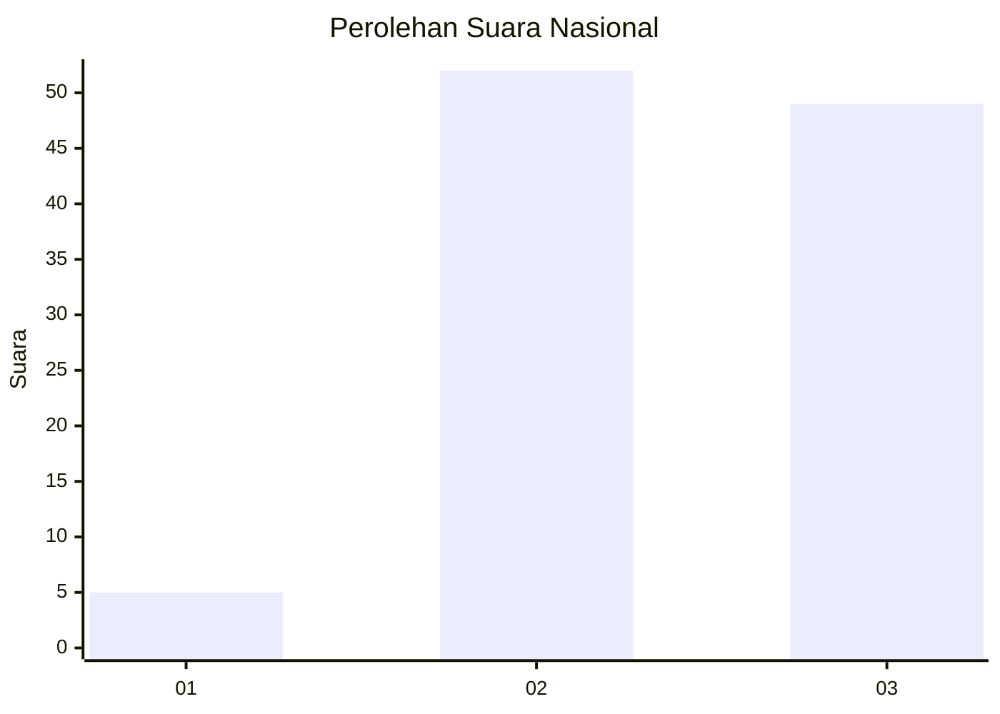
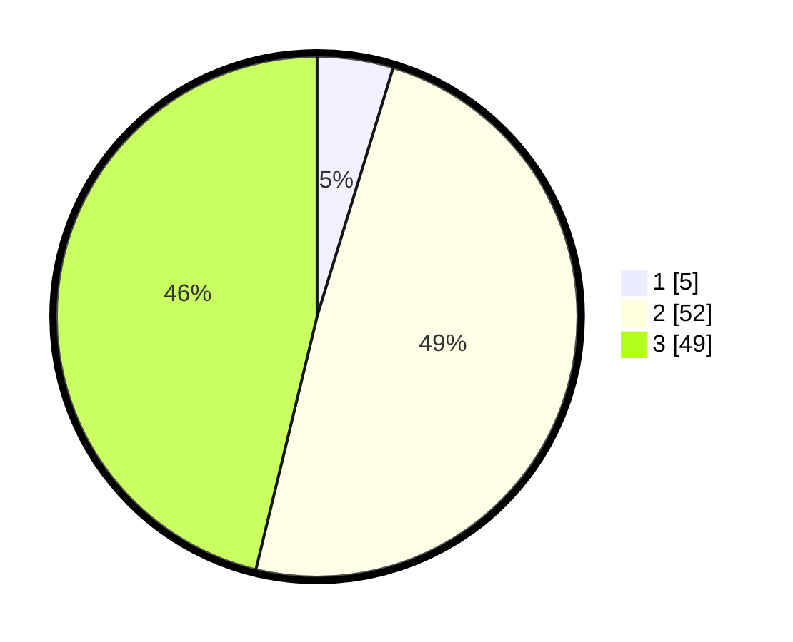

# Hasil

## Grafik

## Tabel

| No. | Nama Paslon    | Suara | Suara (raw) | Persentase |
|:--- |:-------------- | -----:| -----------:| ----------:|
| 1   | ANIES MUHAIMIN | 5     | [5][p-1]    | 4,72       |
| 2   | PRABOWO GIBRAN | 52    | [52][p-2]   | 49,06      |
| 3   | GANJAR MAHFUD  | 49    | [49][p-3]   | 46,23      |

[p-1]: https://github.com/gigit-pemilu/pemilu-2024/blob/main/pilpres/hitung-suara/sub/91-papua/sub/06-biak-numfor/sub/09-warsa/sub/2028-biawer/sub/001-tps/sub/paslon-1.txt
[p-2]: https://github.com/gigit-pemilu/pemilu-2024/blob/main/pilpres/hitung-suara/sub/91-papua/sub/06-biak-numfor/sub/09-warsa/sub/2028-biawer/sub/001-tps/sub/paslon-2.txt
[p-3]: https://github.com/gigit-pemilu/pemilu-2024/blob/main/pilpres/hitung-suara/sub/91-papua/sub/06-biak-numfor/sub/09-warsa/sub/2028-biawer/sub/001-tps/sub/paslon-3.txt

## Foto C Plano

https://sirekap-obj-formc.kpu.go.id/d176/pemilu/ppwp/91/06/09/20/28/9106092028001-20240215-120957--67ffb41c-c898-444c-adc6-5c3901b974b3.jpg

https://sirekap-obj-formc.kpu.go.id/d176/pemilu/ppwp/91/06/09/20/28/9106092028001-20240215-121421--da009f4d-e89c-4a70-8531-5e8f846fbf11.jpg

https://sirekap-obj-formc.kpu.go.id/d176/pemilu/ppwp/91/06/09/20/28/9106092028001-20240215-122309--b458f501-ae36-46e7-8c13-5eb7563cbd84.jpg

## Metadata

| Key        | Value               |
| ---------- | ------------------- |
| Time Stamp | 2024-02-25 15:00:00 |

