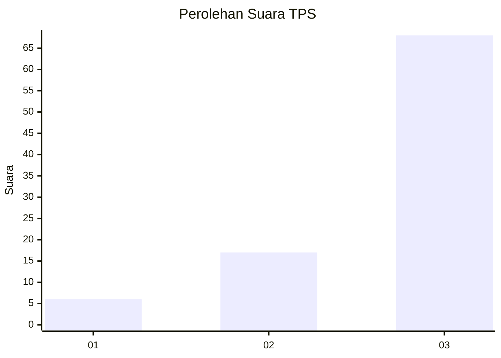
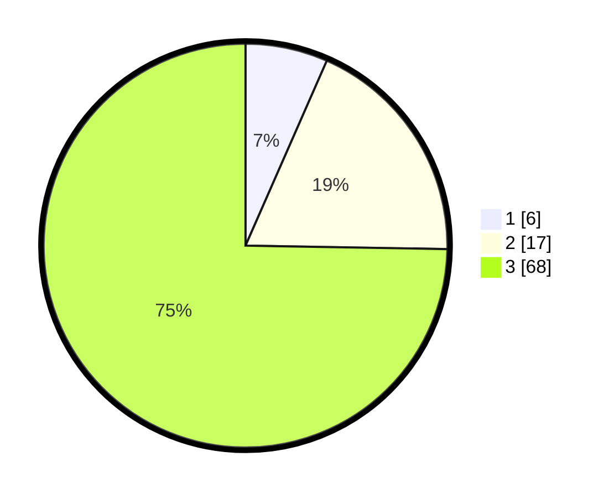

# Hasil

## Grafik

## Tabel

| No. | Nama Paslon    | Suara | Suara (raw) | Persentase |
|:--- |:-------------- | -----:| -----------:| ----------:|
| 1   | ANIES MUHAIMIN | 6     | [6][p-1]    | 6,59       |
| 2   | PRABOWO GIBRAN | 17    | [17][p-2]   | 18,68      |
| 3   | GANJAR MAHFUD  | 68    | [68][p-3]   | 74,73      |

[p-1]: https://github.com/gigit-pemilu/pemilu-2024-91-papua/blob/main/pilpres/hitung-suara/sub/91-papua/sub/06-biak-numfor/sub/10-padaido/sub/2014-inbeyomi/sub/001-tps/sub/paslon-1.txt
[p-2]: https://github.com/gigit-pemilu/pemilu-2024-91-papua/blob/main/pilpres/hitung-suara/sub/91-papua/sub/06-biak-numfor/sub/10-padaido/sub/2014-inbeyomi/sub/001-tps/sub/paslon-2.txt
[p-3]: https://github.com/gigit-pemilu/pemilu-2024-91-papua/blob/main/pilpres/hitung-suara/sub/91-papua/sub/06-biak-numfor/sub/10-padaido/sub/2014-inbeyomi/sub/001-tps/sub/paslon-3.txt

## Foto C Plano

https://sirekap-obj-formc.kpu.go.id/9cfd/pemilu/ppwp/91/06/10/20/14/9106102014001-20240215-081054--66a31547-ce6d-4f38-ba0d-6b85da2d1ad9.jpg

https://sirekap-obj-formc.kpu.go.id/9cfd/pemilu/ppwp/91/06/10/20/14/9106102014001-20240215-000304--a33819bf-069e-47ac-b6db-0c6030f4c9fb.jpg

https://sirekap-obj-formc.kpu.go.id/9cfd/pemilu/ppwp/91/06/10/20/14/9106102014001-20240215-041537--20945162-fd4b-40ac-b870-02d585a511a1.jpg

## Metadata

| Key        | Value               |
| ---------- | ------------------- |
| Time Stamp | 2024-02-22 11:00:00 |

