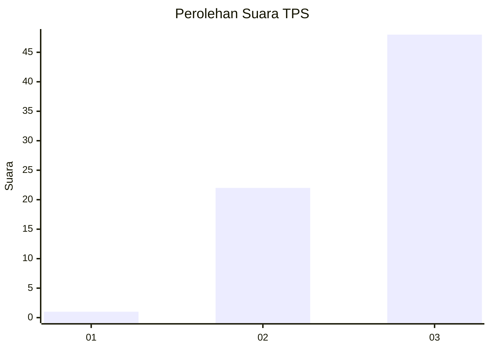
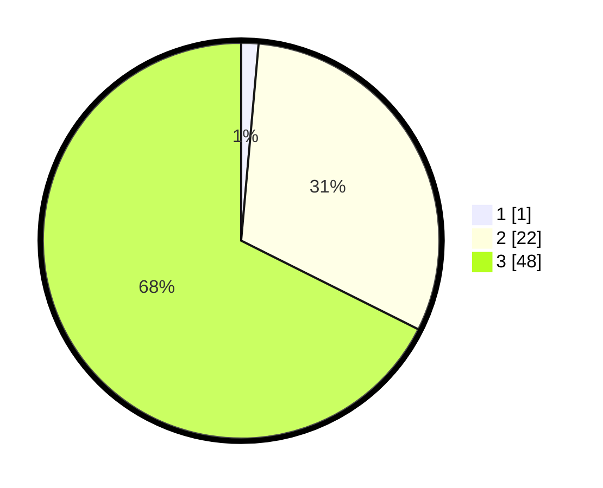

# Hasil

## Grafik

## Tabel

| No. | Nama Paslon    | Suara | Suara (raw) | Persentase |
|:--- |:-------------- | -----:| -----------:| ----------:|
| 1   | ANIES MUHAIMIN | 1     | [1][p-1]    | 1,41       |
| 2   | PRABOWO GIBRAN | 22    | [22][p-2]   | 30,99      |
| 3   | GANJAR MAHFUD  | 48    | [48][p-3]   | 67,61      |

[p-1]: https://github.com/gigit-pemilu/pemilu-2024-91-papua/blob/main/pilpres/hitung-suara/sub/91-papua/sub/06-biak-numfor/sub/10-padaido/sub/2016-sandidori/sub/001-tps/sub/paslon-1.txt
[p-2]: https://github.com/gigit-pemilu/pemilu-2024-91-papua/blob/main/pilpres/hitung-suara/sub/91-papua/sub/06-biak-numfor/sub/10-padaido/sub/2016-sandidori/sub/001-tps/sub/paslon-2.txt
[p-3]: https://github.com/gigit-pemilu/pemilu-2024-91-papua/blob/main/pilpres/hitung-suara/sub/91-papua/sub/06-biak-numfor/sub/10-padaido/sub/2016-sandidori/sub/001-tps/sub/paslon-3.txt

## Foto C Plano

https://sirekap-obj-formc.kpu.go.id/9173/pemilu/ppwp/91/06/10/20/16/9106102016001-20240216-012119--76b58e18-3578-4385-ad57-bd532caee5f4.jpg

https://sirekap-obj-formc.kpu.go.id/9173/pemilu/ppwp/91/06/10/20/16/9106102016001-20240216-012822--08539822-f04f-42f1-8974-f955b8940b7c.jpg

https://sirekap-obj-formc.kpu.go.id/9173/pemilu/ppwp/91/06/10/20/16/9106102016001-20240216-012552--9e69b31b-bfe8-4d40-a384-bbd4e5a8bc47.jpg

## Metadata

| Key        | Value               |
| ---------- | ------------------- |
| Time Stamp | 2024-02-16 03:00:26 |

## DATA PEMILIH TETAP

Jumlah pemilih dalam DPT: **136**.
 * L: **76**.
 * P: **60**.

## DATA PENGGUNA HAK PILIH

Jumlah pengguna hak pilih dalam DPT: **67**.
 * L: **34**.
 * P: **33**.

Jumlah pengguna hak pilih dalam DPTb: **0**.
 * L: **0**.
 * P: **0**.

Jumlah pengguna hak pilih dalam DPK: **4**.
 * L: **3**.
 * P: **1**.

Jumlah pengguna hak pilih: **71**.
 * L: **37**.
 * P: **34**.

## JUMLAH SUARA SAH DAN TIDAK SAH

JUMLAH SELURUH SUARA SAH: **71**.

JUMLAH SUARA TIDAK SAH: **0**.

JUMLAH SELURUH SUARA SAH DAN SUARA TIDAK SAH: **71**.

