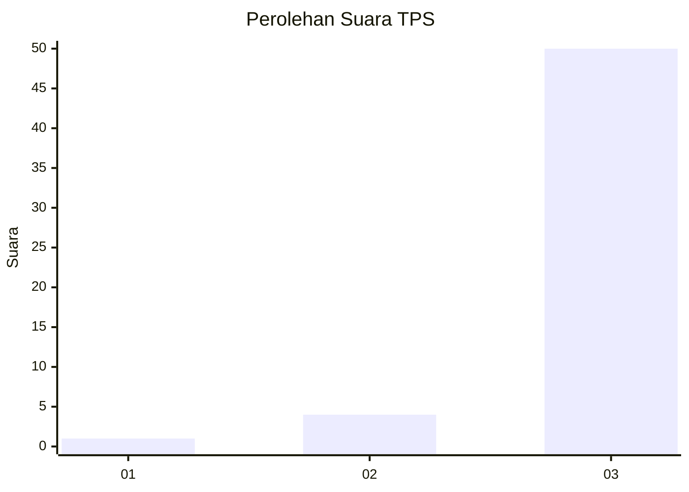
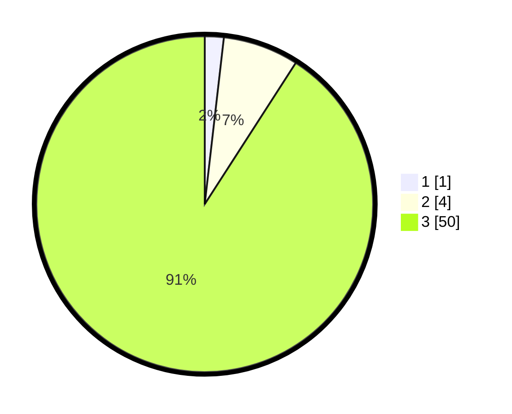

# Hasil

## Grafik

## Tabel

| No. | Nama Paslon    | Suara | Suara (raw) | Persentase |
|:--- |:-------------- | -----:| -----------:| ----------:|
| 1   | ANIES MUHAIMIN | 1     | [1][p-1]    | 1,82       |
| 2   | PRABOWO GIBRAN | 4     | [4][p-2]    | 7,27       |
| 3   | GANJAR MAHFUD  | 50    | [50][p-3]   | 90,91      |

[p-1]: https://github.com/gigit-pemilu/pemilu-2024-91-papua/blob/main/pilpres/hitung-suara/sub/91-papua/sub/06-biak-numfor/sub/10-padaido/sub/2020-paidori/sub/001-tps/sub/paslon-1.txt
[p-2]: https://github.com/gigit-pemilu/pemilu-2024-91-papua/blob/main/pilpres/hitung-suara/sub/91-papua/sub/06-biak-numfor/sub/10-padaido/sub/2020-paidori/sub/001-tps/sub/paslon-2.txt
[p-3]: https://github.com/gigit-pemilu/pemilu-2024-91-papua/blob/main/pilpres/hitung-suara/sub/91-papua/sub/06-biak-numfor/sub/10-padaido/sub/2020-paidori/sub/001-tps/sub/paslon-3.txt

## Foto C Plano

https://sirekap-obj-formc.kpu.go.id/eeae/pemilu/ppwp/91/06/10/20/20/9106102020001-20240215-174045--5b139baf-aafd-4308-b130-ce540bed2975.jpg

https://sirekap-obj-formc.kpu.go.id/eeae/pemilu/ppwp/91/06/10/20/20/9106102020001-20240215-150553--027a73ea-5647-4a1d-be5f-5919bdaa1ad1.jpg

https://sirekap-obj-formc.kpu.go.id/eeae/pemilu/ppwp/91/06/10/20/20/9106102020001-20240215-174745--1a2b1512-2bbc-489a-b1b2-96f9e2663993.jpg

## Metadata

| Key        | Value               |
| ---------- | ------------------- |
| Time Stamp | 2024-02-25 15:00:00 |

