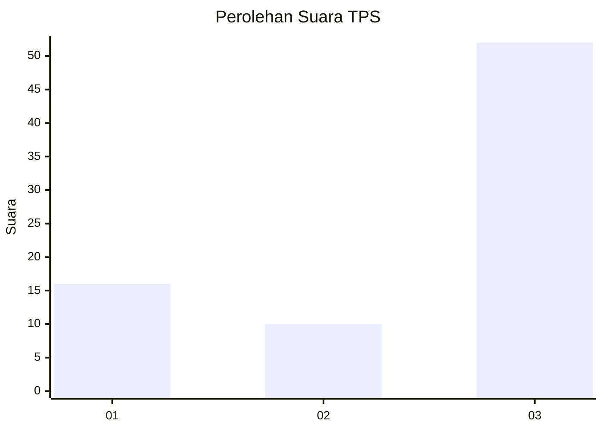
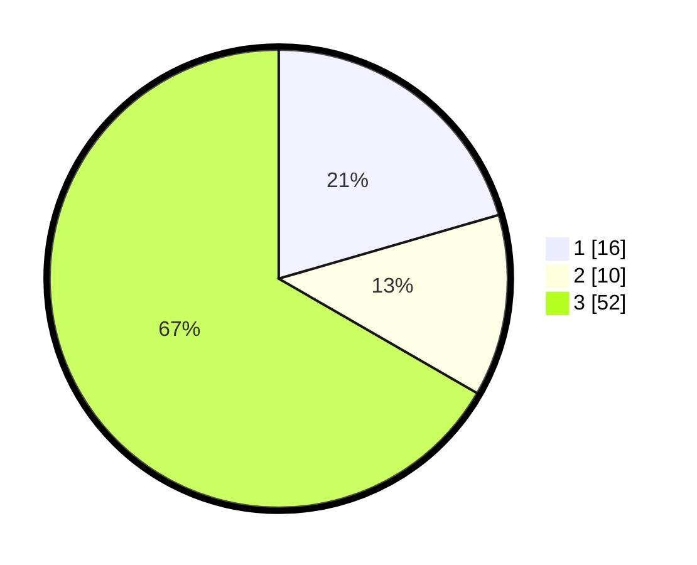

# Hasil

## Grafik

## Tabel

| No. | Nama Paslon    | Suara | Suara (raw) | Persentase |
|:--- |:-------------- | -----:| -----------:| ----------:|
| 1   | ANIES MUHAIMIN | 16    | [16][p-1]   | 20,51      |
| 2   | PRABOWO GIBRAN | 10    | [10][p-2]   | 12,82      |
| 3   | GANJAR MAHFUD  | 52    | [52][p-3]   | 66,67      |

[p-1]: https://github.com/gigit-pemilu/pemilu-2024-91-papua/blob/main/pilpres/hitung-suara/sub/91-papua/sub/06-biak-numfor/sub/10-padaido/sub/2021-kanai/sub/001-tps/sub/paslon-1.txt
[p-2]: https://github.com/gigit-pemilu/pemilu-2024-91-papua/blob/main/pilpres/hitung-suara/sub/91-papua/sub/06-biak-numfor/sub/10-padaido/sub/2021-kanai/sub/001-tps/sub/paslon-2.txt
[p-3]: https://github.com/gigit-pemilu/pemilu-2024-91-papua/blob/main/pilpres/hitung-suara/sub/91-papua/sub/06-biak-numfor/sub/10-padaido/sub/2021-kanai/sub/001-tps/sub/paslon-3.txt

## Foto C Plano

https://sirekap-obj-formc.kpu.go.id/ac1b/pemilu/ppwp/91/06/10/20/21/9106102021001-20240215-095035--24ba9ace-5610-4014-b5a2-c5271e03b1d3.jpg

https://sirekap-obj-formc.kpu.go.id/ac1b/pemilu/ppwp/91/06/10/20/21/9106102021001-20240215-095210--faed77e1-9a09-4e53-9b47-f7bf11452ecd.jpg

https://sirekap-obj-formc.kpu.go.id/ac1b/pemilu/ppwp/91/06/10/20/21/9106102021001-20240215-065545--5303cbc7-aa5b-4b90-b3dd-584274533148.jpg

## Metadata

| Key        | Value               |
| ---------- | ------------------- |
| Time Stamp | 2024-02-25 20:00:00 |

