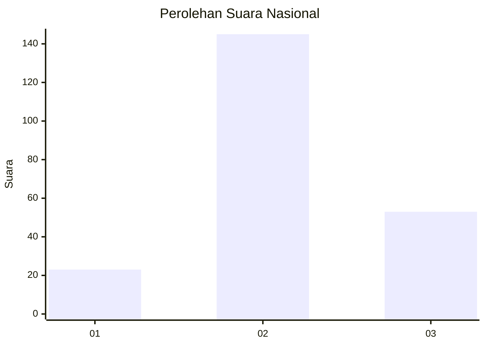
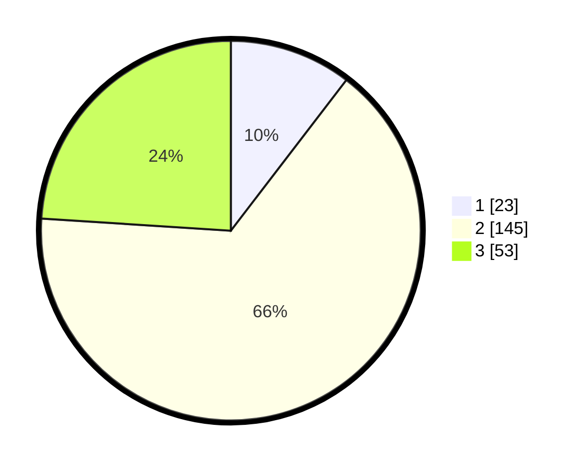

# Hasil

## Grafik

## Tabel

| No. | Nama Paslon    | Suara | Suara (raw) | Persentase |
|:--- |:-------------- | -----:| -----------:| ----------:|
| 1   | ANIES MUHAIMIN | 23    | [23][p-1]   | 10,41      |
| 2   | PRABOWO GIBRAN | 145   | [145][p-2]  | 65,61      |
| 3   | GANJAR MAHFUD  | 53    | [53][p-3]   | 23,98      |

[p-1]: https://github.com/gigit-pemilu/pemilu-2024/blob/main/pilpres/hitung-suara/sub/91-papua/sub/06-biak-numfor/sub/11-yendidori/sub/2001-yendidori/sub/002-tps/sub/paslon-1.txt
[p-2]: https://github.com/gigit-pemilu/pemilu-2024/blob/main/pilpres/hitung-suara/sub/91-papua/sub/06-biak-numfor/sub/11-yendidori/sub/2001-yendidori/sub/002-tps/sub/paslon-2.txt
[p-3]: https://github.com/gigit-pemilu/pemilu-2024/blob/main/pilpres/hitung-suara/sub/91-papua/sub/06-biak-numfor/sub/11-yendidori/sub/2001-yendidori/sub/002-tps/sub/paslon-3.txt

## Foto C Plano

https://sirekap-obj-formc.kpu.go.id/c024/pemilu/ppwp/91/06/11/20/01/9106112001002-20240216-232619--e388ffc0-3a31-44e4-a2af-35e5134fc0b1.jpg

https://sirekap-obj-formc.kpu.go.id/c024/pemilu/ppwp/91/06/11/20/01/9106112001002-20240216-232713--a0cd5d77-0764-44aa-b918-c7308fcd48b8.jpg

https://sirekap-obj-formc.kpu.go.id/c024/pemilu/ppwp/91/06/11/20/01/9106112001002-20240216-232758--61092835-03ef-473c-be25-0d52edb2a2a5.jpg

## Metadata

| Key        | Value               |
| ---------- | ------------------- |
| Time Stamp | 2024-02-25 13:00:00 |

