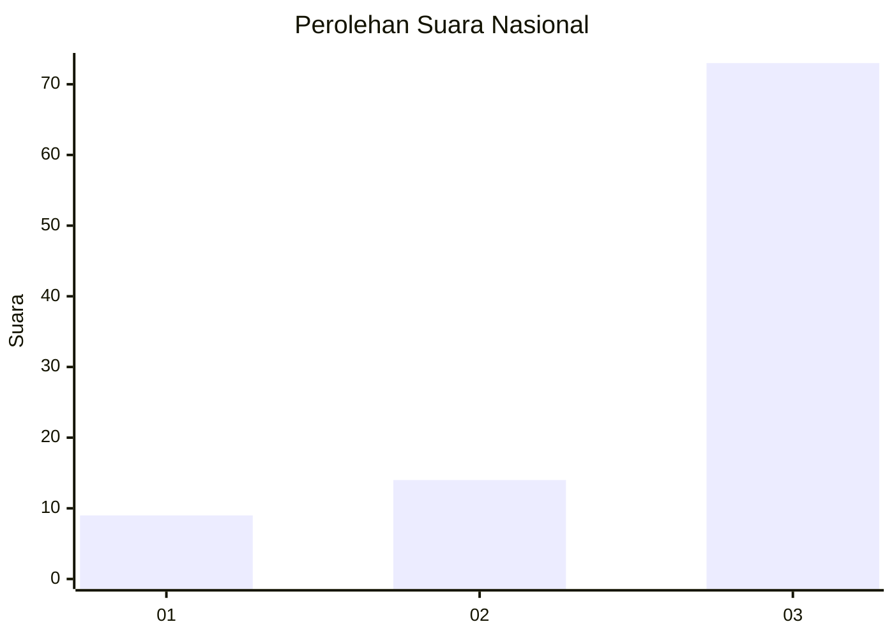
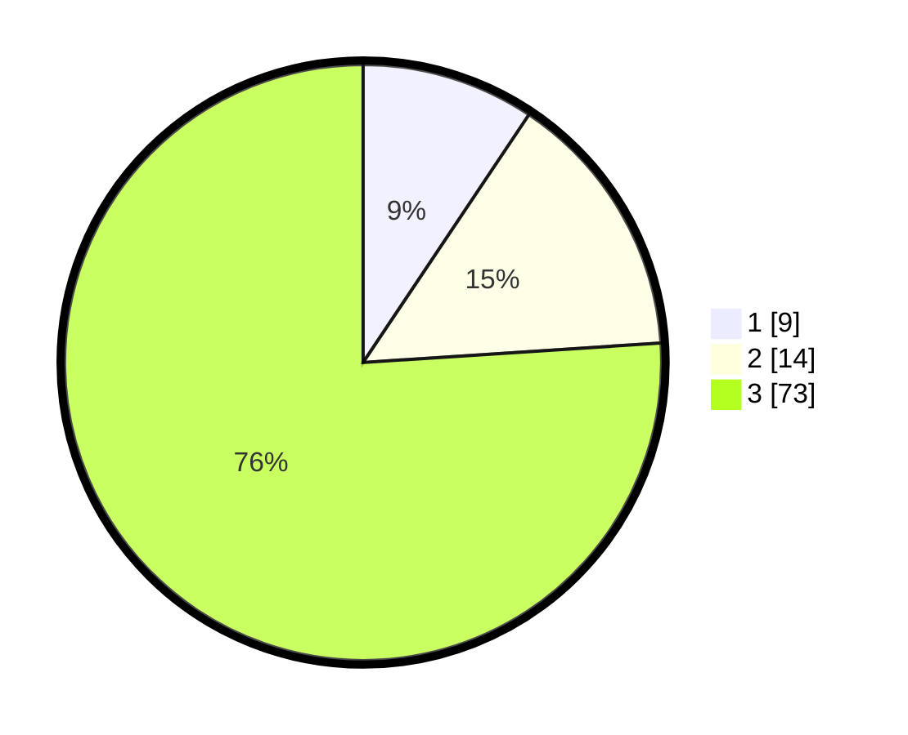

# Hasil

## Grafik

## Tabel

| No. | Nama Paslon    | Suara | Suara (raw) | Persentase |
|:--- |:-------------- | -----:| -----------:| ----------:|
| 1   | ANIES MUHAIMIN | 9     | [9][p-1]    | 9,38       |
| 2   | PRABOWO GIBRAN | 14    | [14][p-2]   | 14,58      |
| 3   | GANJAR MAHFUD  | 73    | [73][p-3]   | 76,04      |

[p-1]: https://github.com/gigit-pemilu/pemilu-2024/blob/main/pilpres/hitung-suara/sub/91-papua/sub/06-biak-numfor/sub/11-yendidori/sub/2005-kabidon/sub/001-tps/sub/paslon-1.txt
[p-2]: https://github.com/gigit-pemilu/pemilu-2024/blob/main/pilpres/hitung-suara/sub/91-papua/sub/06-biak-numfor/sub/11-yendidori/sub/2005-kabidon/sub/001-tps/sub/paslon-2.txt
[p-3]: https://github.com/gigit-pemilu/pemilu-2024/blob/main/pilpres/hitung-suara/sub/91-papua/sub/06-biak-numfor/sub/11-yendidori/sub/2005-kabidon/sub/001-tps/sub/paslon-3.txt

## Foto C Plano

https://sirekap-obj-formc.kpu.go.id/e3ae/pemilu/ppwp/91/06/11/20/05/9106112005001-20240215-040734--6514a8a4-33b7-4b67-bfc9-85f4dc4a581d.jpg

https://sirekap-obj-formc.kpu.go.id/e3ae/pemilu/ppwp/91/06/11/20/05/9106112005001-20240215-035243--fe544928-b6a0-498b-b089-836465a01c47.jpg

https://sirekap-obj-formc.kpu.go.id/e3ae/pemilu/ppwp/91/06/11/20/05/9106112005001-20240215-204537--75fdce49-c3c8-4f03-a9ba-08287013d374.jpg

## Metadata

| Key        | Value               |
| ---------- | ------------------- |
| Time Stamp | 2024-02-25 22:00:00 |

