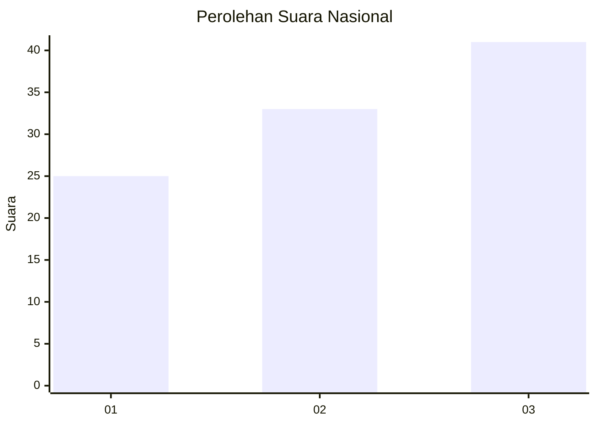
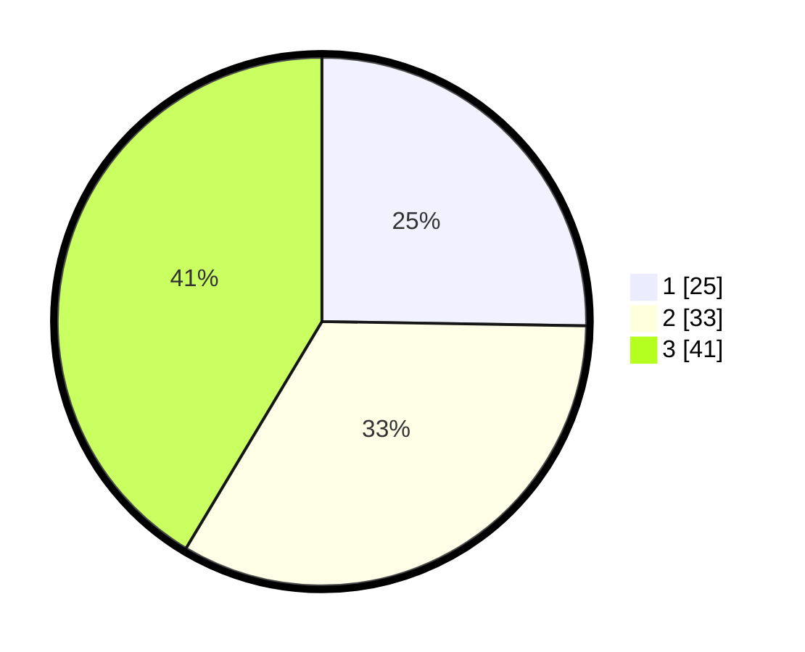

# Hasil

## Grafik

## Tabel

| No. | Nama Paslon    | Suara | Suara (raw) | Persentase |
|:--- |:-------------- | -----:| -----------:| ----------:|
| 1   | ANIES MUHAIMIN | 25    | [25][p-1]   | 25,25      |
| 2   | PRABOWO GIBRAN | 33    | [33][p-2]   | 33,33      |
| 3   | GANJAR MAHFUD  | 41    | [41][p-3]   | 41,41      |

[p-1]: https://github.com/gigit-pemilu/pemilu-2024/blob/main/pilpres/hitung-suara/sub/91-papua/sub/06-biak-numfor/sub/11-yendidori/sub/2006-sunyar/sub/001-tps/sub/paslon-1.txt
[p-2]: https://github.com/gigit-pemilu/pemilu-2024/blob/main/pilpres/hitung-suara/sub/91-papua/sub/06-biak-numfor/sub/11-yendidori/sub/2006-sunyar/sub/001-tps/sub/paslon-2.txt
[p-3]: https://github.com/gigit-pemilu/pemilu-2024/blob/main/pilpres/hitung-suara/sub/91-papua/sub/06-biak-numfor/sub/11-yendidori/sub/2006-sunyar/sub/001-tps/sub/paslon-3.txt

## Foto C Plano

https://sirekap-obj-formc.kpu.go.id/c17b/pemilu/ppwp/91/06/11/20/06/9106112006001-20240215-151104--e9b72a99-7462-40c4-be01-51e0b1602886.jpg

https://sirekap-obj-formc.kpu.go.id/c17b/pemilu/ppwp/91/06/11/20/06/9106112006001-20240215-152235--bf58eaa5-c5f9-4fdc-b3e1-b105dc8c53b2.jpg

https://sirekap-obj-formc.kpu.go.id/c17b/pemilu/ppwp/91/06/11/20/06/9106112006001-20240215-142150--902c1aec-fdf0-4574-bb5e-07a2a5f320bd.jpg

## Metadata

| Key        | Value               |
| ---------- | ------------------- |
| Time Stamp | 2024-02-24 22:31:28 |

