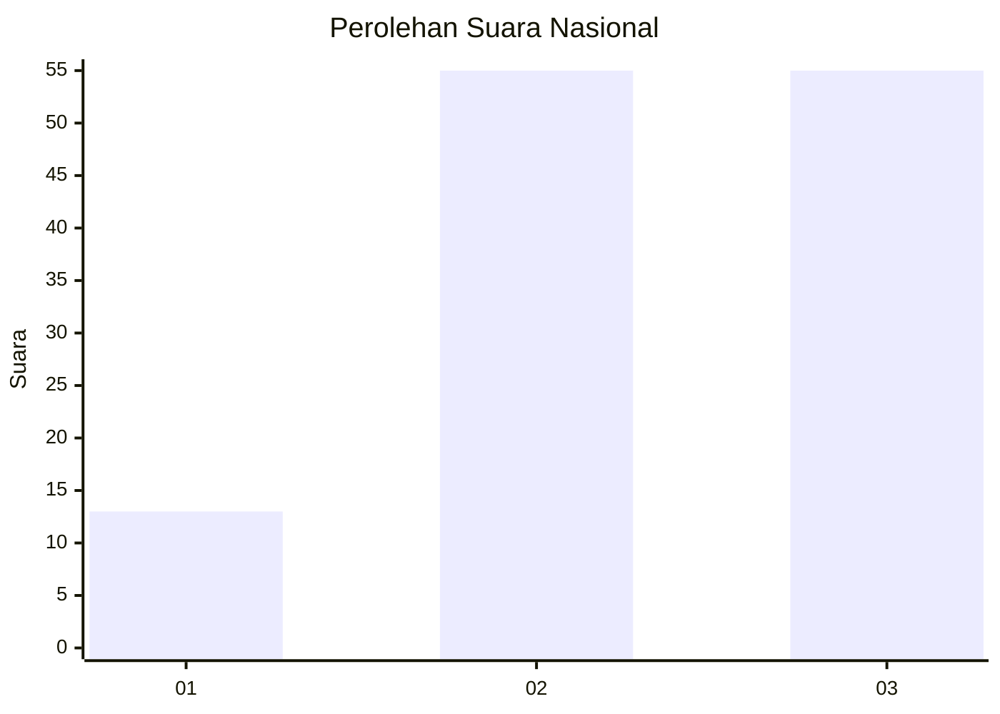
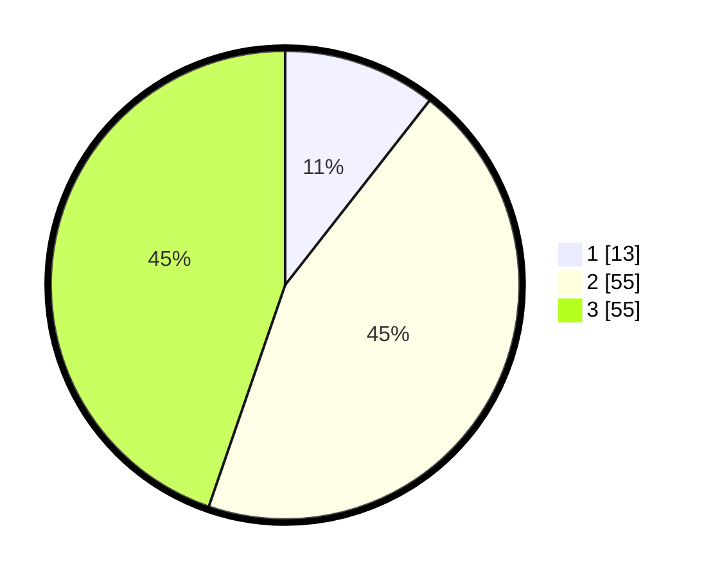

# Hasil

## Grafik

## Tabel

| No. | Nama Paslon    | Suara | Suara (raw) | Persentase |
|:--- |:-------------- | -----:| -----------:| ----------:|
| 1   | ANIES MUHAIMIN | 13    | [13][p-1]   | 10,57      |
| 2   | PRABOWO GIBRAN | 55    | [55][p-2]   | 44,72      |
| 3   | GANJAR MAHFUD  | 55    | [55][p-3]   | 44,72      |

[p-1]: https://github.com/gigit-pemilu/pemilu-2024/blob/main/pilpres/hitung-suara/sub/91-papua/sub/06-biak-numfor/sub/11-yendidori/sub/2010-samber-sup/sub/001-tps/sub/paslon-1.txt
[p-2]: https://github.com/gigit-pemilu/pemilu-2024/blob/main/pilpres/hitung-suara/sub/91-papua/sub/06-biak-numfor/sub/11-yendidori/sub/2010-samber-sup/sub/001-tps/sub/paslon-2.txt
[p-3]: https://github.com/gigit-pemilu/pemilu-2024/blob/main/pilpres/hitung-suara/sub/91-papua/sub/06-biak-numfor/sub/11-yendidori/sub/2010-samber-sup/sub/001-tps/sub/paslon-3.txt

## Foto C Plano

https://sirekap-obj-formc.kpu.go.id/1e5f/pemilu/ppwp/91/06/11/20/10/9106112010001-20240215-112412--9bb4806b-e982-4cf3-ad18-a5ab039e58db.jpg

https://sirekap-obj-formc.kpu.go.id/1e5f/pemilu/ppwp/91/06/11/20/10/9106112010001-20240215-070108--33674b22-fd8b-4ca5-a47d-19df5b28745e.jpg

## Metadata

| Key        | Value               |
| ---------- | ------------------- |
| Time Stamp | 2024-02-25 11:00:00 |

