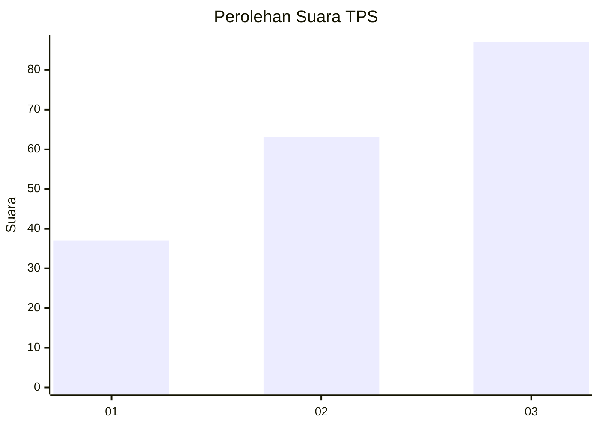
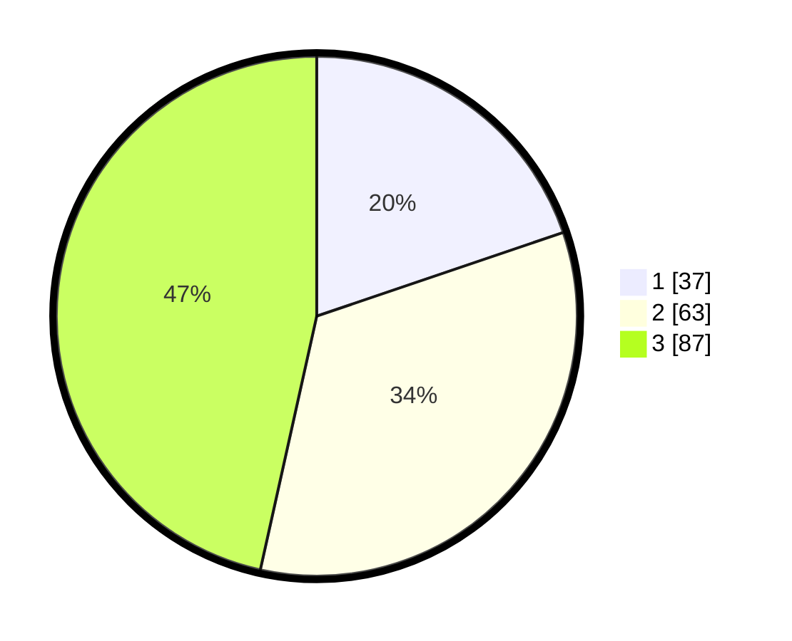

# Hasil

## Grafik

## Tabel

| No. | Nama Paslon    | Suara | Suara (raw) | Persentase |
|:--- |:-------------- | -----:| -----------:| ----------:|
| 1   | ANIES MUHAIMIN | 37    | [37][p-1]   | 19,79      |
| 2   | PRABOWO GIBRAN | 63    | [63][p-2]   | 33,69      |
| 3   | GANJAR MAHFUD  | 87    | [87][p-3]   | 46,52      |

[p-1]: https://github.com/gigit-pemilu/pemilu-2024-91-papua/blob/main/pilpres/hitung-suara/sub/91-papua/sub/06-biak-numfor/sub/11-yendidori/sub/2012-rarnpimbo/sub/001-tps/sub/paslon-1.txt
[p-2]: https://github.com/gigit-pemilu/pemilu-2024-91-papua/blob/main/pilpres/hitung-suara/sub/91-papua/sub/06-biak-numfor/sub/11-yendidori/sub/2012-rarnpimbo/sub/001-tps/sub/paslon-2.txt
[p-3]: https://github.com/gigit-pemilu/pemilu-2024-91-papua/blob/main/pilpres/hitung-suara/sub/91-papua/sub/06-biak-numfor/sub/11-yendidori/sub/2012-rarnpimbo/sub/001-tps/sub/paslon-3.txt

## Foto C Plano

https://sirekap-obj-formc.kpu.go.id/5705/pemilu/ppwp/91/06/11/20/12/9106112012001-20240215-170730--07dd9bb4-0294-492f-8c4d-a551e12b6a6b.jpg

https://sirekap-obj-formc.kpu.go.id/5705/pemilu/ppwp/91/06/11/20/12/9106112012001-20240215-234844--71124b30-eb1c-47b8-bc09-09f9de539f5b.jpg

https://sirekap-obj-formc.kpu.go.id/5705/pemilu/ppwp/91/06/11/20/12/9106112012001-20240215-171155--610b71ef-1ea0-44a0-88a1-8c918754d4ca.jpg

## Metadata

| Key        | Value               |
| ---------- | ------------------- |
| Time Stamp | 2024-02-25 16:00:00 |

