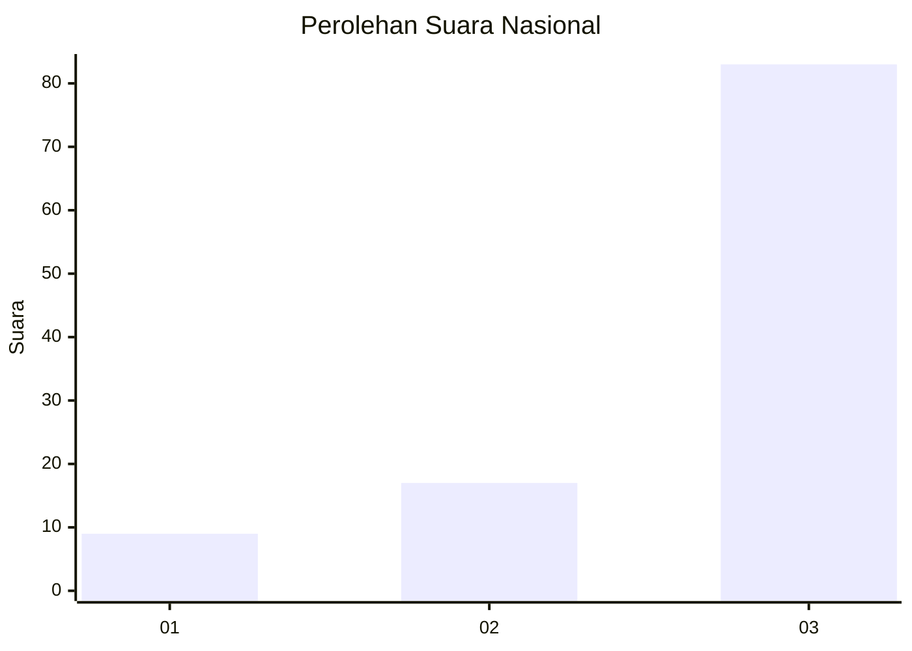
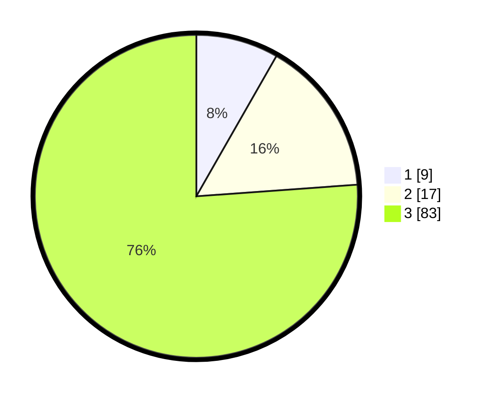

# Hasil

## Grafik

## Tabel

| No. | Nama Paslon    | Suara | Suara (raw) | Persentase |
|:--- |:-------------- | -----:| -----------:| ----------:|
| 1   | ANIES MUHAIMIN | 9     | [9][p-1]    | 8,26       |
| 2   | PRABOWO GIBRAN | 17    | [17][p-2]   | 15,60      |
| 3   | GANJAR MAHFUD  | 83    | [83][p-3]   | 76,15      |

[p-1]: https://github.com/gigit-pemilu/pemilu-2024/blob/main/pilpres/hitung-suara/sub/91-papua/sub/06-biak-numfor/sub/11-yendidori/sub/2014-waroi/sub/002-tps/sub/paslon-1.txt
[p-2]: https://github.com/gigit-pemilu/pemilu-2024/blob/main/pilpres/hitung-suara/sub/91-papua/sub/06-biak-numfor/sub/11-yendidori/sub/2014-waroi/sub/002-tps/sub/paslon-2.txt
[p-3]: https://github.com/gigit-pemilu/pemilu-2024/blob/main/pilpres/hitung-suara/sub/91-papua/sub/06-biak-numfor/sub/11-yendidori/sub/2014-waroi/sub/002-tps/sub/paslon-3.txt

## Foto C Plano

https://sirekap-obj-formc.kpu.go.id/4c07/pemilu/ppwp/91/06/11/20/14/9106112014002-20240215-233518--594561c8-a46d-4166-ad9e-1d215571a7fd.jpg

https://sirekap-obj-formc.kpu.go.id/4c07/pemilu/ppwp/91/06/11/20/14/9106112014002-20240215-235028--7cf9aafe-dcb3-427b-9582-a23e92d337b5.jpg

https://sirekap-obj-formc.kpu.go.id/4c07/pemilu/ppwp/91/06/11/20/14/9106112014002-20240215-235311--694bb595-74c8-4329-9d11-c1a18b1c778f.jpg

## Metadata

| Key        | Value               |
| ---------- | ------------------- |
| Time Stamp | 2024-02-16 00:30:27 |

