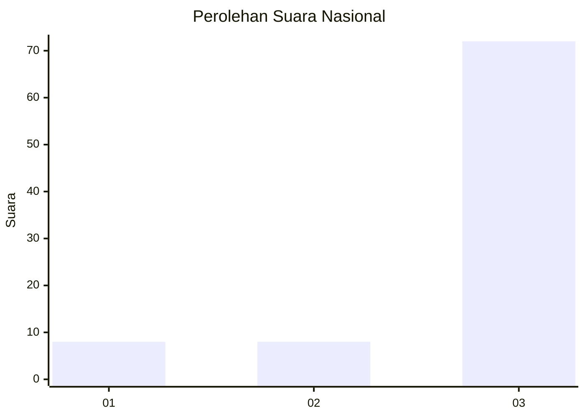
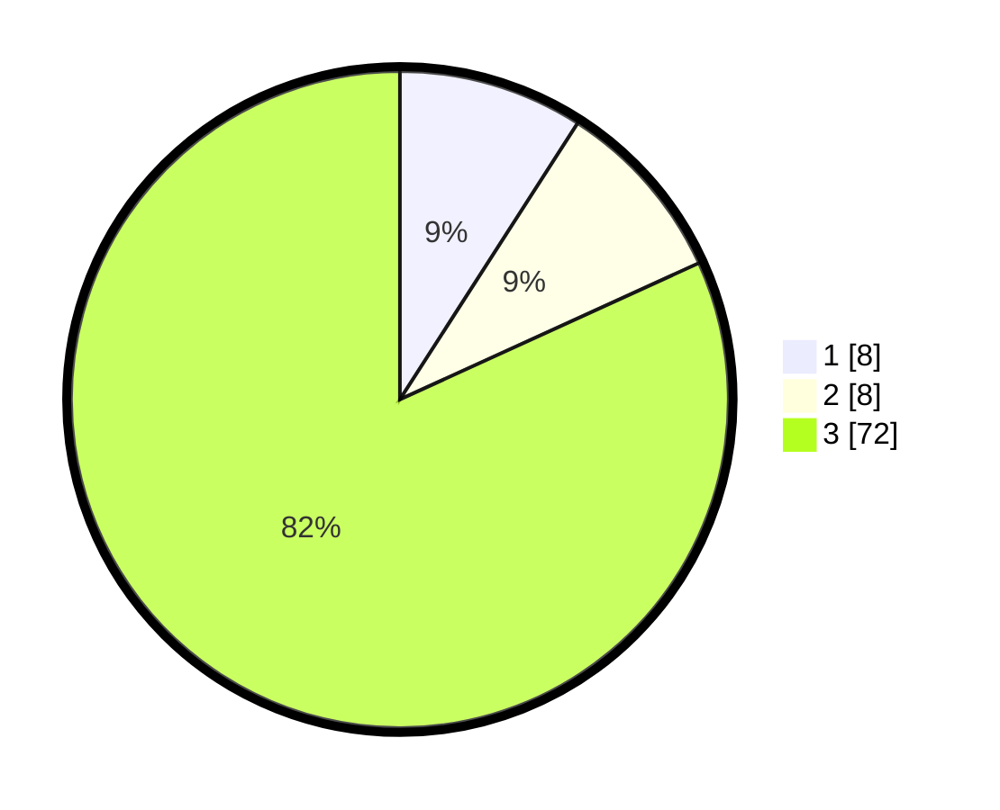

# Hasil

## Grafik

## Tabel

| No. | Nama Paslon    | Suara | Suara (raw) | Persentase |
|:--- |:-------------- | -----:| -----------:| ----------:|
| 1   | ANIES MUHAIMIN | 8     | [8][p-1]    | 9,09       |
| 2   | PRABOWO GIBRAN | 8     | [8][p-2]    | 9,09       |
| 3   | GANJAR MAHFUD  | 72    | [72][p-3]   | 81,82      |

[p-1]: https://github.com/gigit-pemilu/pemilu-2024/blob/main/pilpres/hitung-suara/sub/91-papua/sub/06-biak-numfor/sub/11-yendidori/sub/2016-amyambenram/sub/001-tps/sub/paslon-1.txt
[p-2]: https://github.com/gigit-pemilu/pemilu-2024/blob/main/pilpres/hitung-suara/sub/91-papua/sub/06-biak-numfor/sub/11-yendidori/sub/2016-amyambenram/sub/001-tps/sub/paslon-2.txt
[p-3]: https://github.com/gigit-pemilu/pemilu-2024/blob/main/pilpres/hitung-suara/sub/91-papua/sub/06-biak-numfor/sub/11-yendidori/sub/2016-amyambenram/sub/001-tps/sub/paslon-3.txt

## Foto C Plano

https://sirekap-obj-formc.kpu.go.id/2425/pemilu/ppwp/91/06/11/20/16/9106112016001-20240215-154720--a7646f27-8c17-43bf-9d25-bfce48be0cfc.jpg

https://sirekap-obj-formc.kpu.go.id/2425/pemilu/ppwp/91/06/11/20/16/9106112016001-20240215-154900--0c7d2384-0e4c-4b03-8b6b-e18c214e1717.jpg

https://sirekap-obj-formc.kpu.go.id/2425/pemilu/ppwp/91/06/11/20/16/9106112016001-20240215-155121--c964635f-1d09-4338-b62f-b3c1fa11c4ec.jpg

## Metadata

| Key        | Value               |
| ---------- | ------------------- |
| Time Stamp | 2024-02-25 13:00:00 |

