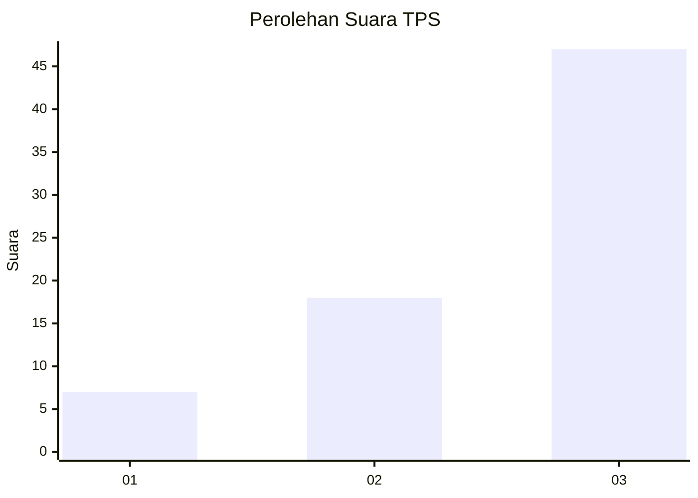
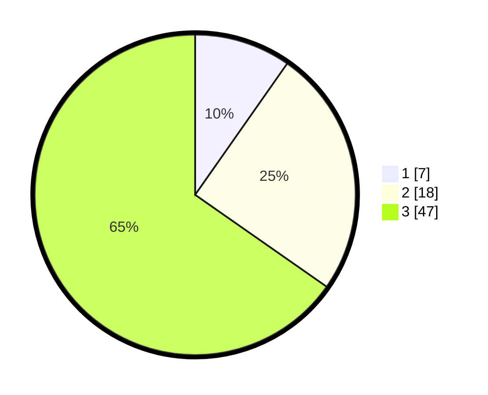

# Hasil

## Grafik

## Tabel

| No. | Nama Paslon    | Suara | Suara (raw) | Persentase |
|:--- |:-------------- | -----:| -----------:| ----------:|
| 1   | ANIES MUHAIMIN | 7     | [7][p-1]    | 9,72       |
| 2   | PRABOWO GIBRAN | 18    | [18][p-2]   | 25,00      |
| 3   | GANJAR MAHFUD  | 47    | [47][p-3]   | 65,28      |

[p-1]: https://github.com/gigit-pemilu/pemilu-2024-91-papua/blob/main/pilpres/hitung-suara/sub/91-papua/sub/06-biak-numfor/sub/11-yendidori/sub/2018-binyeri/sub/001-tps/sub/paslon-1.txt
[p-2]: https://github.com/gigit-pemilu/pemilu-2024-91-papua/blob/main/pilpres/hitung-suara/sub/91-papua/sub/06-biak-numfor/sub/11-yendidori/sub/2018-binyeri/sub/001-tps/sub/paslon-2.txt
[p-3]: https://github.com/gigit-pemilu/pemilu-2024-91-papua/blob/main/pilpres/hitung-suara/sub/91-papua/sub/06-biak-numfor/sub/11-yendidori/sub/2018-binyeri/sub/001-tps/sub/paslon-3.txt

## Foto C Plano

https://sirekap-obj-formc.kpu.go.id/2716/pemilu/ppwp/91/06/11/20/18/9106112018001-20240215-133119--0e81f54a-12e8-47b8-8453-dad863448672.jpg

https://sirekap-obj-formc.kpu.go.id/2716/pemilu/ppwp/91/06/11/20/18/9106112018001-20240215-081017--d5ca50db-94c3-4265-955d-1bcdf4eb2304.jpg

https://sirekap-obj-formc.kpu.go.id/2716/pemilu/ppwp/91/06/11/20/18/9106112018001-20240215-133420--3bbd5b5f-94b6-4fbb-bd4d-2ca74caeb306.jpg

## Metadata

| Key        | Value               |
| ---------- | ------------------- |
| Time Stamp | 2024-02-25 17:00:00 |

