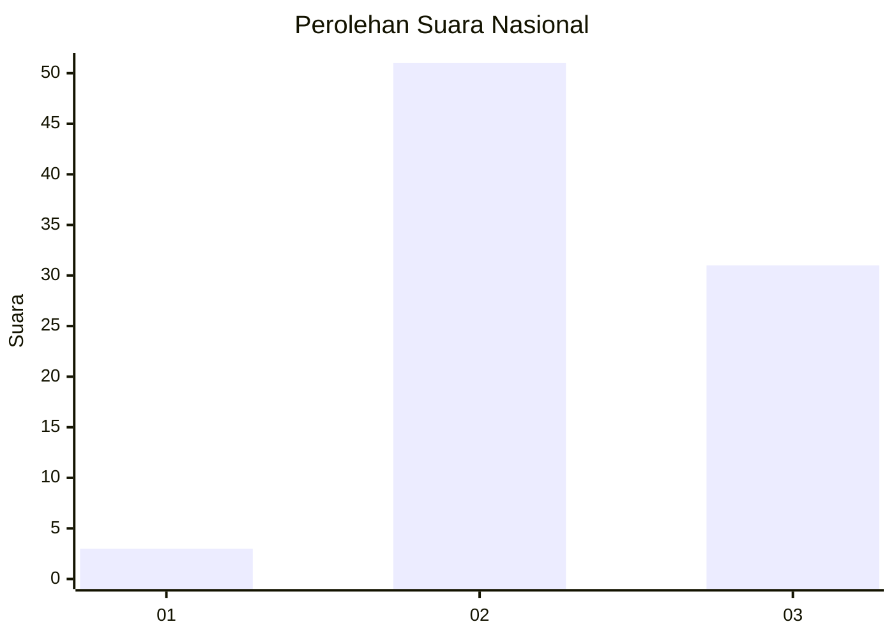
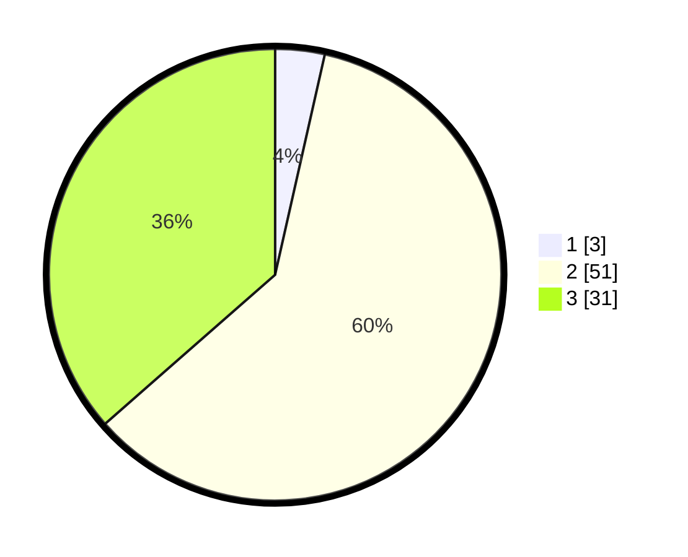

# Hasil

## Grafik

## Tabel

| No. | Nama Paslon    | Suara | Suara (raw) | Persentase |
|:--- |:-------------- | -----:| -----------:| ----------:|
| 1   | ANIES MUHAIMIN | 3     | [3][p-1]    | 3,53       |
| 2   | PRABOWO GIBRAN | 51    | [51][p-2]   | 60,00      |
| 3   | GANJAR MAHFUD  | 31    | [31][p-3]   | 36,47      |

[p-1]: https://github.com/gigit-pemilu/pemilu-2024/blob/main/pilpres/hitung-suara/sub/91-papua/sub/06-biak-numfor/sub/11-yendidori/sub/2019-padwa-pantai/sub/001-tps/sub/paslon-1.txt
[p-2]: https://github.com/gigit-pemilu/pemilu-2024/blob/main/pilpres/hitung-suara/sub/91-papua/sub/06-biak-numfor/sub/11-yendidori/sub/2019-padwa-pantai/sub/001-tps/sub/paslon-2.txt
[p-3]: https://github.com/gigit-pemilu/pemilu-2024/blob/main/pilpres/hitung-suara/sub/91-papua/sub/06-biak-numfor/sub/11-yendidori/sub/2019-padwa-pantai/sub/001-tps/sub/paslon-3.txt

## Foto C Plano

https://sirekap-obj-formc.kpu.go.id/22bb/pemilu/ppwp/91/06/11/20/19/9106112019001-20240214-214354--1db78d80-6616-49f6-b0ba-5de3d04f9ae3.jpg

https://sirekap-obj-formc.kpu.go.id/22bb/pemilu/ppwp/91/06/11/20/19/9106112019001-20240214-215726--928f404f-2271-45ba-b357-403c56d2eebb.jpg

https://sirekap-obj-formc.kpu.go.id/22bb/pemilu/ppwp/91/06/11/20/19/9106112019001-20240214-215906--3a2e004b-3e0e-4405-9414-0f6cbb135b9f.jpg

## Metadata

| Key        | Value               |
| ---------- | ------------------- |
| Time Stamp | 2024-02-25 21:00:00 |

