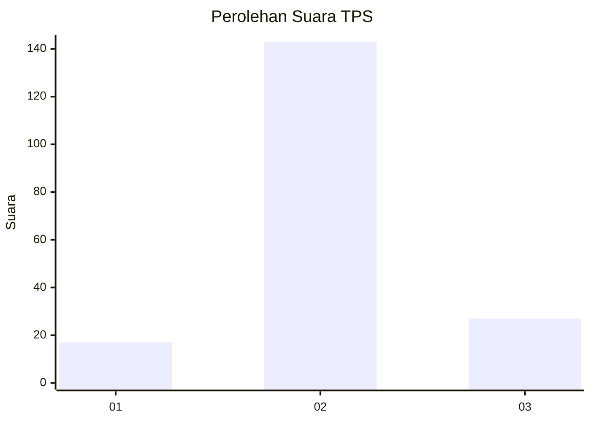

# Hasil

## Grafik

## Tabel

| No. | Nama Paslon    | Suara | Suara (raw) | Persentase |
|:--- |:-------------- | -----:| -----------:| ----------:|
| 1   | ANIES MUHAIMIN | 17    | [17][p-1]   | 9,09       |
| 2   | PRABOWO GIBRAN | 143   | [143][p-2]  | 76,47      |
| 3   | GANJAR MAHFUD  | 27    | [27][p-3]   | 14,44      |

[p-1]: https://github.com/gigit-pemilu/pemilu-2024-91-papua/blob/main/pilpres/hitung-suara/sub/91-papua/sub/06-biak-numfor/sub/12-samofa/sub/1001-samofa/sub/001-tps/sub/paslon-1.txt
[p-2]: https://github.com/gigit-pemilu/pemilu-2024-91-papua/blob/main/pilpres/hitung-suara/sub/91-papua/sub/06-biak-numfor/sub/12-samofa/sub/1001-samofa/sub/001-tps/sub/paslon-2.txt
[p-3]: https://github.com/gigit-pemilu/pemilu-2024-91-papua/blob/main/pilpres/hitung-suara/sub/91-papua/sub/06-biak-numfor/sub/12-samofa/sub/1001-samofa/sub/001-tps/sub/paslon-3.txt

## Foto C Plano

https://sirekap-obj-formc.kpu.go.id/cccd/pemilu/ppwp/91/06/12/10/01/9106121001001-20240214-224909--bb502b56-0009-4e8c-bfb6-0b3519e9f9a3.jpg

https://sirekap-obj-formc.kpu.go.id/cccd/pemilu/ppwp/91/06/12/10/01/9106121001001-20240214-225049--81b66e7b-6e54-456d-949b-fea3ef2da151.jpg

https://sirekap-obj-formc.kpu.go.id/cccd/pemilu/ppwp/91/06/12/10/01/9106121001001-20240214-225311--37edf807-626b-47be-be48-812ada0eefdd.jpg

## Metadata

| Key        | Value               |
| ---------- | ------------------- |
| Time Stamp | 2024-02-25 00:00:00 |

