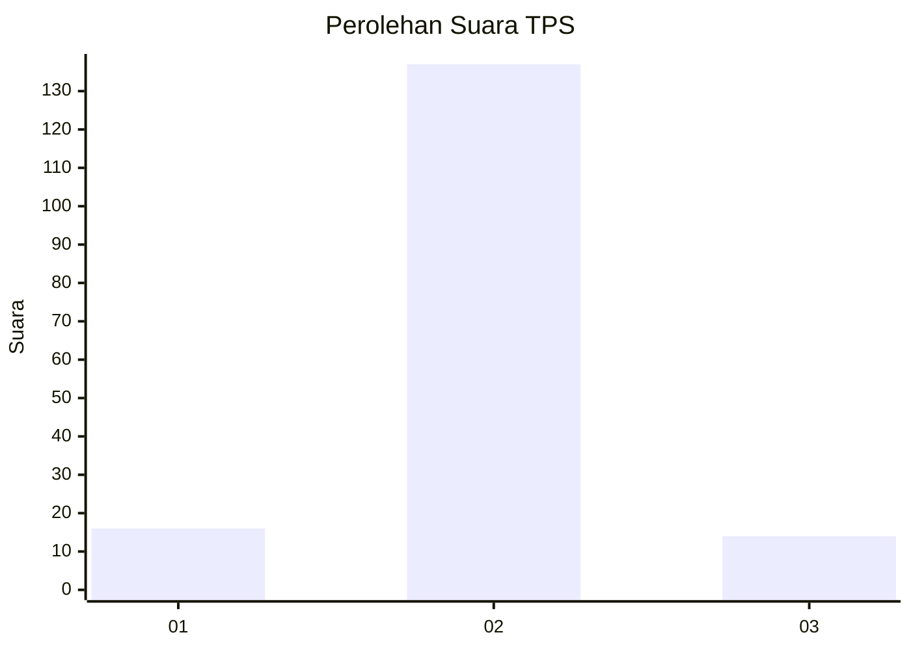
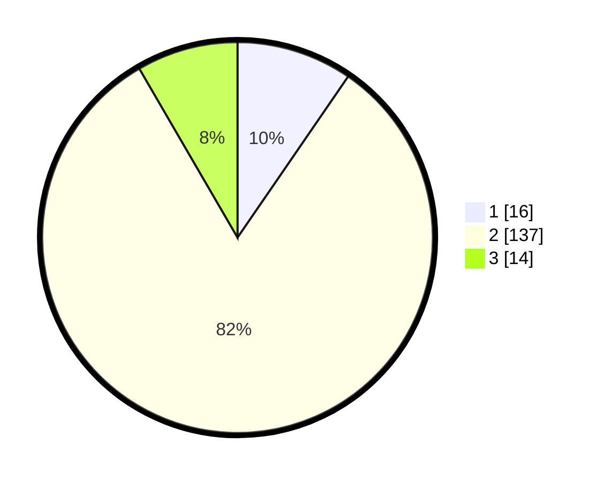

# Hasil

## Grafik

## Tabel

| No. | Nama Paslon    | Suara | Suara (raw) | Persentase |
|:--- |:-------------- | -----:| -----------:| ----------:|
| 1   | ANIES MUHAIMIN | 16    | [16][p-1]   | 9,58       |
| 2   | PRABOWO GIBRAN | 137   | [137][p-2]  | 82,04      |
| 3   | GANJAR MAHFUD  | 14    | [14][p-3]   | 8,38       |

[p-1]: https://github.com/gigit-pemilu/pemilu-2024-91-papua/blob/main/pilpres/hitung-suara/sub/91-papua/sub/06-biak-numfor/sub/12-samofa/sub/1001-samofa/sub/004-tps/sub/paslon-1.txt
[p-2]: https://github.com/gigit-pemilu/pemilu-2024-91-papua/blob/main/pilpres/hitung-suara/sub/91-papua/sub/06-biak-numfor/sub/12-samofa/sub/1001-samofa/sub/004-tps/sub/paslon-2.txt
[p-3]: https://github.com/gigit-pemilu/pemilu-2024-91-papua/blob/main/pilpres/hitung-suara/sub/91-papua/sub/06-biak-numfor/sub/12-samofa/sub/1001-samofa/sub/004-tps/sub/paslon-3.txt

## Foto C Plano

https://sirekap-obj-formc.kpu.go.id/e78c/pemilu/ppwp/91/06/12/10/01/9106121001004-20240215-074841--5040aea1-9552-472f-9728-8479e0cfce48.jpg

https://sirekap-obj-formc.kpu.go.id/e78c/pemilu/ppwp/91/06/12/10/01/9106121001004-20240215-080603--e724859f-b3b7-44af-b08b-0df914007cbc.jpg

https://sirekap-obj-formc.kpu.go.id/e78c/pemilu/ppwp/91/06/12/10/01/9106121001004-20240215-081223--41651bfb-a155-40a7-bac2-99f37e86b70e.jpg

## Metadata

| Key        | Value               |
| ---------- | ------------------- |
| Time Stamp | 2024-02-25 08:00:00 |

