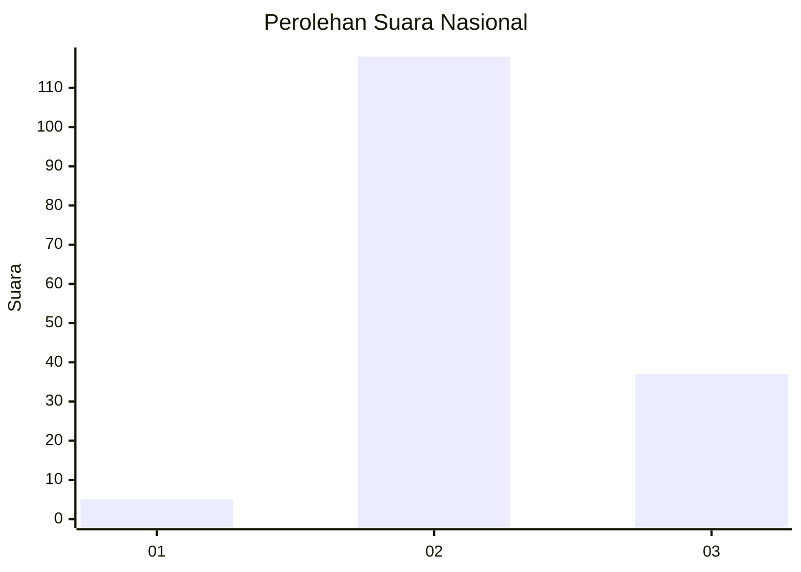
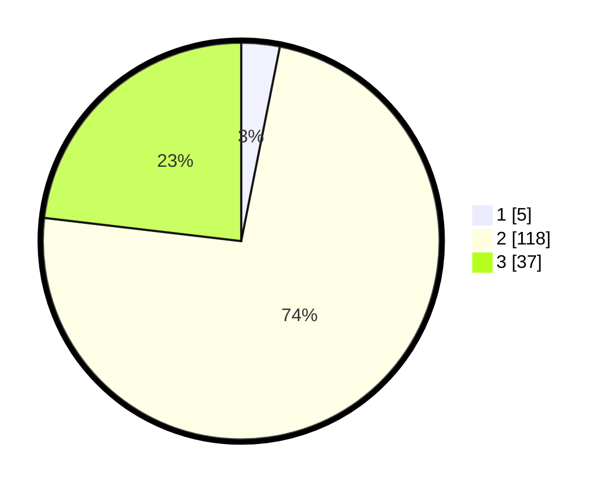

# Hasil

## Grafik

## Tabel

| No. | Nama Paslon    | Suara | Suara (raw) | Persentase |
|:--- |:-------------- | -----:| -----------:| ----------:|
| 1   | ANIES MUHAIMIN | 5     | [5][p-1]    | 3,13       |
| 2   | PRABOWO GIBRAN | 118   | [118][p-2]  | 73,75      |
| 3   | GANJAR MAHFUD  | 37    | [37][p-3]   | 23,13      |

[p-1]: https://github.com/gigit-pemilu/pemilu-2024/blob/main/pilpres/hitung-suara/sub/91-papua/sub/06-biak-numfor/sub/12-samofa/sub/1001-samofa/sub/009-tps/sub/paslon-1.txt
[p-2]: https://github.com/gigit-pemilu/pemilu-2024/blob/main/pilpres/hitung-suara/sub/91-papua/sub/06-biak-numfor/sub/12-samofa/sub/1001-samofa/sub/009-tps/sub/paslon-2.txt
[p-3]: https://github.com/gigit-pemilu/pemilu-2024/blob/main/pilpres/hitung-suara/sub/91-papua/sub/06-biak-numfor/sub/12-samofa/sub/1001-samofa/sub/009-tps/sub/paslon-3.txt

## Foto C Plano

https://sirekap-obj-formc.kpu.go.id/892f/pemilu/ppwp/91/06/12/10/01/9106121001009-20240214-222801--1b8bac15-aab2-4d7e-b536-3ea0cc1c11ad.jpg

https://sirekap-obj-formc.kpu.go.id/892f/pemilu/ppwp/91/06/12/10/01/9106121001009-20240214-222849--fbb28bfe-d8f9-4e87-b017-527bde2cfbff.jpg

https://sirekap-obj-formc.kpu.go.id/892f/pemilu/ppwp/91/06/12/10/01/9106121001009-20240214-222904--7efba772-50f4-4342-83bb-57286258b589.jpg

## Metadata

| Key        | Value               |
| ---------- | ------------------- |
| Time Stamp | 2024-02-25 18:00:00 |

