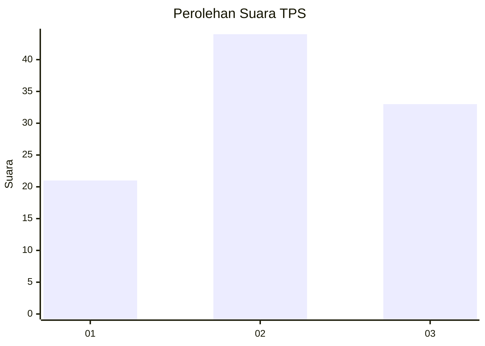
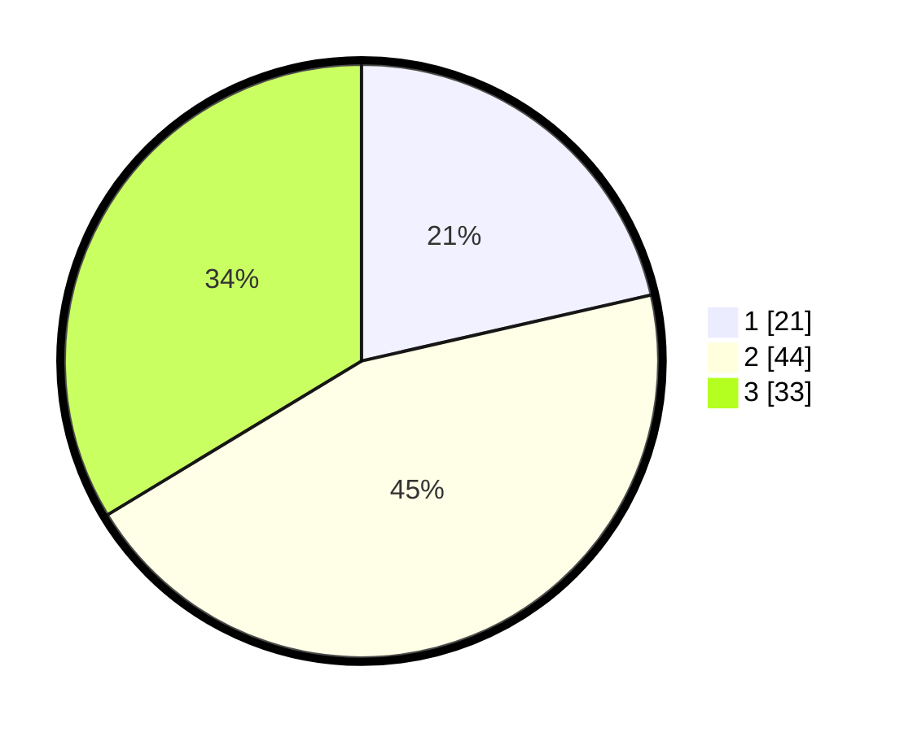

# Hasil

## Grafik

## Tabel

| No. | Nama Paslon    | Suara | Suara (raw) | Persentase |
|:--- |:-------------- | -----:| -----------:| ----------:|
| 1   | ANIES MUHAIMIN | 21    | [21][p-1]   | 21,43      |
| 2   | PRABOWO GIBRAN | 44    | [44][p-2]   | 44,90      |
| 3   | GANJAR MAHFUD  | 33    | [33][p-3]   | 33,67      |

[p-1]: https://github.com/gigit-pemilu/pemilu-2024-91-papua/blob/main/pilpres/hitung-suara/sub/91-papua/sub/06-biak-numfor/sub/12-samofa/sub/1001-samofa/sub/901-tps/sub/paslon-1.txt
[p-2]: https://github.com/gigit-pemilu/pemilu-2024-91-papua/blob/main/pilpres/hitung-suara/sub/91-papua/sub/06-biak-numfor/sub/12-samofa/sub/1001-samofa/sub/901-tps/sub/paslon-2.txt
[p-3]: https://github.com/gigit-pemilu/pemilu-2024-91-papua/blob/main/pilpres/hitung-suara/sub/91-papua/sub/06-biak-numfor/sub/12-samofa/sub/1001-samofa/sub/901-tps/sub/paslon-3.txt

## Foto C Plano

https://sirekap-obj-formc.kpu.go.id/97df/pemilu/ppwp/91/06/12/10/01/9106121001901-20240215-040809--11a183ee-c3b8-40f5-903b-7abd46cae672.jpg

https://sirekap-obj-formc.kpu.go.id/97df/pemilu/ppwp/91/06/12/10/01/9106121001901-20240215-040836--cc0b0c16-395f-4ee0-a113-06982868a23a.jpg

https://sirekap-obj-formc.kpu.go.id/97df/pemilu/ppwp/91/06/12/10/01/9106121001901-20240215-040851--5c2cfb99-f3e5-4a9b-8166-de46aef998ea.jpg

## Metadata

| Key        | Value               |
| ---------- | ------------------- |
| Time Stamp | 2024-02-24 22:31:28 |

