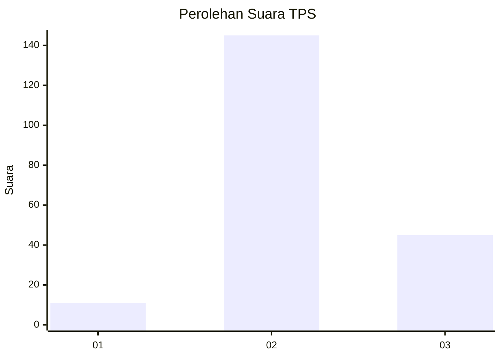
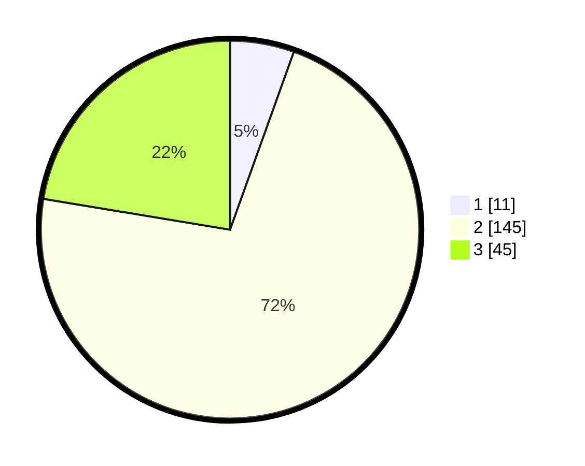

# Hasil

## Grafik

## Tabel

| No. | Nama Paslon    | Suara | Suara (raw) | Persentase |
|:--- |:-------------- | -----:| -----------:| ----------:|
| 1   | ANIES MUHAIMIN | 11    | [11][p-1]   | 5,47       |
| 2   | PRABOWO GIBRAN | 145   | [145][p-2]  | 72,14      |
| 3   | GANJAR MAHFUD  | 45    | [45][p-3]   | 22,39      |

[p-1]: https://github.com/gigit-pemilu/pemilu-2024-91-papua/blob/main/pilpres/hitung-suara/sub/91-papua/sub/06-biak-numfor/sub/12-samofa/sub/1002-brambaken/sub/005-tps/sub/paslon-1.txt
[p-2]: https://github.com/gigit-pemilu/pemilu-2024-91-papua/blob/main/pilpres/hitung-suara/sub/91-papua/sub/06-biak-numfor/sub/12-samofa/sub/1002-brambaken/sub/005-tps/sub/paslon-2.txt
[p-3]: https://github.com/gigit-pemilu/pemilu-2024-91-papua/blob/main/pilpres/hitung-suara/sub/91-papua/sub/06-biak-numfor/sub/12-samofa/sub/1002-brambaken/sub/005-tps/sub/paslon-3.txt

## Foto C Plano

https://sirekap-obj-formc.kpu.go.id/5d52/pemilu/ppwp/91/06/12/10/02/9106121002005-20240215-085355--01550b15-8b4a-48ed-9d97-7fd52f7dc27d.jpg

https://sirekap-obj-formc.kpu.go.id/5d52/pemilu/ppwp/91/06/12/10/02/9106121002005-20240215-085508--d5a46825-e2b3-4e16-b747-b1832493896b.jpg

https://sirekap-obj-formc.kpu.go.id/5d52/pemilu/ppwp/91/06/12/10/02/9106121002005-20240215-085631--601bd87f-ab03-4604-8fd7-e523217802cc.jpg

## Metadata

| Key        | Value               |
| ---------- | ------------------- |
| Time Stamp | 2024-02-25 11:00:00 |

