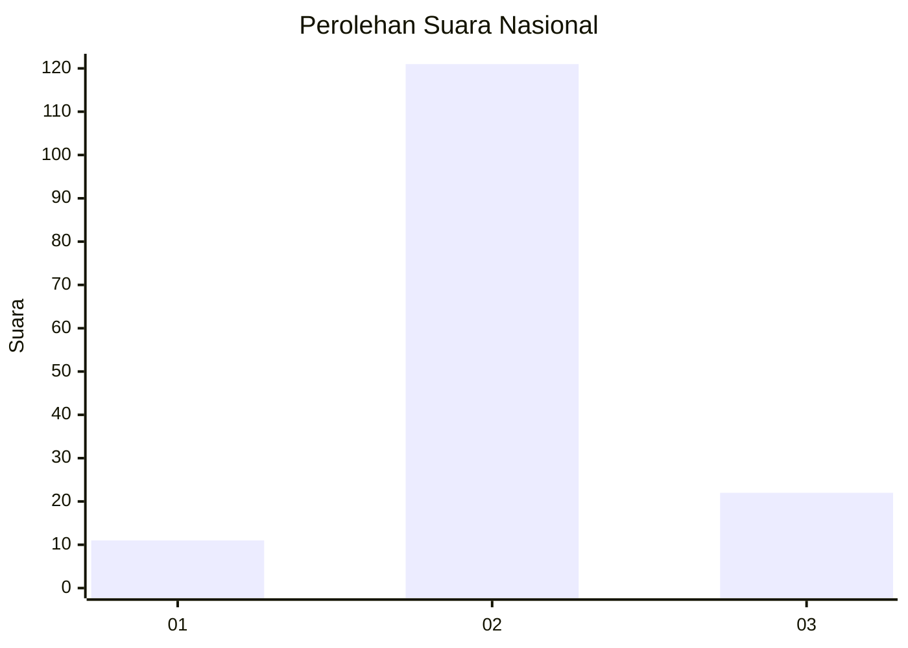

# Hasil

## Grafik

## Tabel

| No. | Nama Paslon    | Suara | Suara (raw) | Persentase |
|:--- |:-------------- | -----:| -----------:| ----------:|
| 1   | ANIES MUHAIMIN | 11    | [11][p-1]   | 7,14       |
| 2   | PRABOWO GIBRAN | 121   | [121][p-2]  | 78,57      |
| 3   | GANJAR MAHFUD  | 22    | [22][p-3]   | 14,29      |

[p-1]: https://github.com/gigit-pemilu/pemilu-2024/blob/main/pilpres/hitung-suara/sub/91-papua/sub/06-biak-numfor/sub/12-samofa/sub/1002-brambaken/sub/006-tps/sub/paslon-1.txt
[p-2]: https://github.com/gigit-pemilu/pemilu-2024/blob/main/pilpres/hitung-suara/sub/91-papua/sub/06-biak-numfor/sub/12-samofa/sub/1002-brambaken/sub/006-tps/sub/paslon-2.txt
[p-3]: https://github.com/gigit-pemilu/pemilu-2024/blob/main/pilpres/hitung-suara/sub/91-papua/sub/06-biak-numfor/sub/12-samofa/sub/1002-brambaken/sub/006-tps/sub/paslon-3.txt

## Foto C Plano

https://sirekap-obj-formc.kpu.go.id/eaff/pemilu/ppwp/91/06/12/10/02/9106121002006-20240215-003446--9976164c-a5f5-4b13-8bf3-40a876d38d33.jpg

https://sirekap-obj-formc.kpu.go.id/eaff/pemilu/ppwp/91/06/12/10/02/9106121002006-20240214-205901--640e99fd-f74e-4aed-88f3-f1419bad592f.jpg

https://sirekap-obj-formc.kpu.go.id/eaff/pemilu/ppwp/91/06/12/10/02/9106121002006-20240214-210038--d96fb4ca-6616-4cf2-bcbd-1629befc17a4.jpg

## Metadata

| Key        | Value               |
| ---------- | ------------------- |
| Time Stamp | 2024-02-15 12:00:28 |

