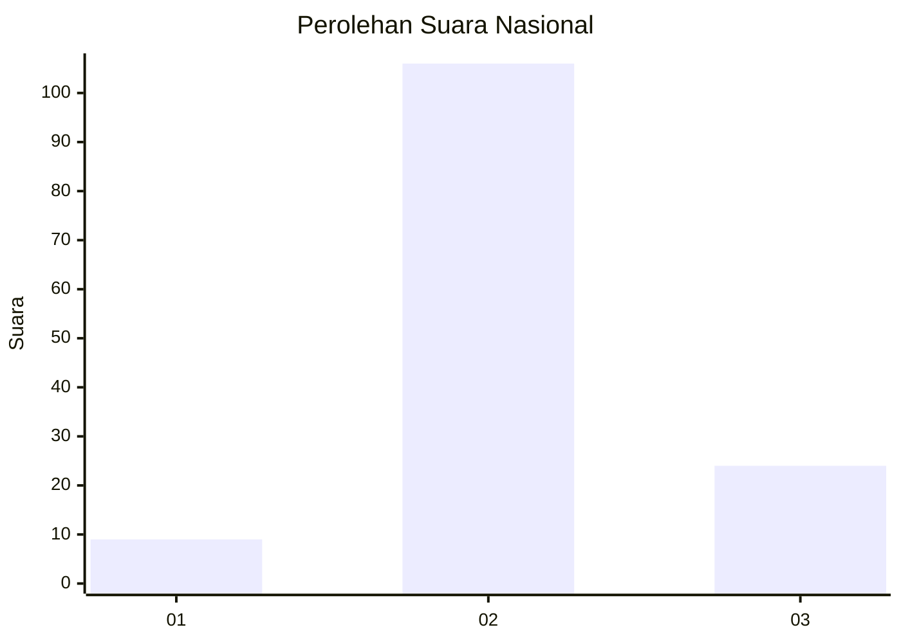

# Hasil

## Grafik

## Tabel

| No. | Nama Paslon    | Suara | Suara (raw) | Persentase |
|:--- |:-------------- | -----:| -----------:| ----------:|
| 1   | ANIES MUHAIMIN | 9     | [9][p-1]    | 6,47       |
| 2   | PRABOWO GIBRAN | 106   | [106][p-2]  | 76,26      |
| 3   | GANJAR MAHFUD  | 24    | [24][p-3]   | 17,27      |

[p-1]: https://github.com/gigit-pemilu/pemilu-2024/blob/main/pilpres/hitung-suara/sub/91-papua/sub/06-biak-numfor/sub/12-samofa/sub/1002-brambaken/sub/012-tps/sub/paslon-1.txt
[p-2]: https://github.com/gigit-pemilu/pemilu-2024/blob/main/pilpres/hitung-suara/sub/91-papua/sub/06-biak-numfor/sub/12-samofa/sub/1002-brambaken/sub/012-tps/sub/paslon-2.txt
[p-3]: https://github.com/gigit-pemilu/pemilu-2024/blob/main/pilpres/hitung-suara/sub/91-papua/sub/06-biak-numfor/sub/12-samofa/sub/1002-brambaken/sub/012-tps/sub/paslon-3.txt

## Foto C Plano

https://sirekap-obj-formc.kpu.go.id/4b4b/pemilu/ppwp/91/06/12/10/02/9106121002012-20240215-114548--bf455e53-86d3-466d-95fa-4b01e0ed0f2d.jpg

https://sirekap-obj-formc.kpu.go.id/4b4b/pemilu/ppwp/91/06/12/10/02/9106121002012-20240215-114710--e93e3047-c102-4990-b3c5-43ac893dcc59.jpg

https://sirekap-obj-formc.kpu.go.id/4b4b/pemilu/ppwp/91/06/12/10/02/9106121002012-20240215-114828--a81b0281-e1bb-4363-a4ba-9b37324e2267.jpg

## Metadata

| Key        | Value               |
| ---------- | ------------------- |
| Time Stamp | 2024-02-24 22:31:28 |

