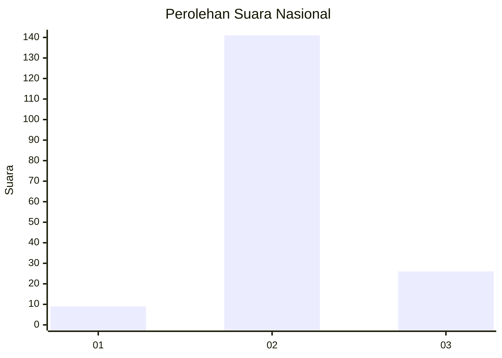

# Hasil

## Grafik

## Tabel

| No. | Nama Paslon    | Suara | Suara (raw) | Persentase |
|:--- |:-------------- | -----:| -----------:| ----------:|
| 1   | ANIES MUHAIMIN | 9     | [9][p-1]    | 5,11       |
| 2   | PRABOWO GIBRAN | 141   | [141][p-2]  | 80,11      |
| 3   | GANJAR MAHFUD  | 26    | [26][p-3]   | 14,77      |

[p-1]: https://github.com/gigit-pemilu/pemilu-2024/blob/main/pilpres/hitung-suara/sub/91-papua/sub/06-biak-numfor/sub/12-samofa/sub/1002-brambaken/sub/014-tps/sub/paslon-1.txt
[p-2]: https://github.com/gigit-pemilu/pemilu-2024/blob/main/pilpres/hitung-suara/sub/91-papua/sub/06-biak-numfor/sub/12-samofa/sub/1002-brambaken/sub/014-tps/sub/paslon-2.txt
[p-3]: https://github.com/gigit-pemilu/pemilu-2024/blob/main/pilpres/hitung-suara/sub/91-papua/sub/06-biak-numfor/sub/12-samofa/sub/1002-brambaken/sub/014-tps/sub/paslon-3.txt

## Foto C Plano

https://sirekap-obj-formc.kpu.go.id/9d54/pemilu/ppwp/91/06/12/10/02/9106121002014-20240215-041450--949bb24f-3351-4fe8-902d-1b2b7e0e0213.jpg

https://sirekap-obj-formc.kpu.go.id/9d54/pemilu/ppwp/91/06/12/10/02/9106121002014-20240215-081448--61d8f723-d96e-4cff-ac07-e27363f73fd4.jpg

https://sirekap-obj-formc.kpu.go.id/9d54/pemilu/ppwp/91/06/12/10/02/9106121002014-20240215-063111--869ac2e9-51ef-46fc-b056-80d350149caa.jpg

## Metadata

| Key        | Value               |
| ---------- | ------------------- |
| Time Stamp | 2024-02-24 22:31:28 |

