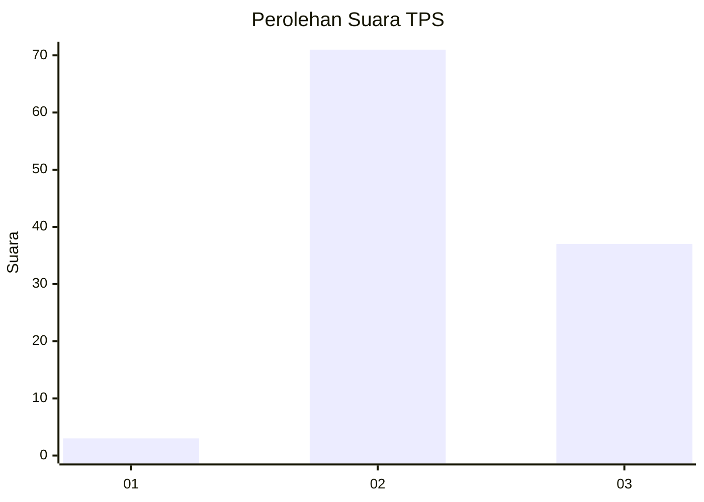
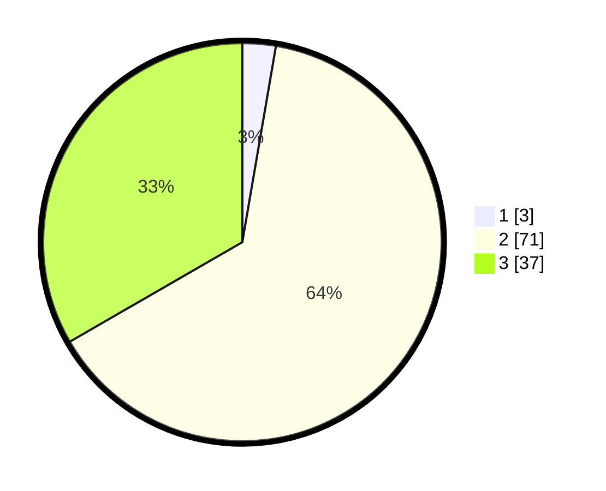

# Hasil

## Grafik

## Tabel

| No. | Nama Paslon    | Suara | Suara (raw) | Persentase |
|:--- |:-------------- | -----:| -----------:| ----------:|
| 1   | ANIES MUHAIMIN | 3     | [3][p-1]    | 2,70       |
| 2   | PRABOWO GIBRAN | 71    | [71][p-2]   | 63,96      |
| 3   | GANJAR MAHFUD  | 37    | [37][p-3]   | 33,33      |

[p-1]: https://github.com/gigit-pemilu/pemilu-2024-91-papua/blob/main/pilpres/hitung-suara/sub/91-papua/sub/06-biak-numfor/sub/12-samofa/sub/1011-yafdas/sub/005-tps/sub/paslon-1.txt
[p-2]: https://github.com/gigit-pemilu/pemilu-2024-91-papua/blob/main/pilpres/hitung-suara/sub/91-papua/sub/06-biak-numfor/sub/12-samofa/sub/1011-yafdas/sub/005-tps/sub/paslon-2.txt
[p-3]: https://github.com/gigit-pemilu/pemilu-2024-91-papua/blob/main/pilpres/hitung-suara/sub/91-papua/sub/06-biak-numfor/sub/12-samofa/sub/1011-yafdas/sub/005-tps/sub/paslon-3.txt

## Foto C Plano

https://sirekap-obj-formc.kpu.go.id/6b85/pemilu/ppwp/91/06/12/10/11/9106121011005-20240215-060639--14af64f1-3d04-42b7-aa8f-1c7b1ec896c6.jpg

https://sirekap-obj-formc.kpu.go.id/6b85/pemilu/ppwp/91/06/12/10/11/9106121011005-20240215-120346--6a799ec1-0765-40a8-86d7-58e708321b37.jpg

https://sirekap-obj-formc.kpu.go.id/6b85/pemilu/ppwp/91/06/12/10/11/9106121011005-20240215-120218--e6e1adb2-f88f-4486-811f-680ad41589ff.jpg

## Metadata

| Key        | Value               |
| ---------- | ------------------- |
| Time Stamp | 2024-02-25 12:00:00 |

