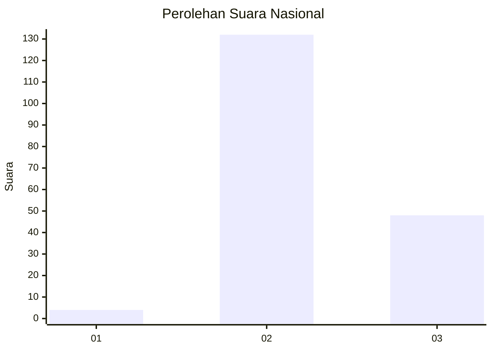
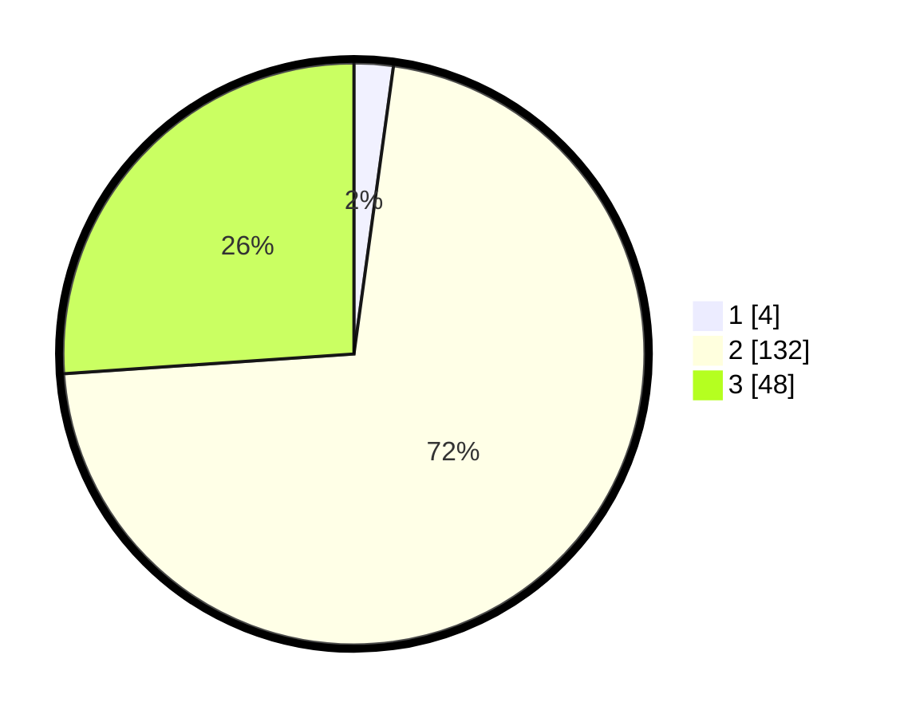

# Hasil

## Grafik

## Tabel

| No. | Nama Paslon    | Suara | Suara (raw) | Persentase |
|:--- |:-------------- | -----:| -----------:| ----------:|
| 1   | ANIES MUHAIMIN | 4     | [4][p-1]    | 2,17       |
| 2   | PRABOWO GIBRAN | 132   | [132][p-2]  | 71,74      |
| 3   | GANJAR MAHFUD  | 48    | [48][p-3]   | 26,09      |

[p-1]: https://github.com/gigit-pemilu/pemilu-2024/blob/main/pilpres/hitung-suara/sub/91-papua/sub/06-biak-numfor/sub/12-samofa/sub/1011-yafdas/sub/012-tps/sub/paslon-1.txt
[p-2]: https://github.com/gigit-pemilu/pemilu-2024/blob/main/pilpres/hitung-suara/sub/91-papua/sub/06-biak-numfor/sub/12-samofa/sub/1011-yafdas/sub/012-tps/sub/paslon-2.txt
[p-3]: https://github.com/gigit-pemilu/pemilu-2024/blob/main/pilpres/hitung-suara/sub/91-papua/sub/06-biak-numfor/sub/12-samofa/sub/1011-yafdas/sub/012-tps/sub/paslon-3.txt

## Foto C Plano

https://sirekap-obj-formc.kpu.go.id/91d6/pemilu/ppwp/91/06/12/10/11/9106121011012-20240215-062633--555ed567-5a07-45dc-a02e-27505d329a37.jpg

https://sirekap-obj-formc.kpu.go.id/91d6/pemilu/ppwp/91/06/12/10/11/9106121011012-20240215-062500--e8031ec6-25b6-4f95-b22f-35f617cbad43.jpg

https://sirekap-obj-formc.kpu.go.id/91d6/pemilu/ppwp/91/06/12/10/11/9106121011012-20240215-062657--f151fe7e-3a9e-4bb9-9421-96ccaf5bcf8a.jpg

## Metadata

| Key        | Value               |
| ---------- | ------------------- |
| Time Stamp | 2024-02-26 15:00:00 |

