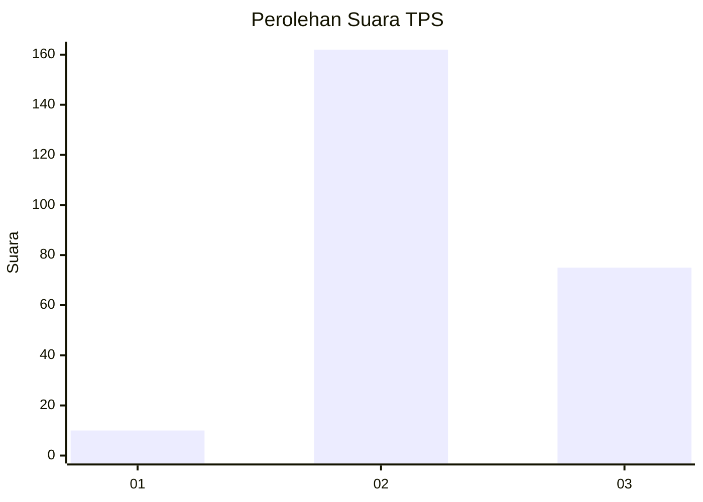

# Hasil

## Grafik

## Tabel

| No. | Nama Paslon    | Suara | Suara (raw) | Persentase |
|:--- |:-------------- | -----:| -----------:| ----------:|
| 1   | ANIES MUHAIMIN | 10    | [10][p-1]   | 4,05       |
| 2   | PRABOWO GIBRAN | 162   | [162][p-2]  | 65,59      |
| 3   | GANJAR MAHFUD  | 75    | [75][p-3]   | 30,36      |

[p-1]: https://github.com/gigit-pemilu/pemilu-2024-91-papua/blob/main/pilpres/hitung-suara/sub/91-papua/sub/06-biak-numfor/sub/12-samofa/sub/1013-snerbo/sub/003-tps/sub/paslon-1.txt
[p-2]: https://github.com/gigit-pemilu/pemilu-2024-91-papua/blob/main/pilpres/hitung-suara/sub/91-papua/sub/06-biak-numfor/sub/12-samofa/sub/1013-snerbo/sub/003-tps/sub/paslon-2.txt
[p-3]: https://github.com/gigit-pemilu/pemilu-2024-91-papua/blob/main/pilpres/hitung-suara/sub/91-papua/sub/06-biak-numfor/sub/12-samofa/sub/1013-snerbo/sub/003-tps/sub/paslon-3.txt

## Foto C Plano

https://sirekap-obj-formc.kpu.go.id/3cd3/pemilu/ppwp/91/06/12/10/13/9106121013003-20240215-142246--4be92b9d-ee0a-43c5-afd1-c09ba99e60c3.jpg

https://sirekap-obj-formc.kpu.go.id/3cd3/pemilu/ppwp/91/06/12/10/13/9106121013003-20240215-143138--04503547-4f7b-4d2e-92cb-38a9c4091590.jpg

https://sirekap-obj-formc.kpu.go.id/3cd3/pemilu/ppwp/91/06/12/10/13/9106121013003-20240215-143747--74b3073d-d3ca-448b-ae42-0bda9c4e89ea.jpg

## Metadata

| Key        | Value               |
| ---------- | ------------------- |
| Time Stamp | 2024-02-24 22:31:28 |

