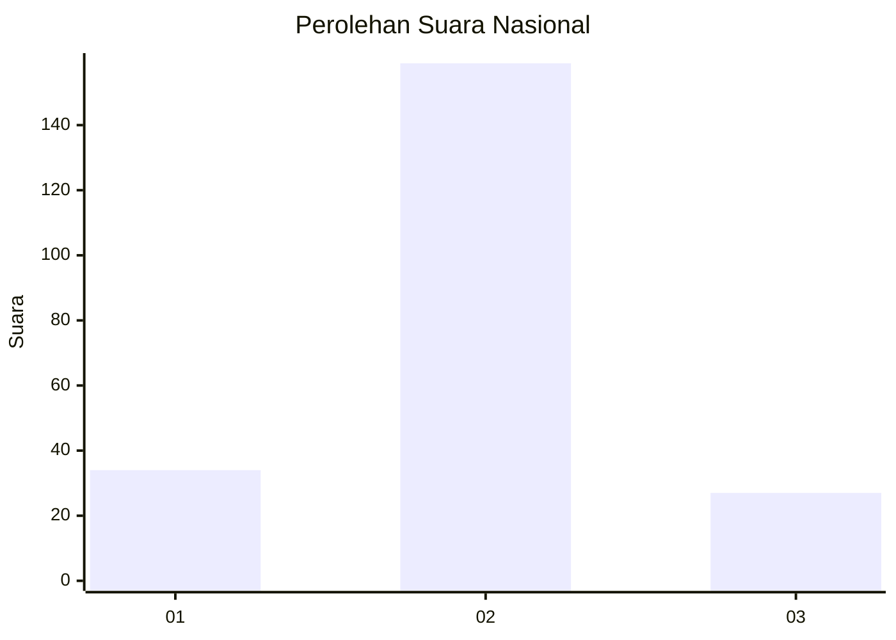
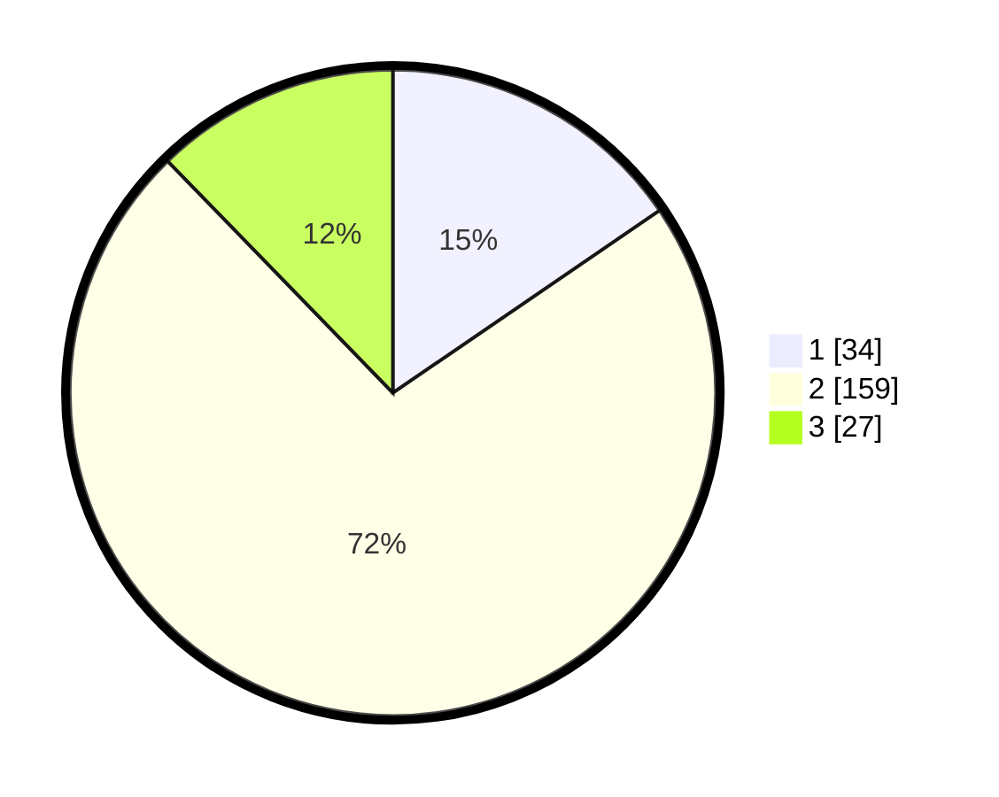

# Hasil

## Grafik

## Tabel

| No. | Nama Paslon    | Suara | Suara (raw) | Persentase |
|:--- |:-------------- | -----:| -----------:| ----------:|
| 1   | ANIES MUHAIMIN | 34    | [34][p-1]   | 15,45      |
| 2   | PRABOWO GIBRAN | 159   | [159][p-2]  | 72,27      |
| 3   | GANJAR MAHFUD  | 27    | [27][p-3]   | 12,27      |

[p-1]: https://github.com/gigit-pemilu/pemilu-2024/blob/main/pilpres/hitung-suara/sub/91-papua/sub/06-biak-numfor/sub/12-samofa/sub/1014-anjareuw/sub/002-tps/sub/paslon-1.txt
[p-2]: https://github.com/gigit-pemilu/pemilu-2024/blob/main/pilpres/hitung-suara/sub/91-papua/sub/06-biak-numfor/sub/12-samofa/sub/1014-anjareuw/sub/002-tps/sub/paslon-2.txt
[p-3]: https://github.com/gigit-pemilu/pemilu-2024/blob/main/pilpres/hitung-suara/sub/91-papua/sub/06-biak-numfor/sub/12-samofa/sub/1014-anjareuw/sub/002-tps/sub/paslon-3.txt

## Foto C Plano

https://sirekap-obj-formc.kpu.go.id/5c02/pemilu/ppwp/91/06/12/10/14/9106121014002-20240215-084634--23c0b729-9ea6-4464-93b1-8b70708f93ca.jpg

https://sirekap-obj-formc.kpu.go.id/5c02/pemilu/ppwp/91/06/12/10/14/9106121014002-20240215-084916--f3569e21-45a6-4fcd-add4-8189aa0d84d6.jpg

https://sirekap-obj-formc.kpu.go.id/5c02/pemilu/ppwp/91/06/12/10/14/9106121014002-20240215-085327--281149ce-1ae5-4605-9741-c6db3f6b98c1.jpg

## Metadata

| Key        | Value               |
| ---------- | ------------------- |
| Time Stamp | 2024-02-24 22:31:28 |

